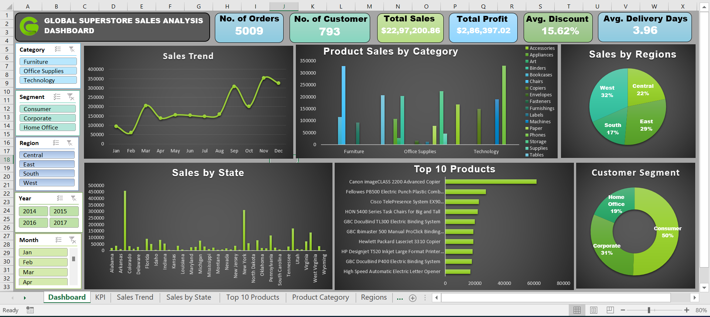

# 📊 Global Superstore Sales Dashboard (Excel)

An **interactive Excel dashboard** analyzing the sales performance of the Global Superstore dataset.  
This project uncovers **sales trends, product performance, regional contribution, customer segments, and profit insights** — helping business leaders make informed, data-driven decisions.

💼 This dashboard acts as a **solution to the business problem** by visually identifying loss-making areas, high-performing products, and regions that drive growth.

      

---

# 🧩 Business Problem

The Global Superstore company faces several business challenges:

- Inconsistent **sales and profit performance** across regions  
- Loss-making categories due to **heavy discounting**
- No visibility into **top-performing vs. low-performing products**
- Unclear understanding of **customer purchasing behavior**
- Difficulty analyzing **seasonal sales trends**
- No consolidated reporting tool for **decision-making**

### ✔ The company needed a dashboard to:
- Track sales, profit, and discount patterns  
- Identify high-value regions & customer segments  
- Find low-profit categories and optimize discount strategy  
- Monitor seasonal trends  
- Support data-driven business decisions  

📘 Detailed explanation available here:  
👉 **[Business Problem.pdf](Business%20Problem.pdf)**

---

# 📸 Dashboard Preview  

---

# 🚀 Key Features

### ⭐ KPI Cards  
- 📦 **Orders**  
- 👥 **Customers**  
- 💰 **Sales**  
- 📈 **Profit**  
- 🎯 **Discount %**  
- 🚚 **Avg. Delivery Days**

### ⭐ Charts & Visuals  
- 📅 Monthly Sales Trend  
- 🗺️ Sales by Region & State  
- 📊 Category & Sub-category Breakdown  
- 🏆 Top 10 Products  
- 👥 Customer Segment Distribution  

### ⭐ Interactive Filters  
**Year | Month | Region | Category | Segment**

---

# 💡 Key Insights from the Dashboard

### 📈 Overall Performance
- **Total Sales:** $22.97M  
- **Total Profit:** $286K  
- **Orders:** 5,009  
- **Customers:** 793  

### 🛒 Category Insights
- **Technology** delivers highest sales & profit  
- **Furniture** shows lower profit due to discount-heavy items  
- **Office Supplies** perform steadily but with low margins  

### 🌎 Regional Insights
- **West Region (32%)** leads total sales  
- **Central Region (22%)** has lowest profitability → review pricing/discounting  

### 👥 Customer Segment Breakdown
- **Consumer (50%)** is the largest revenue driver  
- Corporate: 31%  
- Home Office: 19%  

### 🏆 Top Performing Products
- *Canon imageCLASS 2200 Advanced Copier*  
- *Fellowes PB500 Binding Machine*  

Most top-selling items come from **Technology** & **Office Supplies**.

### 📆 Sales Trend
- Peak months: **March, September, November**  
- Indicates promotion/season-based sales spikes  

---

# 📘 Project Report

A complete step-by-step analysis report (methodology, visuals, insights, recommendations):

👉 **[Global Superstore Sales Dashboard Report.pdf](Global%20Superstore%20Sales%20Dashboard%20Report.pdf)**

---

# 🛠 Tools & Techniques Used

- **Microsoft Excel**
  - Pivot Tables & Pivot Charts  
  - Slicers & Timeline filters  
  - KPI Cards  
  - Data Cleaning  
  - Custom Formatting & Dashboard Layout  

---

# 📂 Files in This Repository

| File | Description |
|------|-------------|
| `Superstore_rawdata.csv` | Dataset used for analysis |
| `Superstore_Dashboard.xlsx` | Final interactive Excel dashboard |
| `Dashboard_Screenshot.png` | Dashboard preview |
| `Business Problem.pdf` | Detailed business problem |
| `Global Superstore Sales Analysis Report.pdf` | Full project report |
| `README.md` | Project documentation |

---

# 📊 Dataset

- **Source:** Kaggle – Superstore Dataset  
- **License:** Public dataset for learning & analysis  

---

# ⚙️ How to Explore

1. Download **Superstore_Dashboard.xlsx**  
2. Open in **Excel 2016 or later**  
3. Use slicers to filter Year, Month, Region, Category, Segment  
4. Charts & KPIs update dynamically  

---

## 🧑‍💻 Author

**👤 Harsh Belekar**  
📍 Data Analyst | Python | SQL | Power BI | Excel | Data Visualization  
📬 [LinkedIn](https://www.linkedin.com/in/harshbelekar) | 🔗[GitHub](https://github.com/Harsh-Belekar)

📧 [harshbelekar74@gmail.com](mailto:harshbelekar74@gmail.com)

---

⭐ *If you found this project helpful, feel free to star the repo and connect with me for collaboration!*
