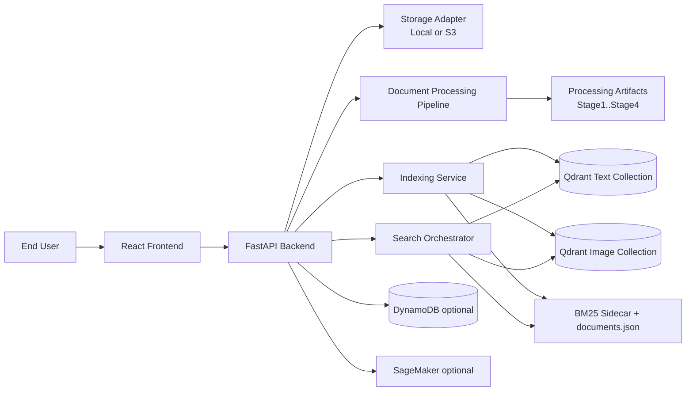
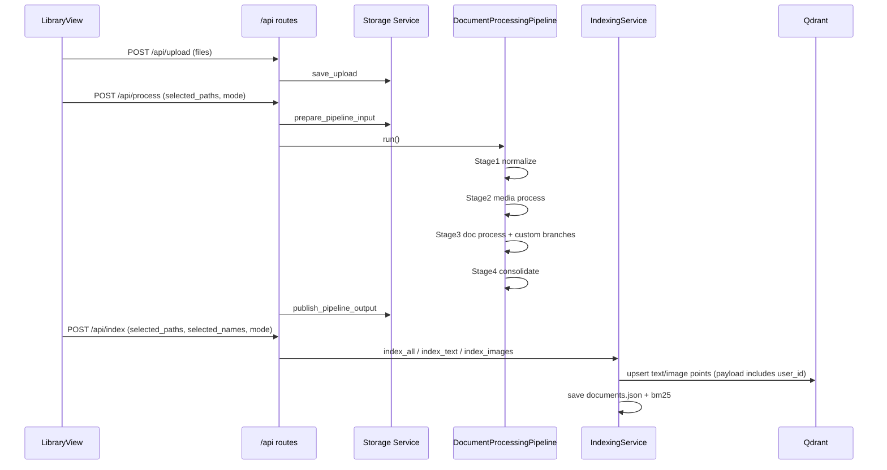
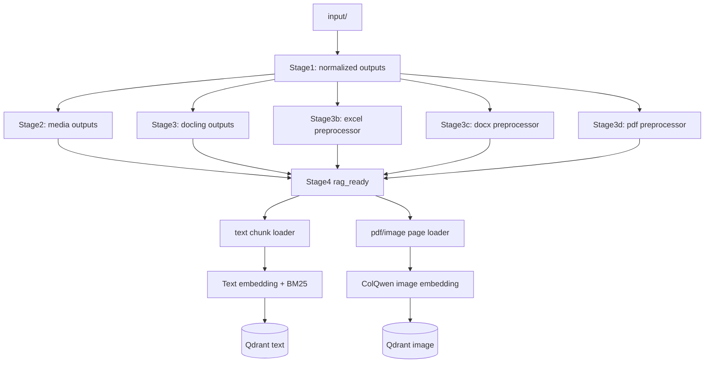

# Project Architecture Blueprint

Generated: 2026-04-18
Scope: Current architecture and processing flow for document pipelines in `Phase_2_FE_AI_Merge`.
Primary analyzed areas:
- `Phase_2_FE_AI_Merge/backend`
- `Phase_2_FE_AI_Merge/frontend`

## 1. Architecture Detection and Analysis

### 1.1 Detected Technology Stack

Backend:
- Python 3.11
- FastAPI (`app/main.py`)
- Uvicorn runtime
- Qdrant vector database (`app/repositories/*_index_repository.py`)
- Optional AWS services:
  - S3 (storage backend)
  - SageMaker endpoints (ColQwen, Docling, Whisper)
  - DynamoDB (identity, usage telemetry, knowledge/admin data)

Processing engine:
- Internal multi-stage pipeline (`src/processor/pipeline.py`)
- Normalizer (`src/processor/normalizer.py`)
- Media processor (`src/processor/media_processor_enhanced.py` via `media_processor.py`)
- Docling processor (`src/processor/document_processor.py`)
- Custom preprocessors for Excel/DOCX/PDF (`src/chunking/*_preprocessor.py`)

Frontend:
- React + TypeScript + Vite
- Axios API client with auth and tenancy headers (`frontend/src/api/client.ts`)
- Pipeline control UI (`frontend/src/views/LibraryView.tsx`)

### 1.2 Detected Architecture Pattern

Primary pattern: Layered modular monolith with orchestrated pipeline sub-architecture.

Observed layers:
- API routes: `app/api/routes/*`
- Services/orchestrators: `app/services/*`
- Repositories/infrastructure adapters: `app/repositories/*`, `app/storage/*`
- Processing engine: `src/processor/*`, `src/chunking/*`, `src/retrieval/*`

Key hybrid traits:
- Request/response service API for operational control.
- Batch-like staged processing pipeline for document transformation.
- Multi-tenant data isolation by payload and storage prefix, not by service split.

## 2. Architectural Overview

The system implements a full document lifecycle for educational knowledge ingestion:
1. Upload originals.
2. Normalize and process files through staged pipeline execution.
3. Consolidate artifacts into RAG-ready structure.
4. Build text and image indexes.
5. Serve retrieval and optional generation.

Guiding principles evident in implementation:
- Preserve API thinness: routes delegate to services.
- Keep processing deterministic through stage directories and explicit outputs.
- Support cloud/local parity via storage abstraction (`LocalFileStorage` vs `S3FileStorage`).
- Support multitenancy with a single shared Qdrant collection per modality filtered by `user_id` payload.
- Prefer graceful degradation for dependent service failures (for example Qdrant cleanup failures on delete do not block file deletion).

## 3. Architecture Visualization

### 3.1 System Context (C4 Level 1)



### 3.2 Processing + Indexing Interaction (Component/Flow)



### 3.3 Pipeline Stage Data Flow



## 4. Core Architectural Components

### 4.1 API Composition Layer

Primary files:
- `backend/app/main.py`
- `backend/app/api/routes/pipeline_routes.py`
- `backend/app/api/routes/files_routes.py`
- `backend/app/api/routes/search_routes.py`
- `backend/app/api/deps.py`

Responsibilities:
- Expose orchestration endpoints (`/upload`, `/process`, `/index`, `/search`, `/files-with-metadata`).
- Resolve tenant/user context from `X-User-Id` using sanitization.
- Enforce per-user process/index mutual exclusion via in-memory lock maps.

### 4.2 Processing Service Facade

Primary file:
- `backend/app/services/processing_service.py`

Responsibilities:
- Build runtime `PipelineConfig` from YAML + environment.
- Apply fast vs standard profile.
- Prepare selected inputs and trigger `DocumentProcessingPipeline`.
- Publish processing artifacts through active storage adapter.

### 4.3 Pipeline Engine

Primary file:
- `backend/src/processor/pipeline.py`

Responsibilities:
- Execute ordered stages with optional skip/cache behavior.
- Prune stale outputs for removed inputs.
- Support stage variants (Docling path and custom Excel/DOCX/PDF preprocessors).

### 4.4 Consolidation Layer

Primary file:
- `backend/src/processor/consolidator.py`

Responsibilities:
- Merge stage outputs into one RAG-ready document folder model.
- Include media-first artifacts from stage2 (transcript chunks, frames, manifest).

### 4.5 Indexing Layer

Primary files:
- `backend/app/services/indexing_service.py`
- `backend/app/repositories/text_index_repository.py`
- `backend/app/repositories/image_index_repository.py`

Responsibilities:
- Load stage4 artifacts.
- Produce text embeddings + BM25 sidecars.
- Produce image multivectors (ColQwen).
- Upsert to shared collections with tenant payload filtering.

### 4.6 Retrieval + Generation Orchestration

Primary files:
- `backend/app/services/search_orchestrator.py`
- `backend/app/services/text_search_service.py`
- `backend/app/services/image_search_service.py`

Responsibilities:
- Execute text and image retrieval in parallel when applicable.
- Merge retrieval outputs and optionally invoke generator.
- Track telemetry and cache retrieval branch results.

### 4.7 Storage Abstraction

Primary files:
- `backend/app/storage/service.py`
- `backend/app/core/paths.py`

Responsibilities:
- Abstract local vs S3 behaviors for upload/list/delete/sync/publish.
- Provide per-user workspace in S3 mode using temporary local execution roots.

### 4.8 Frontend Pipeline Control

Primary files:
- `frontend/src/api/ragApi.ts`
- `frontend/src/views/LibraryView.tsx`
- `frontend/src/App.tsx`

Responsibilities:
- Trigger upload/process/index APIs.
- Track selected file progress with polling.
- Maintain file list state from `/api/files-with-metadata`.

## 5. Architectural Layers and Dependencies

Implemented dependency chain:
- Frontend views -> frontend API client.
- Backend routes -> backend services.
- Services -> repositories + storage adapters + processor modules.
- Repositories/adapters -> Qdrant/S3/DynamoDB/SageMaker libraries.

Enforcement mechanisms:
- Router files are mostly orchestration wrappers.
- Repository classes centralize Qdrant collection and payload index operations.
- Shared path + storage functions reduce duplicated environment-dependent path logic.

Potential violations observed:
- Some route modules include substantial status-mapping logic (for example `files_routes.py`) that could be service-extracted further.
- Search route currently mixes API and telemetry header projection logic.

## 6. Data Architecture

### 6.1 Document Artifact Model

Core staged directories:
- `stage1_normalized`
- `stage2_media_processed`
- `stage3_document_processed`
- `stage4_rag_ready`

Stage4 serves as canonical indexing input.

### 6.2 Text Index Data Model

Payload fields (representative):
- `chunk_id`
- `user_id`
- `source`
- `text_preview`
- Optional `storage_uri`, `storage_backend`

Vector storage:
- Shared text collection (default `edu_text_chunks`)
- Cosine distance
- Optional scalar/binary quantization

Sparse sidecars:
- `documents.json`
- `bm25_index.pkl`

### 6.3 Image Index Data Model

Payload fields (representative):
- `user_id`
- `source`
- `source_path`
- `page`, `total_pages`
- `image_width`, `image_height`
- Optional `storage_uri`, `storage_backend`

Vector storage:
- Shared image collection (default `edu_image_pages`)
- Multivector MaxSim (DOT)

### 6.4 Tenancy Model

- HTTP-level tenant context from `X-User-Id`.
- Qdrant tenancy via payload filter (`user_id`), not per-user collections.
- S3 tenancy via key prefixes `users/{id}/` when isolation enabled.
- Local mode shares filesystem paths but still carries user_id in payloads.

## 7. Cross-Cutting Concerns Implementation

### 7.1 Authentication and Authorization

Backend:
- Firebase token login and local account login in `app/identity/routes.py`.
- Profile and admin APIs with role checks.

Frontend:
- Axios request interceptor injects `Authorization` and `X-User-Id` (`frontend/src/api/client.ts`).

### 7.2 Error Handling and Resilience

Patterns:
- Route-level try/except wrapping with HTTP status conversion.
- Qdrant connectivity checks convert to 503 with setup hint.
- Delete cascade continues if index cleanup fails; reports cleanup error separately.
- Pipeline lock returns 409 if user already has active job.

### 7.3 Logging and Monitoring

- Service startup/shutdown logs in `app/main.py`.
- Pipeline stage logs to console and file artifacts.
- Usage telemetry middleware writes invocation metrics to DynamoDB when configured.

### 7.4 Validation

- Pydantic request schemas in API layer.
- Path traversal guards for processed/input file preview endpoints.
- Sanitized user IDs in dependency and core path layer.

### 7.5 Configuration Management

Sources:
- `config/default.yaml`
- `.env` environment values

Merge behavior:
- Runtime config merged in `app/core/paths.py::merged_runtime_settings`.
- Feature flags for storage backend, SageMaker inference, cache toggles, mode selection.

## 8. Service Communication Patterns

Synchronous internal communication:
- Route -> Service -> Repository calls (in-process, direct Python invocation).

Asynchronous/parallel communication:
- Indexing standard mode runs text and image indexing in thread pool.
- Search orchestrator can run text and image retrieval in parallel.

External protocols:
- HTTP(S): frontend-backend API, SageMaker runtime, optional Bedrock/OpenAI APIs.
- S3 API: artifact persistence and retrieval.
- Qdrant API: vector operations.

API style:
- REST-like endpoints under `/api`.
- Mode and selection-driven process/index APIs.

## 9. Technology-Specific Architectural Patterns

### 9.1 Python/FastAPI Patterns

- Thin route handlers with dependency injection for tenant context.
- Service classes for orchestrated business workflows.
- Repository classes encapsulating Qdrant semantics and payload indexing.

### 9.2 React Patterns

- Central API module (`ragApi.ts`) as backend contract layer.
- View-level pipeline orchestration and polling in `LibraryView.tsx`.
- Global app routing and knowledge sub-tab mode separation in `App.tsx`.

### 9.3 Data/ML Pipeline Patterns

- Stage-oriented filesystem pipeline.
- Content-type routing in normalizer and processor layers.
- Hybrid retrieval composition (BM25 + dense + image) with optional generation pass.

## 10. Implementation Patterns

### 10.1 Interface Design Patterns

- Storage adapter interface (`FileStorageService`) with local/S3 implementations.
- Repository interfaces implicit via concrete classes for text and image indexing.

### 10.2 Service Implementation Patterns

- Per-user in-memory locking for non-overlapping process/index jobs.
- Mode-aware profile switching (`standard` vs `fast`) before stage execution.
- Additive indexing for selected documents without full snapshot replacement.

### 10.3 Repository Patterns

- Ensure collection and payload indexes lazily.
- Delete operations by source and by user.
- Scroll-based source discovery for status reconciliation.

### 10.4 API Handling Patterns

- Process/index endpoints accept selected path/name lists for partial operations.
- Status and metadata endpoints aggregate multiple backends (storage + snapshot + index probe).

### 10.5 Domain Model Patterns

Document lifecycle states surfaced to UI:
- `uploaded`
- `processed`
- `indexed`
- `processing`
- `failed`

## 11. Testing Architecture

Backend tests:
- API tests under `backend/tests/api`
- Service tests under `backend/tests/services`

Pytest markers (`backend/pytest.ini`):
- `unit`
- `integration`
- `gpu`

Coverage areas inferred from test file set:
- Status/files routes
- Processed document snapshot logic
- Search cache orchestration behavior
- Qdrant repository and error handling
- Storage service behavior
- Usage telemetry and user resolution

## 12. Deployment Architecture

Backend deployment:
- `backend/Dockerfile` (Python 3.11-slim, poppler-utils, uvicorn on port 5000).

Frontend deployment:
- `frontend/Dockerfile` (Vite build stage + Nginx runtime on port 3000).

Runtime topology:
- Frontend -> Backend HTTP API.
- Backend -> Qdrant (cloud or docker mode).
- Backend -> S3 and optional SageMaker/DynamoDB based on env flags.

Environment-specific adaptation:
- Local mode uses repository directories for input/output.
- S3 mode uses temp local workspace for execution, then publishes to buckets.

## 13. Extension and Evolution Patterns

### 13.1 Feature Addition Patterns

Add new file type processing:
1. Extend type detection and normalization branch in `normalizer.py`.
2. Add stage3 parser/preprocessor if needed.
3. Ensure stage4 consolidator recognizes resulting artifacts.
4. Verify indexing loader includes new chunk/image artifacts.

Add new retrieval strategy:
1. Implement service method in `text_search_service.py` or new service.
2. Extend orchestrator routing and API contract in `search_routes.py`.
3. Add tests in `tests/services` and `tests/api`.

### 13.2 Modification Patterns

Safe modifications:
- Keep route signatures stable; evolve via optional fields.
- Maintain payload `user_id` semantics for all Qdrant writes.
- Keep stage folder contracts stable unless migration path is provided.

### 13.3 Integration Patterns

External service integrations should be mediated via:
- Config toggle in `default.yaml` and env override.
- Service adapter layer (`app/services` or `app/storage`).
- Failure-isolating error handling in routes.

## 14. Architectural Pattern Examples

### 14.1 Layer Separation Example

```python
# app/api/routes/pipeline_routes.py
@router.post("/process")
def process(...):
    stats = run_processing(user_id=user_id, force=force, selected_paths=selected_paths, mode=mode)
```

Route delegates orchestration to service, avoiding stage implementation in API layer.

### 14.2 Tenant-Scoped Collection Query Example

```python
# app/repositories/text_index_repository.py
qfilter = Filter(must=[FieldCondition(key="user_id", match=MatchValue(value=user_id))])
res = self.client.query_points(..., query_filter=qfilter)
```

Shared collection is filtered by tenant payload.

### 14.3 Frontend Pipeline Trigger Example

```typescript
// frontend/src/views/LibraryView.tsx
await runProcess(false, selectedPaths, pipelineMode);
await runIndex(false, selectedPaths, selectedNames, pipelineMode);
```

UI directly maps user selection to targeted backend processing/indexing.

## 15. Architectural Decision Records (Inferred)

### ADR-01: Shared Qdrant Collections with Payload Tenancy
- Context: Need scalable multitenancy without collection explosion.
- Decision: Use shared text/image collections and filter by `user_id` payload.
- Consequences:
  - Positive: Simplified collection management.
  - Tradeoff: Strict requirement to keep payload indexes healthy.

### ADR-02: Stage-Based File Pipeline
- Context: Need deterministic and inspectable processing of heterogeneous documents/media.
- Decision: Use stage directories (stage1..stage4) with explicit consolidator.
- Consequences:
  - Positive: Strong debugging and artifact introspection.
  - Tradeoff: More file I/O and snapshot maintenance complexity.

### ADR-03: Local/S3 Dual Mode via Storage Adapter
- Context: Support both local development and cloud deployment.
- Decision: `FileStorageService` abstraction with local and S3 implementations.
- Consequences:
  - Positive: Same route/service code in both modes.
  - Tradeoff: Additional complexity in path/URI handling and sync steps.

### ADR-04: Fast Mode for Throughput
- Context: Full multimodal processing may be expensive for rapid iteration.
- Decision: Add `fast` mode to reduce VLM/table/image operations and run text-only indexing.
- Consequences:
  - Positive: Lower latency and compute cost.
  - Tradeoff: Reduced multimodal richness and image index completeness.

## 16. Architecture Governance

Current governance mechanisms:
- Layer conventions documented in backend README.
- Per-user route locking to prevent conflicting long-running jobs.
- Test suites for core routes/services.
- Processed snapshot/cache logic centralized in `processed_documents_service.py`.
- Payload index enforcement in repository ensure methods.

Recommended governance enhancements:
- Add architectural lint checks for route->service->repository boundaries.
- Add integration tests for selected-path partial process/index behavior in S3 mode.
- Add schema contract tests for stage4 artifact consistency.

## 17. Blueprint for New Development

### 17.1 Development Workflow for New Document Processing Features

1. Define artifact contract first.
- Decide what stage4 files your feature must emit.

2. Implement processing path.
- Normalizer branch or custom preprocessor branch.
- Ensure `pipeline.py` calls it in appropriate stage.

3. Consolidate and expose.
- Update consolidator if new artifacts must be visible.
- Ensure `processed_documents_service.py` can surface them.

4. Index and retrieve.
- Extend indexing loader if new text/image artifacts affect retrieval.

5. Verify end-to-end.
- Upload -> process -> index -> search using same `X-User-Id`.

### 17.2 Implementation Templates

New processor template:
- Input: normalized stage output.
- Output: deterministic folder under `stage4_rag_ready/{doc_id}` with markdown/chunks/manifest.
- Metadata: include source identity fields needed for deletion/index cleanup.

New route template:
- Validate request with schema.
- Resolve tenant via dependency.
- Delegate to service.
- Wrap dependency-specific failures in meaningful HTTP status.

### 17.3 Common Pitfalls

- Forgetting tenant payload (`user_id`) in Qdrant writes.
- Diverging stage4 naming conventions causing status and cleanup mismatches.
- Assuming local-only path semantics when running in S3 mode.
- Running process/index concurrently for same user without lock semantics.
- Updating index without refreshing or preserving `documents.json` and BM25 sidecars.

---

## Appendix A: End-to-End Document Flow (Current)

1. User uploads file in Library tab.
2. Frontend calls `POST /api/upload`.
3. Backend stores original and metadata sidecar.
4. User selects file(s), runs `POST /api/process`.
5. Pipeline executes stage1..stage4 and publishes artifacts.
6. User runs `POST /api/index` (or text/image variants).
7. Text chunks and image pages are embedded and upserted into Qdrant with tenant payload.
8. Search uses `/api/search`:
   - Text: BM25 + dense + hybrid.
   - Image: ColQwen MaxSim.
   - Optional generation composes final answer.

## Appendix B: Key Files Map

Backend orchestration:
- `backend/app/main.py`
- `backend/app/api/routes/pipeline_routes.py`
- `backend/app/services/processing_service.py`
- `backend/app/services/indexing_service.py`
- `backend/app/services/search_orchestrator.py`

Pipeline internals:
- `backend/src/processor/pipeline.py`
- `backend/src/processor/normalizer.py`
- `backend/src/processor/document_processor.py`
- `backend/src/processor/consolidator.py`

Storage and tenancy:
- `backend/app/core/paths.py`
- `backend/app/storage/service.py`
- `backend/app/api/deps.py`

Frontend control:
- `frontend/src/api/ragApi.ts`
- `frontend/src/views/LibraryView.tsx`
- `frontend/src/App.tsx`
