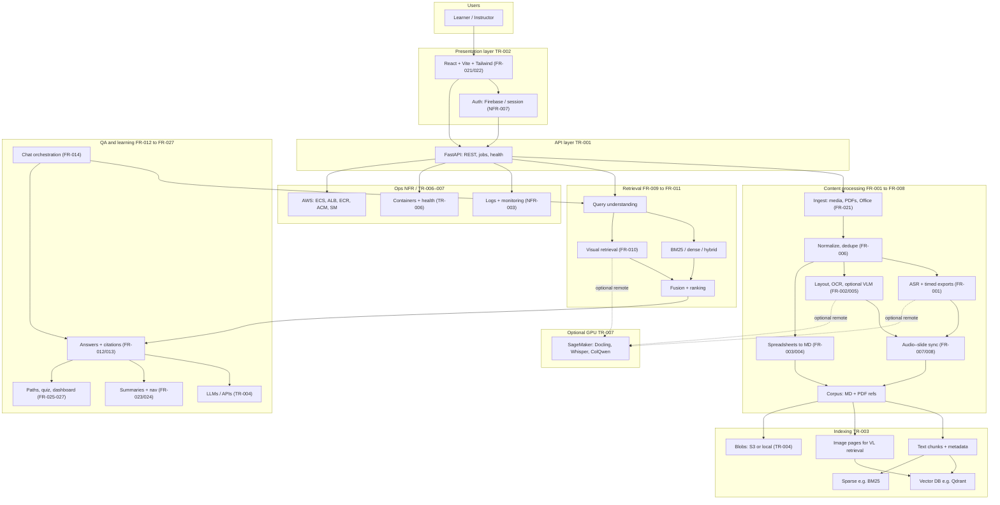

# Capstone Project - HCMUT CS251

> **Educational Content Processing & Retrieval-Augmented Generation System**
> A comprehensive research platform for multimodal lecture processing, intelligent retrieval, and RAG pipeline development.

---

## 🎯 Project Overview

This capstone builds an **educational content processing and Retrieval-Augmented Generation (RAG)** system: ingest multimodal lecture materials, align and structure them, index them for **text and visual** retrieval, and support **question answering with citations**, **lecture-aware summaries**, and **personalized learning** features behind a **modern web UI** and **production-style deployment** options.

The authoritative requirements baseline is **[`docs/requirements.md`](docs/requirements.md)** (Software Requirements Specification): **37** requirements in total—**22** functional (FR-001–FR-022 and extended FRs in that doc), **8** non-functional (NFR-001–NFR-008), and **7** technical (TR-001–TR-007). Highlights from the SRS scope:

- **Content processing**: ASR and timed exports (**FR-001**); documents, OCR, dual outputs (**FR-002**); spreadsheet merged cells and Markdown (**FR-003**, **FR-004**); images / VLM (**FR-005**); deduplication (**FR-006**); audio–slide alignment and temporal navigation (**FR-007**, **FR-008**).
- **Retrieval & QA**: BM25, dense, hybrid (**FR-009**); vision–language retrieval (**FR-010**); query handling (**FR-011**); grounded answers (**FR-012**, **FR-013**); chat decomposition, strategy, and multi-search aggregation (**FR-014**).
- **Product features**: file management and search UI (**FR-021**, **FR-022**); automated summaries and summary navigation (**FR-023**, **FR-024**); learning paths, assessment, and analytics (**FR-025–FR-027**).
- **Non-functional**: latency and scale targets (**NFR-001–NFR-002**); availability, integrity, UX, accessibility, security, and privacy (**NFR-003–NFR-008**).
- **Technical**: FastAPI + async APIs, React 18 + Vite + Tailwind, vector and metadata stores, external LLM/embedding services, Docker, and **cloud-ready** infrastructure (**TR-001–TR-007**).

Research-week folders (`Week03*`, `Week05*`, `Week07*`) map to these requirements incrementally; **`Phase_2_FE_AI_Merge`** is the maintained integrated app (Firebase UI, Qdrant/S3, optional **SageMaker**, **Terraform** for ECS/ALB/ECR).

---

## 🏗️ System Architecture

The following view aligns the implementation shape with the SRS: multimodal **ingest → process → index → retrieve → generate**, plus **auth**, **persistence**, and optional **AWS** hosting.



**Layer summary**

| Layer                  | Role                                           | SRS touchpoints                                  |
| ---------------------- | ---------------------------------------------- | ------------------------------------------------ |
| Client                 | Uploads, search, summaries, dashboards, auth   | FR-021–FR-022, FR-023–FR-027, NFR-005–NFR-008 |
| API                    | Orchestration, RBAC hooks, integration         | TR-001, NFR-003–NFR-004                         |
| Processing             | ASR, OCR/VLM, spreadsheets, sync, corpus       | FR-001–FR-008                                   |
| Storage                | Vectors, sparse index, blobs, metadata         | TR-003, TR-004, NFR-004                          |
| Retrieval & generation | Hybrid + visual search, RAG, chat, LLM         | FR-009–FR-014, TR-004                           |
| Deployment             | Containers, cloud LB TLS, optional managed GPU | TR-006–TR-007, NFR-002–NFR-003                 |

For HTTPS and custom domains on AWS, see [`docs/deployment-alb-acm-custom-domain.md`](docs/deployment-alb-acm-custom-domain.md).

---

## 📦 Project Components

### 🔧 **Utility: Research Paper Downloader** (`downloads/`)

A robust batch downloader for academic PDFs from major venues (arXiv, ACL, CVPR, AAAI, ACM). Features intelligent metadata extraction, automatic retries, and comprehensive logging.

**Key Features**:

- Multi-venue support with site-specific heuristics
- Semantic filename generation from paper metadata
- PDF validation and deduplication
- Exponential backoff retry mechanism

---

### 📅 **Week 03-04: Foundation Development**

#### **MKhoi: ASR & OCR Pipeline** (`Week0304_MKhoi_OCR_ASR/`)

Baseline implementation for extracting text from lecture videos and slides.

**Technologies**:

- **ASR**: PhoWhisper (OpenAI Whisper variant optimized for Vietnamese)
- **OCR**: Tesseract with adaptive preprocessing
- **Audio Processing**: FFmpeg extraction, 16kHz WAV conversion
- **Batch Processing**: Multi-file support with structured outputs

**Output**: Timestamped transcripts (TXT/JSON) + extracted slide text

---

#### **NKhoi: Retrieval Systems Evaluation** (`Week0304_NKhoi_Retrieval/`)

Comprehensive comparison of retrieval methods on MS MARCO dataset.

**Methods Evaluated**:

- **BM25**: Sparse keyword-based retrieval (baseline)
- **Dense**: Sentence-BERT embeddings with cosine similarity
- **Hybrid**: Weighted Sum + Reciprocal Rank Fusion (RRF)

**Key Findings**:

- Dense retrieval achieves 3.6× higher nDCG@10 than BM25 on MS MARCO
- Hybrid methods provide marginal improvements but add complexity
- Vocabulary mismatch severely impacts BM25 on natural language queries

**Metrics**: nDCG@10, Recall@10, latency analysis

---

#### **QPhu: RAG Framework Comparison** (`Week0304_QPhu_RAG_Pipeline/`)

Systematic evaluation of three RAG implementation approaches.

**Frameworks**:

1. **LangChain**: High-level abstractions, extensive integrations
2. **LlamaIndex**: Python-native, data-centric design
3. **Manual**: Custom implementation for full control

**Configuration Options**:

- **Vector Stores**: FAISS (in-memory), Chroma (persistent)
- **LLMs**: OpenAI GPT-4o-mini, Azure OpenAI, Google Gemini, Ollama
- **Benchmarking**: Automated metrics collection and reporting

**Use Case**: Comparative analysis for selecting optimal RAG stack

---

### 📅 **Week 05-06: Advanced Enhancements**

#### **MKhoi: Multi-Model ASR/OCR** (`Week0506_Mkhoi_OCR_ASR/`)

Expanded processing pipeline with multiple AI backends and detailed benchmarking.

**ASR Models**:

- **OpenAI Whisper**: Variants from `tiny` to `large-v3`
- **Google Gemini**: API-based with 2.0/2.5 Flash models
- **DeepSeek**: Alternative API provider

**OCR Enhancements**:

- Advanced preprocessing (OTSU, adaptive thresholding)
- Multi-language support (Vietnamese + English)
- PDF batch processing with Poppler integration

**Deliverables**: Model comparison reports (`asr rank.md`, `ocr rank.md`, `model comparison.md`)

---

#### **NKhoi: Production Retrieval Systems** (`Week0506_NKhoi_Retrieval/`)

Industrial-grade retrieval implementations using specialized tools.

**Upgrades**:

- **Milvus**: Vector database for billion-scale dense retrieval
- **Pyserini**: Lucene-based BM25 with advanced linguistic processing
- **ColPali**: Vision-language retrieval for document images (no OCR needed)

**Performance Improvements**:

- 44 minutes → ~10 seconds for BM25 (Pyserini)
- 6 seconds → <1 second for Dense (Milvus)
- Better tokenization, stemming, and query optimization

**Novel Approach**: ColPali for end-to-end visual retrieval (bypassing OCR errors)

---

### 📅 **Week 07-09: Production Pipeline**

#### **QPhu: Unified Processing Pipeline** (`Week070809_QPhu_Processor/`)

Complete overhaul into production-ready 4-stage pipeline with enterprise features and intelligent processing.

**Architecture Overview**:

- **Stage 1 (Normalizer)**: Format conversion with consistent filename truncation for Windows compatibility
- **Stage 2 (Media Processor)**: Audio/video transcription with multiple export formats (JSON/SRT/VTT/MD)
- **Stage 3 (Docling Processor)**: Smart deduplication avoiding duplicate processing, VLM-powered understanding
- **Stage 4 (Consolidator)**: RAG-ready unified structure with dual-mode outputs

**Core Features**:

- **Smart Deduplication**: Process each file only once, optimal quality source selection
- **Dual RAG Outputs**: Normalized PDFs for image retrieval + Markdown for semantic search
- **Universal Format Support**: 15+ formats (DOCX, PPTX, HTML, Images, Video, Audio, PDF, Excel, CSV, AsciiDoc, WebVTT)

**Advanced Capabilities**:

- **Visual Understanding**: SmolVLM-256M integration for image descriptions and layout analysis
- **Processing Modes**:
  - Full Mode (default): VLM-enabled, highest quality, ~1× speed
  - Balanced Mode (`--no-vlm`): OCR-only with exports, ~2× faster
  - Fast Mode (`--fast-mode`): OCR-only minimal exports, 3-5× faster
- **Intelligent Caching**: MD5-based skip system with `--force` flag to bypass
- **Windows Optimization**: Automatic filename truncation (50 chars + MD5 hash) for 260-char path limit
- **Multi-OCR Support**: RapidOCR (primary), Tesseract, EasyOCR
- **ASR Integration**: Whisper-based transcription for audio/video with configurable models

**Performance Optimizations**:

- GPU acceleration (CUDA support)
- Batch processing with progress tracking
- Exponential backoff retry mechanism
- Comprehensive error handling and logging
- Graceful degradation for unsupported formats

**Output Structure**:

```
stage4_rag_ready/
├── document_name.pdf                    # Image-based RAG (preserved layout)
├── document_name.md                     # Text-based RAG (semantic search)
└── document_name_docling_additional/    # Extracted images/tables
    ├── images/
    └── tables/
```

---

### 📅 **Phase 2 Integrated Application: FE + AI + AWS (`Phase_2_FE_AI_Merge/`)**

Single tree that combines the production-style **FastAPI** backend (Qdrant, S3, optional SageMaker inference), the **React + Firebase** frontend from the FE track, **SageMaker** hosting packs (unified Docling + Whisper + ColQwen container and optional split endpoints), and **Terraform** for AWS: **ECR**, **ECS Fargate**, **Application Load Balancer** with optional **HTTPS** (ACM), auto scaling, and an optional **SageMaker endpoint** aligned with `sagemaker/unified`.

| Area                                 | Path                                                        | Documentation                                                                       |
| ------------------------------------ | ----------------------------------------------------------- | ----------------------------------------------------------------------------------- |
| Folder overview                      | `Phase_2_FE_AI_Merge/`                                    | [`Phase_2_FE_AI_Merge/README.md`](Phase_2_FE_AI_Merge/README.md)                     |
| Integration log                      | `Phase_2_FE_AI_Merge/MERGE_SUMMARY.md`                    | Merge checklist and features                                                        |
| Terraform (ALB, ECS, ECR, SageMaker) | `Phase_2_FE_AI_Merge/terraform/`                          | [`Phase_2_FE_AI_Merge/terraform/README.md`](Phase_2_FE_AI_Merge/terraform/README.md) |
| SageMaker build / deploy             | `Phase_2_FE_AI_Merge/sagemaker/`                          | [`Phase_2_FE_AI_Merge/sagemaker/README.md`](Phase_2_FE_AI_Merge/sagemaker/README.md) |
| HTTPS + custom domain runbook        | `docs/technical/DOCS_deployment-alb-acm-custom-domain.md` | ACM validation, DNS, ALB listeners                                                  |

Use **`Phase_2_FE_AI_Merge`** as the maintained application tree for local development, technical review, deployment, and testing.

---

## 🚀 Quick Start

**📚 For capstone presentations / documentation review:**
Start with **[`docs/INDEX.md`](docs/INDEX.md)** (navigation guide) → **[`docs/CAPSTONE_PRESENTATION_GUIDE.md`](docs/CAPSTONE_PRESENTATION_GUIDE.md)** (presentation strategy and document checklist).

**👨‍💻 For development setup:**
Prerequisites follow **[`docs/requirements.md`](docs/requirements.md)** (TR-001–TR-005, NFR-005–NFR-006): **Python 3.9+**, **FastAPI** backend; **React 18+**, **Vite**, **Tailwind** frontend; **FFmpeg**, **Tesseract**, **Poppler** for media; **GPU** optional locally if you offload heavy inference to APIs or **SageMaker** ([`Phase_2_FE_AI_Merge/sagemaker/README.md`](Phase_2_FE_AI_Merge/sagemaker/README.md)). **Docker** and **Terraform** are for packaging and cloud layout (TR-006–TR-007).

**Shell:** All commands below are **Windows PowerShell** (5.1 or 7+). From another shell, translate `Set-Location`/`Copy-Item`/`.\venv\Scripts\Activate.ps1` as needed. If script activation is blocked, run once: `Set-ExecutionPolicy -Scope CurrentUser RemoteSigned` (or start Python via `.\venv\Scripts\python.exe` without activating).

### Clone and base setup

```powershell
git clone https://github.com/pdz1804/capstone-project.git
Set-Location capstone-project
python -m venv venv
.\venv\Scripts\Activate.ps1
```

### Recommended: merged app (`Phase_2_FE_AI_Merge/`)

Full UI (Firebase), Qdrant/S3-aware API, tests, **Terraform** and **SageMaker** docs—see [**`Phase_2_FE_AI_Merge/README.md`**](Phase_2_FE_AI_Merge/README.md).

```powershell
# Backend (see Phase_2_FE_AI_Merge/backend/README.md for uvicorn/install scripts)
Set-Location Phase_2_FE_AI_Merge\backend
pip install -r requirements.txt
Copy-Item .env.example .env
# Edit .env: keys, Qdrant, S3, SageMaker flags

# Frontend — new PowerShell window at the repository root, then:
Set-Location Phase_2_FE_AI_Merge\frontend
npm install
Copy-Item .env.example .env
npm run dev
```

**URLs (typical):** UI `http://localhost:5173` (or Vite default), API `http://localhost:8000`, docs `http://localhost:8000/docs`. Run the API with the command in `backend/README.md` (e.g. `uvicorn` on `app.main:app`).

**Terraform (local validation only—no apply):**

```powershell
Set-Location Phase_2_FE_AI_Merge\terraform
terraform init -backend=false
terraform fmt -recursive
terraform validate
```

### Research and pipeline folders (optional)

```powershell
Set-Location Week0506_Mkhoi_OCR_ASR\src
python main.py asr --output-dir results\asr @(Get-ChildItem -Path "data\videos\*.mp4" | ForEach-Object { $_.FullName })

Set-Location ..\..\Week0304_NKhoi_Retrieval
jupyter notebook manual_bm25_dense_hybrid.ipynb

Set-Location ..\Week0304_QPhu_RAG_Pipeline
python setup_and_run.py

Set-Location ..\Week070809_QPhu_Processor
python src\pipeline.py input\ output\
# Optional: add --fast-mode where that script supports it
```

Use `Set-Location <repoRoot>` first if you are not already at the repository root (replace `<repoRoot>` with your clone path, e.g. `D:\PDZ\BKU\Learning\LVTN\GD1\Code`).

---

## 🎓 Academic Context

**Course**: CS251 - Capstone Project
**Institution**: Ho Chi Minh City University of Technology (HCMUT)
**Focus**: Applied AI for Educational Content Processing
**Domain**: Information Retrieval, NLP, Multimodal Learning, RAG Systems

**Research Contributions**:

1. Vietnamese-optimized ASR/OCR pipeline for lecture processing
2. Comprehensive retrieval method comparison on MS MARCO
3. RAG framework selection guide for educational Q&A
4. Production-grade retrieval system implementations
5. Multimodal document understanding with Docling
6. Dual-mode RAG processing pipeline (text + image retrieval)
7. Intelligent document deduplication and caching system
8. Performance-quality tradeoff framework (Fast vs Full modes)

---

## 📚 Documentation

**📖 Start Here:**

- **[`docs/INDEX.md`](docs/INDEX.md)** ⭐ — **Central documentation index** with reading paths by role, quick navigation, and complete documentation map. Use this to find what you need.

**Core Documentation**

- **[`docs/README.md`](docs/README.md)** — Documentation hub and overview.
- **[`docs/FEATURES.md`](docs/FEATURES.md)** ⭐ — Comprehensive feature documentation: all 18 features with implementation details, APIs, configurations.

**Authoritative Technical Documents**

- **[`docs/technical/APPLICATION_OVERVIEW.md`](docs/technical/APPLICATION_OVERVIEW.md)** — Product scope, user workflows, architecture summary, features, quality attributes, and engineering assessment.
- **[`docs/technical/API_REFERENCE.md`](docs/technical/API_REFERENCE.md)** — Maintainer-level API reference covering authentication, files, processing, indexing, search, chat, insights, feedback, and operational guidance.
- **[`docs/requirements.md`](docs/requirements.md)** — Software Requirements Specification: functional, non-functional, technical constraints, and verification criteria (37 requirements total).
- **[`docs/technical/GUARDRAIL_CONFIGURATION.md`](docs/technical/GUARDRAIL_CONFIGURATION.md)** ⭐ — AWS Bedrock guardrails configuration, content safety filters, PII protection, implementation details.

**Testing and performance evidence**

- **[`docs/testing/FINAL_APPLICATION_PERFORMANCE_REPORT_20260426.md`](docs/testing/FINAL_APPLICATION_PERFORMANCE_REPORT_20260426.md)** — Final application performance report for technical lead review and capstone protection day.
- **[`docs/jmeter-capacity-tests/runs/README_MAIN_APIS.md`](docs/jmeter-capacity-tests/runs/README_MAIN_APIS.md)** — JMeter runbook and result exports for Process, Index, and Search.
- **[`docs/jmeter-capacity-tests/runs/README_NON_MAIN_APIS.md`](docs/jmeter-capacity-tests/runs/README_NON_MAIN_APIS.md)** — JMeter runbook and result exports for Auth, User, Stats, Upload, Chat, and Insights.

**Architecture and deployment**

- **[`docs/diagram/README_SYSTEM_DOCUMENTATION.md`](docs/diagram/README_SYSTEM_DOCUMENTATION.md)** — System documentation and diagram index.
- **[`docs/technical/DOCS_deployment-alb-acm-custom-domain.md`](docs/technical/DOCS_deployment-alb-acm-custom-domain.md)** — ACM certificates, DNS validation, ALB HTTP→HTTPS, custom domains.
- **[`docs/technical/DOCS_search-cache-redis-setup.md`](docs/technical/DOCS_search-cache-redis-setup.md)** — Redis/ElastiCache search cache setup and operational notes.

**Cost estimation**

- **[`docs/others/AWS_Cost_Estimation_50_Users_Professional.xlsx`](docs/others/AWS_Cost_Estimation_50_Users_Professional.xlsx)** — Detailed cost analysis and scalability projections for 50 concurrent users.

**Merged production application (`Phase_2_FE_AI_Merge/`)**

- **[`Phase_2_FE_AI_Merge/README.md`](Phase_2_FE_AI_Merge/README.md)** — Top-level map: frontend, backend, SageMaker pack, Terraform; local quick paths.
- **[`Phase_2_FE_AI_Merge/MERGE_SUMMARY.md`](Phase_2_FE_AI_Merge/MERGE_SUMMARY.md)** — What was integrated from FE and AI service tracks.
- **[`Phase_2_FE_AI_Merge/backend/README.md`](Phase_2_FE_AI_Merge/backend/README.md)** — FastAPI layout, Qdrant/BM25/hybrid/image retrieval, S3 vs local storage.
- **[`Phase_2_FE_AI_Merge/terraform/README.md`](Phase_2_FE_AI_Merge/terraform/README.md)** — AWS resources (ECR, ECS, ALB, optional HTTPS, optional SageMaker) and safe Terraform checks.
- **[`Phase_2_FE_AI_Merge/sagemaker/README.md`](Phase_2_FE_AI_Merge/sagemaker/README.md)** — Unified container, ECR push, deploy/delete scripts, backend environment variables.

**Research milestones and utilities**

- READMEs inside **`Week0304_*`**, **`Week0506_*`**, **`Week070809_QPhu_Processor/`**, and **`downloads/`** (datasets and paper references).
- **`DETAILED_PIPELINE_FLOWS.md`**, **`Week0506_*/`** comparison markdowns, and other week-specific notes where present.

---

## 🔬 Research Papers & References

The `downloads/` directory contains a curated collection of research papers covering:

- Retrieval-Augmented Generation (RAG) architectures
- Dense retrieval methods (DPR, ColBERT, ANCE)
- Multimodal learning (CLIP, LayoutLM, Docling)
- Speech recognition (Whisper, Wav2Vec 2.0)
- OCR and document understanding

---

## 🤝 Contributing

This is an academic capstone project. For collaboration or questions:

- **Repository**: [github.com/pdz1804/capstone-project](https://github.com/pdz1804/capstone-project)
- **Issues**: Use GitHub Issues for bug reports or feature requests
- **Contact**: See individual weekly READMEs for team member information

---

## 📄 License

This project is licensed under the MIT License - see the [LICENSE](LICENSE) file for details.

Copyright (c) 2025 Quang Phu, Ngoc Khoi, and Minh Khoi

---

## 🙏 Acknowledgments

Open-source models, APIs, and platforms that this codebase builds on (see also TR-004–TR-005 and integration notes in [`docs/requirements.md`](docs/requirements.md)):

- **OpenAI** — Whisper and LLM APIs used in ASR and generation experiments.
- **Google** — Gemini (multimodal/API), **Firebase** (authentication in the merged frontend stack), and embedding-related tooling referenced in weekly work.
- **Hugging Face** — `transformers`, model hubs, and pretrained checkpoints (e.g. ColQwen, sentence encoders).
- **IBM** — **Docling** and related document-understanding components.
- **Qdrant** — vector database used in the Phase 2 AI service and merge backend.
- **Amazon Web Services** — **S3**, **SageMaker** real-time inference, and (via Terraform) **ECS**, **ECR**, **ALB**, **ACM** for optional cloud deployment.
- **HashiCorp** — **Terraform** for infrastructure as code in `Phase_2_FE_AI_Merge/terraform/`.
- **Pyserini / Anserini & Milvus** — retrieval stacks explored in research-week milestones.
- **LangChain & LlamaIndex** — RAG framework comparisons (early-phase notebooks and prototypes).
- **FFmpeg, Tesseract, Poppler** — media, OCR, and PDF tooling (TR-005).
- **React, Vite, Tailwind CSS** — frontend stack (TR-002).

---

**Version:** 1.0
**Last Updated:** April 28, 2026

**Team:** MKhoi, NKhoi, QPhu.
