# Diagrams Plan for BK-MInD Capstone Thesis

## Overview

For the HCMUT capstone thesis, **6-8 diagrams** are needed in total, split into two categories: **standard software engineering diagrams** (required for any thesis) and **AI/ML-specific diagrams** (needed because the core contribution is a multimodal RAG pipeline).

A **Deployment Diagram** is absolutely needed alongside the **Architecture Diagram** -- they are different diagrams serving different purposes.

---

## Category 1: Standard Software Engineering Diagrams (4-5 diagrams)

### 1. System Architecture Diagram (So do kien truc he thong)

- **What it shows**: High-level view of ALL major software components and how they communicate -- Frontend (React), Backend (FastAPI), Model Server (ColQwen on GPU), Database (PostgreSQL + pgvector), Cache/Queue (Redis), Object Storage (S3)
- **Focus**: Logical components, APIs, protocols (REST, WebSocket), data flow directions
- **NOT about**: Physical machines or cloud resources -- that is the deployment diagram

### 2. Deployment Diagram (So do trien khai -- UML Deployment Diagram)

- **What it shows**: How software maps to **physical/cloud infrastructure** -- AWS ECS Fargate (backend + frontend services), EC2 g4dn.xlarge (ColQwen model server), ALB (load balancer), ECR (container registry), RDS (database), S3 (storage), CloudWatch (monitoring)
- **Focus**: Nodes (servers/containers), artifacts (Docker images), communication paths (ports, protocols, VPC networking)
- **Why needed**: The system deploys to AWS with Terraform (36 resources as per the deployment status)

### 3. Use Case Diagram (So do Use Case)

- **What it shows**: Actors (Student, possibly Admin/Lecturer) and their interactions with the system -- Upload Document, Search/Ask Question, View Summary, Generate Study Roadmap, Process Lecture Video
- **Why needed**: Standard requirement for BKU thesis -- shows functional scope at a glance

### 4. Sequence Diagrams (So do tuan tu) -- 2-3 diagrams for key flows

- **Flow 1**: Document Upload and Processing -- User -> Frontend -> Backend -> S3 (store) -> Celery Worker -> OCR/ASR -> Chunking -> Embedding -> Index (pgvector + BM25)
- **Flow 2**: RAG Query -- User -> Frontend -> Backend -> Hybrid Retrieval (BM25 + Dense + ColQwen Visual) -> RRF Reranking -> LLM Generation -> Response with Citations
- **Flow 3** (optional): Study Roadmap Generation
- **Why needed**: Shows the temporal interaction between components, critical for reviewers to understand how the system actually works

### 5. Entity-Relationship Diagram - ERD (So do quan he thuc the)

- **What it shows**: Database schema -- Documents, Chunks, Embeddings (pgvector), Users, Sessions, ProcessingJobs, etc.
- **Why needed**: Standard requirement; shows data model and relationships

---

## Category 2: AI/ML-Specific Diagrams (2-3 diagrams)

### 6. Multimodal RAG Pipeline Architecture Diagram (So do kien truc pipeline RAG da phuong thuc)

- **What it shows**: The core AI contribution -- the processing pipeline from raw input (video, slides, PDF) through:
  - **Ingestion**: Video -> ASR (Whisper/PhoWhisper) -> Transcript; PDF/Slides -> OCR (Docling/RapidOCR) -> Text + Layout; Pages -> VLM (SmolVLM) -> Visual descriptions
  - **Indexing**: Text Chunking -> Sparse (BM25) + Dense (Sentence-BERT) embeddings; Page Images -> ColQwen multi-vector embeddings
  - **Retrieval**: Hybrid retrieval (sparse + dense + visual) -> RRF fusion -> Reranking
  - **Generation**: Retrieved context -> LLM -> Answer with citations
- **This is the MOST IMPORTANT diagram for the thesis** because it shows the core technical contribution (the "dual-stream indexing architecture" described in the project scope)

### 7. Component Diagram (So do thanh phan) -- or Module Dependency Diagram

- **What it shows**: Software modules and their dependencies -- `processor/` (OCR, ASR, Docling), `chunking/` (text splitters), `retrieval/` (BM25, Dense, Hybrid, Visual), `generation/` (LLM), `evaluation/` (benchmarks)
- **Focus**: Internal software structure, showing how code modules depend on each other
- **Why useful**: The system has multiple interchangeable retrieval strategies

### 8. Activity Diagram (So do hoat dong) -- for Document Processing Workflow

- **What it shows**: The workflow/decision logic -- e.g., when a document is uploaded: detect format -> if video: extract audio -> ASR; if PDF: OCR -> layout analysis; if slides: page-to-image -> VLM description -> chunk -> embed -> index
- **Focus**: Decision points, parallel processing paths, error handling

---

## Summary Table

| #  | Diagram Name                 | UML Type        | Purpose                                    | Priority   |
|----|------------------------------|-----------------|--------------------------------------------|------------|
| 1  | System Architecture Diagram  | Informal / C4   | High-level components + communication      | Must       |
| 2  | Deployment Diagram           | UML Deployment  | Cloud infrastructure mapping               | Must       |
| 3  | Use Case Diagram             | UML Use Case    | Functional scope + actors                  | Must       |
| 4  | Sequence Diagrams (2-3)      | UML Sequence    | Key flow interactions                      | Must       |
| 5  | ERD                          | ER Diagram      | Database schema                            | Must       |
| 6  | RAG Pipeline Diagram         | Custom/Flowchart| Core AI architecture (main contribution)   | Must       |
| 7  | Component Diagram            | UML Component   | Software module structure                  | Should     |
| 8  | Activity Diagram             | UML Activity    | Processing workflow + decisions             | Should     |

**Minimum**: 6 diagrams (1-6) -- this covers what any HCMUT thesis committee expects.

**Recommended**: All 8 -- gives a complete picture and shows engineering rigor.

---

## Key Distinction: Architecture Diagram vs. Deployment Diagram

|                    | Architecture Diagram                                     | Deployment Diagram                                                        |
|--------------------|----------------------------------------------------------|---------------------------------------------------------------------------|
| **Shows**          | Logical software components                              | Physical/cloud infrastructure                                             |
| **Focus**          | What the system is made of                               | Where the system runs                                                     |
| **Example**        | "Frontend communicates with Backend via REST API"        | "Frontend runs on ECS Fargate (256 CPU, 512MB) behind ALB in us-west-2"  |
| **Abstraction**    | Technology-agnostic (could run anywhere)                 | Technology-specific (AWS ECS, EC2, ALB, RDS)                              |

They are **complementary** -- both are needed.

---

## Recommended Tools for Drawing

- **draw.io** (free, exports to PDF/PNG) -- good for polished thesis diagrams
- **Mermaid** (code-based, version-controllable) -- good for keeping diagrams in markdown docs
- **Lucidchart** (polished UML output) -- good for formal UML compliance

---
---

## Diagram 1: System Architecture Diagram

This diagram shows the **full target application architecture** — not just AI services.
The system currently runs locally for AI services only (Phase 2 local development).
Planned application features (user management, learning paths, summaries, etc.) are
shown with dashed borders to indicate they are not yet implemented.

Note: Whisper (ASR), Docling (document parsing with OCR + VLM), and ColQwen (visual
retrieval model) all require GPU acceleration, so they are co-located on the same GPU server.

Note: Stage 2 (Media Processing) reads from the **original raw input directory** — not from
Stage 1 output. Stage 3 (Docling) reads from Stage 1 normalized PDFs. Stage 4 consolidates
all stage outputs.

```mermaid
graph TB
    %% ── External ──
    User["User (Student)"]

    %% ── Frontend Layer ──
    subgraph Frontend["Frontend (React 18 + Vite + TailwindCSS)"]
        direction TB
        UI_Upload["Upload UI<br/>(Drag-and-Drop)"]
        UI_Processing["Processing Status UI"]
        UI_Search["Search / Q&A UI"]
        UI_Results["Results Display<br/>(Markdown + KaTeX + Images)"]
    end

    %% ── Backend Layer ──
    subgraph Backend["Backend (FastAPI - Python)"]
        direction TB
        API_Gateway["REST API Gateway"]

        subgraph Routes["API Routes"]
            R_Files["/api/files<br/>File Upload & Management"]
            R_Pipeline["/api/pipeline<br/>Processing Control"]
            R_Search["/api/search<br/>Query & Retrieval"]
            R_Images["/api/images<br/>Image Serving"]
        end

        subgraph PlannedRoutes["Planned API Routes"]
            R_Auth["/api/auth<br/>Authentication & Users"]
            R_Summaries["/api/summaries<br/>Lecture Summaries"]
            R_Roadmaps["/api/roadmaps<br/>Learning Paths"]
            R_Sync["/api/sync<br/>Audio-Slide Sync"]
        end

        subgraph Processing["Processing Pipeline (4-Stage Orchestrator)"]
            direction TB

            subgraph Stage1["Stage 1: Document Normalization"]
                Normalizer["Document Normalizer<br/>(DOC, PPT, HTML, etc.)"]
                LibreOffice["LibreOffice Converter<br/>(Non-PDF to PDF)"]
            end

            subgraph Stage2["Stage 2: Media Processing"]
                MediaProc["Media Processor"]
                MoviePy["MoviePy<br/>(Video to Audio WAV + Frame JPG)"]
                WhisperClient["Whisper ASR<br/>(Delegates to GPU Server)"]
                FrameExtract["Frame Extractor<br/>(OpenCV + ImageHash Dedup)"]
                ChunkEnhancer["Chunk Enhancer<br/>(LLM Descriptions + Metadata)"]
            end

            subgraph Stage3["Stage 3: Document Parsing (GPU)"]
                DoclingNote["Docling<br/>(Multi-format to Markdown +<br/>Images + Tables)"]
                OCR_Engine["OCR Engine<br/>(RapidOCR / Tesseract / EasyOCR)"]
                VLM_Desc["VLM Image Descriptions<br/>(Granite Docling)"]
            end

            subgraph Stage4["Stage 4: RAG-Ready Consolidation"]
                Consolidator["Consolidator<br/>(Unify all outputs into<br/>per-document RAG structure)"]
            end
        end

        subgraph Chunking["Chunking Module"]
            TextChunker["Text Chunker<br/>(Recursive / Semantic)"]
        end

        subgraph Retrieval["Retrieval Module"]
            BM25["BM25 Sparse Retriever"]
            Dense["Dense Retriever<br/>(Sentence-BERT)"]
            Hybrid["Hybrid Retriever<br/>(RRF Fusion)"]
            ImageRetriever["Image Retriever<br/>(ColQwen Late-Interaction)"]
        end

        subgraph Generation["Generation Module"]
            LLM["LLM Answer Generator<br/>(with Citations)"]
        end

        UnifiedPipeline["Unified RAG Pipeline<br/>(Orchestrator)"]

        subgraph PlannedFeatures["Planned Application Features"]
            direction TB
            AuthModule["User Management<br/>& Authentication<br/>(Signup / Login / Roles)"]
            SummaryGen["Lecture Summary<br/>Generator<br/>(AI Summarization)"]
            LearningPath["Personalized Learning<br/>Paths & Roadmaps"]
            AudioSlideSync["Audio-Slide Temporal<br/>Synchronization"]
            SpreadsheetParser["Advanced Spreadsheet<br/>Parsing Engine"]
            NotificationSvc["Notification Service<br/>(Progress / Alerts)"]
        end
    end

    %% ── GPU Server (Whisper + Docling + ColQwen co-located) ──
    subgraph GPUServer["GPU Model Server (FastAPI)<br/>Co-located: Whisper + Docling + ColQwen"]
        direction TB

        subgraph WhisperService["Whisper ASR Service (GPU)"]
            Whisper_Infer["Whisper Inference<br/>(Audio WAV to Transcript)"]
            Whisper_Model["Whisper Model<br/>(GPU-Accelerated)"]
            Whisper_Out["Output: Transcript Text<br/>(Timestamped Segments)"]
        end

        subgraph DoclingService["Docling Processing Service (GPU)"]
            Docling_Parse["Document Parsing<br/>(PDF, XLS, CSV, Image, MD, TXT)"]
            Docling_OCR["OCR<br/>(RapidOCR on GPU)"]
            Docling_VLM["VLM Picture Descriptions<br/>(Granite Docling)"]
            Docling_Out["Output: Markdown + Images + Tables"]
        end

        subgraph ColQwenService["ColQwen Inference Service"]
            MS_EmbedImg["/embed-images<br/>Image to Multi-Vector"]
            MS_EmbedQuery["/embed-query<br/>Query to Embedding"]
            MS_Score["/score<br/>MaxSim Scoring"]
            MS_Health["/health<br/>GPU Stats"]
            ColQwen["ColQwen 2.5 Model<br/>(8-bit Quantized)"]
        end
    end

    %% ── Storage ──
    subgraph Storage["Storage Layer"]
        LocalFS["Local File System<br/>(Current: uploads / output)"]
        CloudVectorDB["Cloud Vector Database<br/>(TBD: Qdrant / Pinecone<br/>/ OpenSearch / S3 Vectors)"]
        ObjectStorage["Object Storage<br/>(AWS S3 - Planned)"]
    end

    %% ── Planned: Database ──
    subgraph PlannedDB["Database (Planned)"]
        RelationalDB["PostgreSQL / RDS<br/>(Users, Sessions, Metadata)"]
        CacheDB["Redis / ElastiCache<br/>(Sessions, Job Queue, Cache)"]
    end

    %% ── Connections: User to Frontend ──
    User -->|"HTTP"| Frontend

    %% ── Connections: Frontend to Backend ──
    UI_Upload -->|"POST /api/files/upload"| API_Gateway
    UI_Processing -->|"GET /api/pipeline/status"| API_Gateway
    UI_Search -->|"POST /api/search"| API_Gateway
    API_Gateway --> R_Files
    API_Gateway --> R_Pipeline
    API_Gateway --> R_Search
    API_Gateway --> R_Images

    %% ── Connections: Processing Pipeline Internal ──
    R_Files --> LocalFS
    R_Pipeline --> UnifiedPipeline
    UnifiedPipeline --> Normalizer
    Normalizer --> LibreOffice
    UnifiedPipeline -->|"Original Input Files<br/>(Videos, Audio, Media)"| MediaProc
    LibreOffice -->|"Normalized PDFs"| Stage3
    MediaProc --> MoviePy
    MoviePy -->|"WAV Audio"| WhisperClient
    MoviePy -->|"Raw Frames"| FrameExtract
    WhisperClient -->|"Transcript Chunks"| ChunkEnhancer
    FrameExtract -->|"Deduplicated Frames"| ChunkEnhancer
    ChunkEnhancer -->|"Enhanced Chunks + Metadata"| Consolidator
    Stage3 -->|"Markdown + Images + Tables"| Consolidator
    Consolidator -->|"RAG-Ready Structure"| TextChunker

    %% ── Connections: Backend Stage 2 to GPU Server (Whisper) ──
    WhisperClient -->|"HTTP REST<br/>(Audio WAV for Transcription)"| Whisper_Infer
    Whisper_Infer --> Whisper_Model
    Whisper_Model --> Whisper_Out

    %% ── Connections: Backend Stage 3 to GPU Server (Docling) ──
    DoclingNote -->|"HTTP REST<br/>(Document Parsing Request)"| Docling_Parse
    OCR_Engine -->|"GPU-accelerated OCR"| Docling_OCR
    VLM_Desc -->|"GPU-accelerated VLM"| Docling_VLM
    Docling_Parse --> Docling_OCR
    Docling_Parse --> Docling_VLM
    Docling_OCR --> Docling_Out
    Docling_VLM --> Docling_Out

    %% ── Connections: Retrieval ──
    R_Search --> UnifiedPipeline
    UnifiedPipeline --> Hybrid
    Hybrid --> BM25
    Hybrid --> Dense
    UnifiedPipeline --> ImageRetriever
    UnifiedPipeline --> LLM
    TextChunker --> BM25
    TextChunker --> Dense

    %% ── Connections: Backend to GPU Server (ColQwen) ──
    ImageRetriever -->|"POST /embed-images<br/>POST /embed-query<br/>POST /score<br/>(HTTP REST)"| ColQwenService
    MS_EmbedImg --> ColQwen
    MS_EmbedQuery --> ColQwen
    MS_Score --> ColQwen

    %% ── Connections: Backend to Storage ──
    Dense -->|"Store/Query<br/>Dense Embeddings"| CloudVectorDB
    ImageRetriever -->|"Store/Query<br/>Multi-Vector Embeddings"| CloudVectorDB
    Normalizer -->|"Store Raw Files<br/>(Planned)"| ObjectStorage

    %% ── Connections: Planned Features ──
    API_Gateway -.-> R_Auth
    API_Gateway -.-> R_Summaries
    API_Gateway -.-> R_Roadmaps
    API_Gateway -.-> R_Sync
    R_Auth -.-> AuthModule
    R_Summaries -.-> SummaryGen
    R_Roadmaps -.-> LearningPath
    R_Sync -.-> AudioSlideSync
    AuthModule -.->|"User Data"| RelationalDB
    SummaryGen -.->|"Cache Results"| CacheDB
    LearningPath -.->|"User Progress"| RelationalDB
    NotificationSvc -.->|"Job Queue"| CacheDB

    %% ── Styles ──
    classDef frontend fill:#4FC3F7,stroke:#0277BD,color:#000
    classDef backend fill:#81C784,stroke:#2E7D32,color:#000
    classDef gpu fill:#FFB74D,stroke:#E65100,color:#000
    classDef storage fill:#CE93D8,stroke:#6A1B9A,color:#000
    classDef placeholder fill:#BDBDBD,stroke:#616161,color:#000,stroke-dasharray: 5 5
    classDef user fill:#FFF,stroke:#333,color:#000
    classDef stage fill:#A5D6A7,stroke:#1B5E20,color:#000

    class User user
    class Frontend,UI_Upload,UI_Processing,UI_Search,UI_Results frontend
    class Backend,API_Gateway,Routes,R_Files,R_Pipeline,R_Search,R_Images backend
    class Processing,Stage1,Normalizer,LibreOffice stage
    class Stage2,MediaProc,MoviePy,WhisperClient,FrameExtract,ChunkEnhancer stage
    class Stage3,DoclingNote,OCR_Engine,VLM_Desc stage
    class Stage4,Consolidator stage
    class Chunking,TextChunker,Retrieval,BM25,Dense,Hybrid,ImageRetriever,Generation,LLM,UnifiedPipeline backend
    class GPUServer,WhisperService,Whisper_Infer,Whisper_Model,Whisper_Out,DoclingService,Docling_Parse,Docling_OCR,Docling_VLM,Docling_Out,ColQwenService,MS_EmbedImg,MS_EmbedQuery,MS_Score,MS_Health,ColQwen gpu
    class LocalFS,ObjectStorage storage
    class CloudVectorDB placeholder
    class PlannedRoutes,R_Auth,R_Summaries,R_Roadmaps,R_Sync planned
    class PlannedFeatures,AuthModule,SummaryGen,LearningPath,AudioSlideSync,SpreadsheetParser,NotificationSvc planned
    class PlannedDB,RelationalDB,CacheDB planned
```

---
---

## Diagram 2: Deployment Diagram

This diagram shows the **full target deployment architecture** — not just AI services.
It accurately reflects what is already provisioned via Terraform (ECS Fargate, ALB, ECR,
CloudWatch, Auto-Scaling) and what exists separately (EC2 GPU instance).
Whisper, Docling, and ColQwen are co-located on the same GPU server since all require GPU.
Planned infrastructure (RDS, ElastiCache, CloudFront, Cognito, etc.) is shown with
dashed borders to indicate it is not yet provisioned.

```mermaid
graph TB
    %% ── External ──
    Internet["Internet<br/>(Student Browser)"]

    subgraph AWS["AWS Cloud (us-west-2)"]

        subgraph VPC["Default VPC"]

            %% ── ALB ──
            subgraph ALB_Block["Application Load Balancer<br/>(rag-pipeline-alb)"]
                ALB_HTTP["HTTP Listener :80"]
                ALB_Rule_Frontend["Default Rule<br/>/* --> Frontend TG"]
                ALB_Rule_API["Priority 1 Rule<br/>/api/* --> Backend TG"]
                ALB_SG["ALB Security Group<br/>(Allow HTTP/HTTPS Inbound)"]
            end

            %% ── ECS ──
            subgraph ECS["ECS Cluster - Fargate<br/>(rag-pipeline-cluster)<br/>Container Insights: Enabled"]

                subgraph Backend_Service["Backend Service<br/>(rag-pipeline-cluster-backend-service)"]
                    Backend_Task["Backend Task Definition<br/>Image: ECR backend:latest<br/>CPU: 512 | Memory: 1024 MB<br/>Port: 5000<br/>Health: /health<br/><br/>Runs: FastAPI API + Processing<br/>Pipeline Orchestrator + Retrieval<br/>+ Chunking + Generation"]
                end

                subgraph Frontend_Service["Frontend Service<br/>(rag-pipeline-cluster-frontend-service)"]
                    Frontend_Task["Frontend Task Definition<br/>Image: ECR frontend:latest<br/>CPU: 256 | Memory: 512 MB<br/>Port: 3000 (Nginx)<br/>Health: /health<br/><br/>Runs: React 18 + Vite build<br/>served by Nginx"]
                end

                ECS_SG["ECS Tasks Security Group<br/>(Allow from ALB SG + Inter-task)"]
            end

            %% ── Auto-Scaling ──
            subgraph AutoScaling["Auto-Scaling Policies"]
                Backend_AS["Backend Auto-Scaling<br/>Min: 1 | Max: 10<br/>CPU Target: 70%<br/>Memory Target: 80%<br/>Scale-out: 60s | Scale-in: 300s"]
                Frontend_AS["Frontend Auto-Scaling<br/>Min: 1 | Max: 5<br/>CPU Target: 70%<br/>Memory Target: 80%"]
            end

            %% ── EC2 GPU Server (Whisper + Docling + ColQwen co-located) ──
            subgraph EC2_Block["EC2 Instance<br/>(g4dn.xlarge - NVIDIA T4 16GB GPU)"]
                GPU_Whisper["Whisper ASR<br/>(GPU-Accelerated)<br/>- Audio WAV to Transcript<br/>- Timestamped Segments"]
                GPU_Docling["Docling Processing<br/>(GPU-Accelerated)<br/>- Document Parsing<br/>- OCR (RapidOCR)<br/>- VLM Image Descriptions<br/>(Granite Docling)"]
                GPU_ColQwen["ColQwen Model Server<br/>FastAPI :8000<br/>ColQwen 2.5 (8-bit Quantized)<br/>Endpoints: /embed-images,<br/>/embed-query, /score, /health"]
            end

        end

        %% ── ECR ──
        subgraph ECR["Elastic Container Registry"]
            ECR_Backend["rag-pipeline-backend<br/>(Scan on Push: Enabled<br/>Retain: 10 images)"]
            ECR_Frontend["rag-pipeline-frontend<br/>(Scan on Push: Enabled<br/>Retain: 10 images)"]
        end

        %% ── CloudWatch ──
        subgraph CloudWatch["CloudWatch Logging"]
            CW_Backend["/ecs/rag-pipeline-cluster/backend<br/>(Retention: 7 days)"]
            CW_Frontend["/ecs/rag-pipeline-cluster/frontend<br/>(Retention: 7 days)"]
        end

        %% ── IAM ──
        subgraph IAM["IAM Roles"]
            IAM_Backend_Exec["Backend Task Execution Role<br/>(ECR Pull + CloudWatch Logs)"]
            IAM_Backend_Task["Backend Task Role"]
            IAM_Frontend_Exec["Frontend Task Execution Role<br/>(ECR Pull + CloudWatch Logs)"]
            IAM_Frontend_Task["Frontend Task Role"]
        end

        %% ── Planned / Not Yet Provisioned ──
        subgraph Planned["Planned Infrastructure (Not Yet Provisioned)"]
            S3["AWS S3<br/>Object Storage<br/>(File Uploads)"]
            VectorDB["Cloud Vector Database<br/>(TBD: Qdrant / Pinecone<br/>/ OpenSearch / S3 Vectors)"]
        end

        %% ── Planned: Data & Auth Services ──
        subgraph PlannedData["Planned Data & Auth Services"]
            RDS["Amazon RDS<br/>(PostgreSQL)<br/>Users, Sessions, Metadata,<br/>Learning Progress"]
            ElastiCache["Amazon ElastiCache<br/>(Redis)<br/>Session Store, Job Queue,<br/>Response Cache"]
            Cognito["Amazon Cognito<br/>User Authentication<br/>& Authorization"]
            SQS["Amazon SQS<br/>Async Processing<br/>Job Queue"]
        end

        %% ── Planned: CDN & Edge ──
        subgraph PlannedEdge["Planned CDN & Edge"]
            CloudFront["Amazon CloudFront<br/>CDN for Static Assets<br/>& API Caching"]
            WAF["AWS WAF<br/>Web Application Firewall"]
        end

    end

    %% ── Connections: Internet to ALB ──
    Internet -->|"HTTP :80"| ALB_HTTP
    ALB_HTTP --> ALB_Rule_Frontend
    ALB_HTTP --> ALB_Rule_API

    %% ── Connections: ALB to ECS ──
    ALB_Rule_Frontend -->|"Forward to :3000"| Frontend_Task
    ALB_Rule_API -->|"Forward to :5000"| Backend_Task

    %% ── Connections: ECS to ECR ──
    Backend_Task -.->|"Pull Image"| ECR_Backend
    Frontend_Task -.->|"Pull Image"| ECR_Frontend

    %% ── Connections: ECS to CloudWatch ──
    Backend_Task -.->|"awslogs driver"| CW_Backend
    Frontend_Task -.->|"awslogs driver"| CW_Frontend

    %% ── Connections: Auto-Scaling ──
    Backend_AS -.->|"Scale"| Backend_Service
    Frontend_AS -.->|"Scale"| Frontend_Service

    %% ── Connections: IAM ──
    IAM_Backend_Exec -.->|"Assigned to"| Backend_Task
    IAM_Frontend_Exec -.->|"Assigned to"| Frontend_Task

    %% ── Connections: Backend to GPU Server ──
    Backend_Task -->|"HTTP REST<br/>Audio Transcription<br/>(Whisper GPU)"| GPU_Whisper
    Backend_Task -->|"HTTP REST<br/>Document Parsing<br/>(Docling GPU)"| GPU_Docling
    Backend_Task -->|"HTTP :8000<br/>Embed/Score<br/>(ColQwen GPU)"| GPU_ColQwen

    %% ── Connections: Backend to Planned ──
    Backend_Task -.->|"Store/Retrieve Files<br/>(Planned)"| S3
    Backend_Task -.->|"Store/Query Embeddings<br/>(Planned)"| VectorDB

    %% ── Connections: Planned Data & Auth ──
    Backend_Task -.->|"User Data, Progress<br/>(Planned)"| RDS
    Backend_Task -.->|"Cache, Sessions<br/>(Planned)"| ElastiCache
    Backend_Task -.->|"Auth Tokens<br/>(Planned)"| Cognito
    Backend_Task -.->|"Async Jobs<br/>(Planned)"| SQS

    %% ── Connections: Planned CDN & Edge ──
    Internet -.->|"HTTPS (Planned)"| CloudFront
    CloudFront -.->|"Origin"| ALB_HTTP
    CloudFront -.->|"Static Assets"| S3
    WAF -.->|"Protect"| CloudFront

    %% ── Styles ──
    classDef aws fill:#FF9900,stroke:#CC7A00,color:#000
    classDef ecs fill:#FF6F00,stroke:#BF360C,color:#FFF
    classDef alb fill:#4DB6AC,stroke:#00695C,color:#000
    classDef ecr fill:#7986CB,stroke:#283593,color:#FFF
    classDef cw fill:#4DD0E1,stroke:#006064,color:#000
    classDef iam fill:#A1887F,stroke:#4E342E,color:#FFF
    classDef gpu fill:#FFB74D,stroke:#E65100,color:#000
    classDef planned fill:#BDBDBD,stroke:#616161,color:#000,stroke-dasharray: 5 5
    classDef internet fill:#FFF,stroke:#333,color:#000

    class Internet internet
    class ALB_Block,ALB_HTTP,ALB_Rule_Frontend,ALB_Rule_API,ALB_SG alb
    class ECS,Backend_Service,Frontend_Service,Backend_Task,Frontend_Task,ECS_SG ecs
    class AutoScaling,Backend_AS,Frontend_AS ecs
    class ECR,ECR_Backend,ECR_Frontend ecr
    class CloudWatch,CW_Backend,CW_Frontend cw
    class IAM,IAM_Backend_Exec,IAM_Backend_Task,IAM_Frontend_Exec,IAM_Frontend_Task iam
    class EC2_Block,GPU_Whisper,GPU_Docling,GPU_ColQwen gpu
    class Planned,S3,VectorDB planned
    class PlannedData,RDS,ElastiCache,Cognito,SQS planned
    class PlannedEdge,CloudFront,WAF planned
```

