# AI Service Pipelines   Comprehensive & Accurate Documentation

**Version:** 3.0 (Verified with Actual Code)  
**Date:** May 2026  
**Scope:** Phase 2 AI Service   7-stage processing + indexing + search pipelines

---

## Executive Summary

The Phase 2 AI Service implements a **sophisticated 7-stage pipeline** that intelligently routes different file types through specialized processors:

- **Stage 1:** Normalization (format detection & conversion)
- **Stage 2:** Media Processing (audio/video extraction & transcription)
- **Stage 3:** Docling Document Processing (general-purpose document parsing)
- **Stage 3b:** Excel Processing (custom XML parser + table-aware chunking)
- **Stage 3c:** DOCX Processing (custom XML parser + heading-aware chunking)  
- **Stage 3d:** PDF Processing (born-digital custom parser + heading-aware chunking)
- **Stage 4:** RAG-Ready Consolidation

Each stage 3 variant (3b, 3c, 3d) **runs conditionally** based on whether its input type is detected in Stage 1 outputs.

---

## Table of Contents

1. [Pipeline Architecture Overview](#pipeline-architecture-overview)
2. [7-Stage Pipeline Model](#7-stage-pipeline-model)
3. [Stage 1: Normalization](#stage-1-normalization)
4. [Stage 2: Media Processing](#stage-2-media-processing)
5. [Stage 3: Main Document Processing (Docling)](#stage-3-main-document-processing-docling)
6. [Stage 3b: Excel Processing (Conditional)](#stage-3b-excel-processing-conditional)
7. [Stage 3c: DOCX Processing (Conditional)](#stage-3c-docx-processing-conditional)
8. [Stage 3d: PDF Processing (Conditional)](#stage-3d-pdf-processing-conditional)
9. [Stage 4: RAG-Ready Consolidation](#stage-4-rag-ready-consolidation)
10. [Indexing Pipeline](#indexing-pipeline)
11. [Search & Retrieval Pipeline](#search--retrieval-pipeline)
12. [Storage Architecture](#storage-architecture)

---

## Pipeline Architecture Overview

This document covers the **Processing, Indexing, and Search/Retrieval pipelines** of the Phase 2 AI Service. It does not cover the overall system architecture (API server, UI, storage layer, etc.), only the pipeline flows.

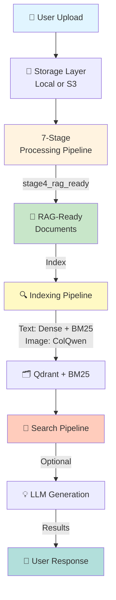

---

## 7-Stage Pipeline Model

### Complete Pipeline Architecture

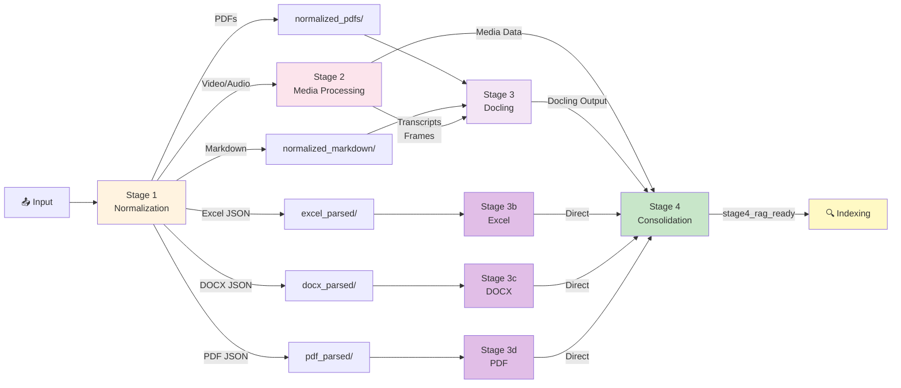

### Stage Summary Table

| Stage | Name | Processor | Input | Output | Condition |
|-------|------|-----------|-------|--------|-----------|
| **1** | Normalization | DocumentNormalizer | Raw files | Normalized PDFs/JSON/Markdown | Always runs |
| **2** | Media Processing | MediaProcessor | MP4, WAV, MP3, etc. | Transcripts, Frames, Audio | If media files present |
| **3** | Document Processing (Docling) | DocumentConverter | Normalized PDFs, Markdown | Markdown with extracted tables and images | Always runs |
| **3b** | Excel Processing | ExcelPreprocessor | excel_parsed/ JSON | RAG-ready chunks | If `excel_parsed/` exists |
| **3c** | DOCX Processing | DocxPreprocessor | docx_parsed/ JSON | RAG-ready chunks | If `docx_parsed/` exists |
| **3d** | PDF Processing | PdfPreprocessor | pdf_parsed/ JSON | RAG-ready chunks | If `pdf_parsed/` exists |
| **4** | Consolidation | Stage4Consolidator | All stage 3 outputs + media | stage4_rag_ready/ | Always runs |

---

## Stage 1: Normalization

### Purpose
Detects input file types and routes them appropriately:
- **Custom parsers**: XML-based parsing for Excel/DOCX/PDF → JSON
- **Format conversion**: DOCX/PPTX → PDF, TXT → Markdown
- **Passthrough**: CSV, AsciiDoc, VTT, Images → just copy, let Docling handle natively

### File Type Routing

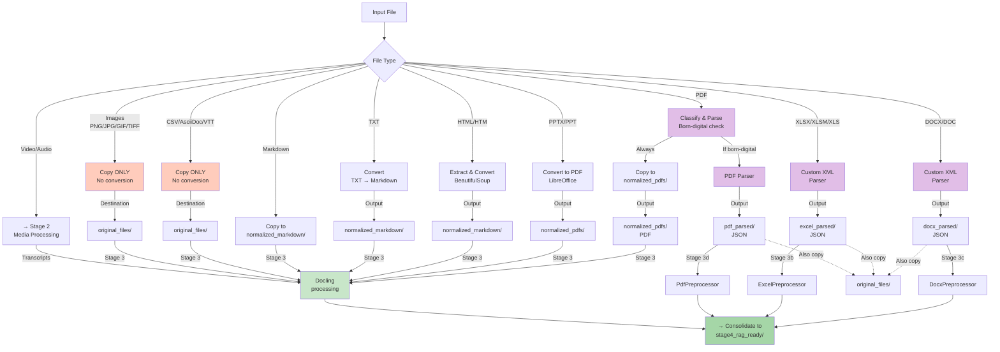

### Stage 1 Processing Details

| File Type | Handler | Output Location | Process | Destination for Stage 3 |
|-----------|---------|-----------------|---------|-------------------------|
| **DOCX/DOC** | Custom XML Parser | `docx_parsed/` (JSON) | Parses heading hierarchy + content | → Stage 3c (DocxPreprocessor) |
| **XLSX/XLSM/XLS** | Custom XML Parser | `excel_parsed/` (JSON) | Parses table structures + data | → Stage 3b (ExcelPreprocessor) |
| **PDF** | Born-digital Parser | `pdf_parsed/` (JSON) | Extracts heading hierarchy + content | → Stage 3d (PdfPreprocessor) |
| **PPTX/PPT** | LibreOffice | `normalized_pdfs/` (PDF) | Converts to PDF | → Stage 3 (Docling) |
| **HTML/HTM** | BeautifulSoup | `normalized_markdown/` (MD) | Extracts text & structure | → Stage 3 (Docling) |
| **TXT** | Simple converter | `normalized_markdown/` (MD) | Converts to markdown | → Stage 3 (Docling) |
| **MD** | Direct copy | `normalized_markdown/` (MD) | No conversion needed | → Stage 3 (Docling) |
| **CSV** | ⚠️ **Copy ONLY** | `original_files/` | **NOT normalized**, copied as-is | → Stage 3 (Docling processes natively) |
| **AsciiDoc** (.adoc, .asciidoc, .asc) | ⚠️ **Copy ONLY** | `original_files/` | **NOT normalized**, copied as-is | → Stage 3 (Docling processes natively) |
| **VTT** (Subtitles) | ⚠️ **Copy ONLY** | `original_files/` | **NOT normalized**, copied as-is | → Stage 3 (Docling processes natively) |
| **Images** (PNG, JPG, TIFF, etc.) | ⚠️ **Copy ONLY** | `original_files/` | **NOT converted to PDF**, copied as-is | → Stage 3 (Docling processes natively with VLM/OCR) |
| **Video/Audio** (MP4, WAV, MP3, etc.) | Media detection | *Skipped* | Not copied to originals | → Stage 2 (Media Processing) |

### Stage 1 Output Directory Structure

```
output/stage1_normalized/
│
├── normalized_pdfs/              # Converted PDFs
│   ├── presentation.pdf          # From PPTX (LibreOffice)
│   └── document.pdf              # From direct copy
│
├── normalized_markdown/          # Converted Markdown
│   ├── webpage.md                # From HTML (BeautifulSoup)
│   ├── notes.md                  # From TXT
│   └── readme.md                 # From direct copy
│
├── docx_parsed/                  # ✓ CUSTOM PARSER OUTPUT (JSON)
│   ├── word_doc1.json            # Heading tree + content structure
│   └── word_doc2.json
│
├── excel_parsed/                 # ✓ CUSTOM PARSER OUTPUT (JSON)
│   ├── spreadsheet1.json         # Table structures + data
│   └── spreadsheet2.json
│
├── pdf_parsed/                   # ✓ CUSTOM PARSER OUTPUT (JSON)
│   ├── born_digital1.json        # Heading hierarchy + layout
│   └── born_digital2.json
│
└── original_files/               # ⚠️ PASSTHROUGH (Not normalized)
    ├── data.csv                  # CSV copied as-is
    ├── docs.adoc                 # AsciiDoc copied as-is
    ├── movie.vtt                 # VTT copied as-is
    ├── diagram.png               # Image copied as-is (NOT to PDF!)
    ├── photo.jpg                 # Image copied as-is
    ├── word_doc1.docx            # Backup of DOCX original
    ├── spreadsheet1.xlsx         # Backup of Excel original
    └── ...
```

### Key Insights about Stage 1

✅ **CSV, AsciiDoc, VTT, Images**: 
- **NOT normalized or converted**
- Just copied to `original_files/`
- Docling in Stage 3 handles them natively
- Images specifically: "Do NOT convert to PDF! Docling processes images better natively"

✅ **Excel, DOCX, PDF**:
- **Custom XML parsers** extract structure to JSON
- JSON consumed by Stage 3b/3c/3d processors
- Original files also copied to `original_files/` as backup

✅ **PPTX, HTML, TXT**:
- **Format conversion** to PDF or Markdown
- Ready for Stage 3 Docling processing

---

## Stage 2: Media Processing

### Purpose
Extract, transcribe, and process media files (videos and audio) to produce searchable text and visual content.

### Supported Media Types

**Video Formats:** `.mp4` | `.avi` | `.mov` | `.mkv` | `.flv` | `.wmv` | `.webm`

**Audio Formats:** `.wav` | `.mp3` | `.m4a` | `.flac` | `.ogg` | `.aac`

### Media Processing Flow

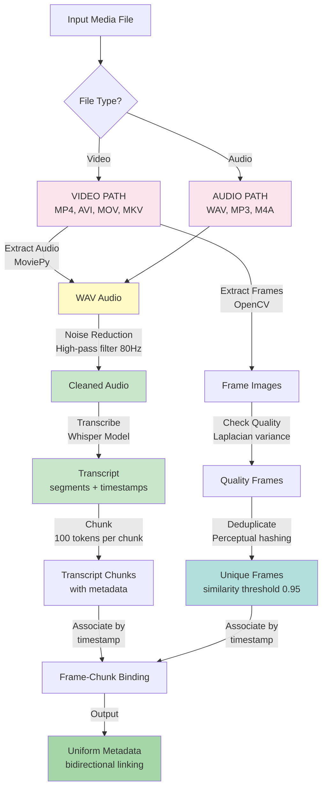

### Stage 2 Output Directory Structure

```
output/stage2_media_processed/
├── extracted_audio/
│   ├── video1.wav                 # Extracted audio (16 kHz, mono)
│   └── audio_file.wav
│
├── transcripts/                   # Full Whisper output (5 formats)
│   ├── video1.json                # Full metadata with segments
│   ├── video1.txt                 # Plain text
│   ├── video1.md                  # Markdown with [HH:MM:SS] timestamps
│   ├── video1.srt                 # SRT subtitle format
│   ├── video1.vtt                 # WebVTT subtitle format
│   └── ...
│
├── transcript_chunks/
│   ├── video1_chunks.json         # {metadata, chunks[]}
│   │                              # Each chunk: text, token_count, start_time, 
│   │                              #              end_time, associated_frames
│   └── ...
│
├── extracted_frames/
│   ├── video1/
│   │   ├── frame_000000.jpg       # Frame at t=0s
│   │   ├── frame_000030.jpg       # Every Nth frame
│   │   ├── frame_000060.jpg
│   │   └── ...
│   └── video2/
│       └── ...
│
└── media_metadata/
    ├── video1_metadata.json            # Provenance + processing info
    ├── video1_frame_metadata.json      # Frame hashes, dedup info
    │                                   # {frame_path, frame_index, 
    │                                   #  is_duplicate, associated_chunk_index}
    ├── audio_file_metadata.json
    └── processing_statistics.json      # Summary stats
```

---

## Stage 3: Main Document Processing (DocumentProcessorV2 Unified Router)

### Purpose & Overall Flow

Stage 3 is the **intelligent document processing hub** that handles multiple file types through parallel processing paths. Here's how it works:

**Stage 3 consists of 4 parallel paths:**

1. **Stage 3 (Main)**: DocumentProcessorV2 Unified Router   processes normalized PDFs, markdown, and original files (CSV, AsciiDoc, VTT, Images) that are **not handled by Stage 3b/3c/3d custom parsers**

2. **Stage 3b (Excel)**: ExcelPreprocessor   runs **only if** Excel files were detected and parsed in Stage 1 (JSON in `excel_parsed/`)

3. **Stage 3c (DOCX)**: DocxPreprocessor   runs **only if** Word documents were detected and parsed in Stage 1 (JSON in `docx_parsed/`)

4. **Stage 3d (PDF)**: PdfPreprocessor   runs **only if** PDF files were detected and parsed in Stage 1 (JSON in `pdf_parsed/`)

**Key Design**: Stages 3b/3c/3d run **conditionally**   they only execute if their specialized input exists. Meanwhile, Stage 3 (V2 Router) handles all other file types. Both output directly to `stage4_rag_ready/`, which Stage 4 then consolidates.

**Processing Timeline**:
- Stage 3 (V2 Router) runs first, handling normalized PDFs, Markdown, and passthrough files
- Stages 3b, 3c, and 3d run **sequentially after** Stage 3 (conditional   only if their parsed inputs exist from Stage 1)
  - Stage 3b: ExcelPreprocessor (if `excel_parsed/` exists)
  - Stage 3c: DocxPreprocessor (if `docx_parsed/` exists)
  - Stage 3d: PdfPreprocessor (if `pdf_parsed/` exists)
- Each sub-stage outputs directly to its own document folder in `stage4_rag_ready/`
- Stage 4 (Consolidation) runs last and merges all outputs into a unified RAG-ready structure
- **Note**: Parallel execution is currently disabled (`parallel_processing: false`); this is planned as a future enhancement.

### Supported Input Formats (10 Types via DocumentProcessorV2)

Docling DocumentConverter supports these 10 format families:

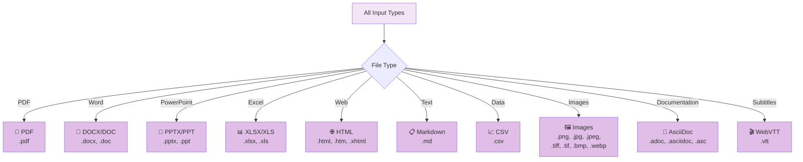

**Complete Format List:**
- **PDF** → `.pdf`
- **Microsoft Word** → `.docx`, `.doc`
- **PowerPoint** → `.pptx`, `.ppt`
- **Excel Spreadsheets** → `.xlsx`, `.xls`
- **Web Pages** → `.html`, `.htm`, `.xhtml`
- **Markdown** → `.md`
- **Comma-Separated Data** → `.csv`
- **Images with OCR** → `.png`, `.jpg`, `.jpeg`, `.tiff`, `.tif`, `.bmp`, `.webp`
- **AsciiDoc** → `.adoc`, `.asciidoc`, `.asc` (technical documentation format)
- **WebVTT Subtitles** → `.vtt` (video subtitle format)

### Stage 3 Smart Deduplication Logic

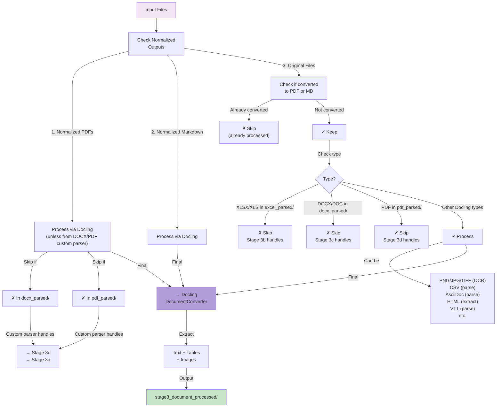

### DocumentProcessorV2 Unified Router (Current Implementation)

**Architecture**: Intelligent file-type router with specialized processors for each format

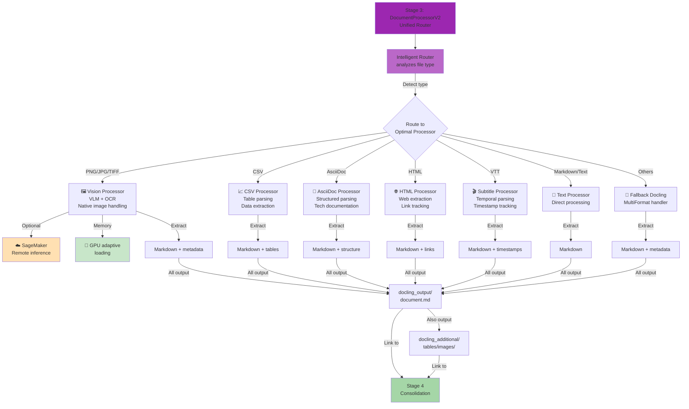

### Key Features of DocumentProcessorV2

✅ **Intelligent Routing**: Automatically detects file type and routes to optimal processor

✅ **SageMaker Support**: Optional remote inference for heavy processing (vision models, etc.)

✅ **GPU Memory Management**: Adaptive loading prevents out-of-memory errors with large files

✅ **Unified Output**: All formats produce consistent markdown + metadata output

✅ **Smart Deduplication**: Skips files already handled by Stage 3b/3c/3d custom parsers

### Stage 3 Processing Decision Flow

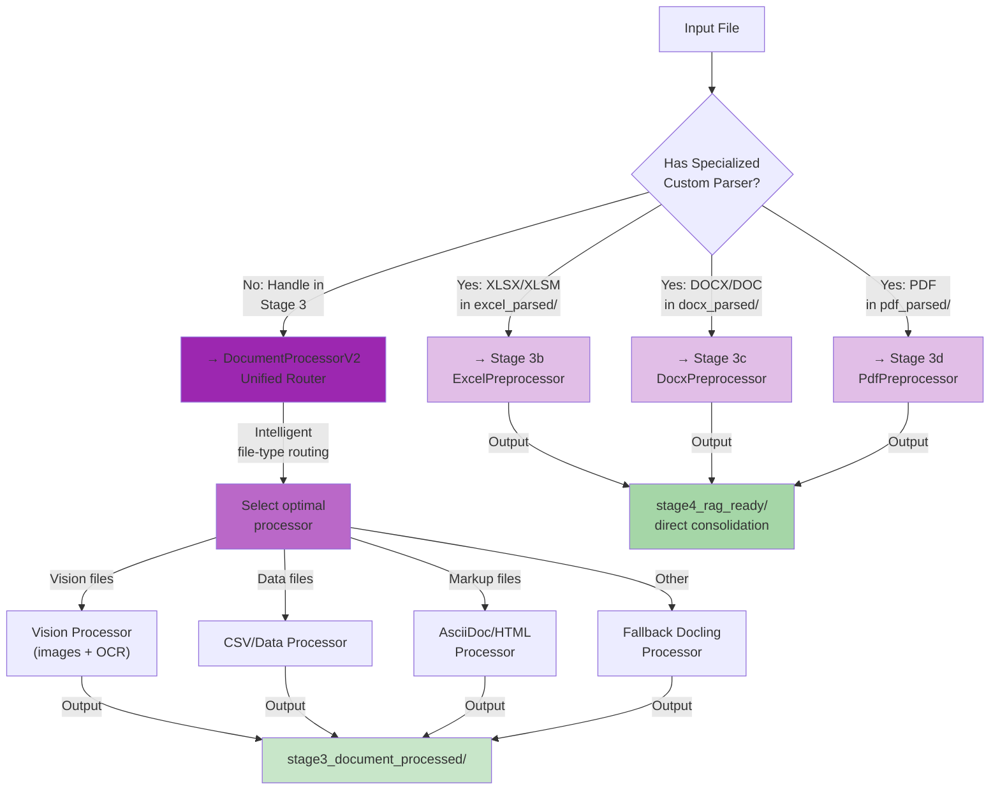

### Stage 3 Output Structure

```
output/stage3_document_processed/
├── document1/                     # From PNG/JPG/etc OCR
│   ├── document1.md               # Main markdown output
│   └── docling_additional/
│       ├── tables/
│       │   └── extracted_tables.md
│       └── images/
│           └── extracted_images.png
│
├── webpage1/                      # From HTML
│   ├── webpage1.md
│   └── docling_additional/
│       └── images/
│           └── embedded_content.png
│
├── documentation/                 # From .adoc AsciiDoc
│   ├── documentation.md
│   └── docling_additional/
│       └── images/
│           └── doc_diagrams.png
│
├── subtitles/                     # From .vtt WebVTT
│   ├── subtitles.md
│   └── docling_additional/
│
├── dataset/                       # From CSV
│   ├── dataset.md
│   └── docling_additional/
│       └── tables/
│           └── parsed_data.md
│
└── logs/
    └── processing.log
```

---

## Stage 3b: Excel Processing (Conditional)

### Purpose
Custom XML-based parsing of Excel files with **table-aware chunking**.

### Trigger Condition
Only runs if `excel_parsed/` directory exists (populated in Stage 1).

### Processing Details

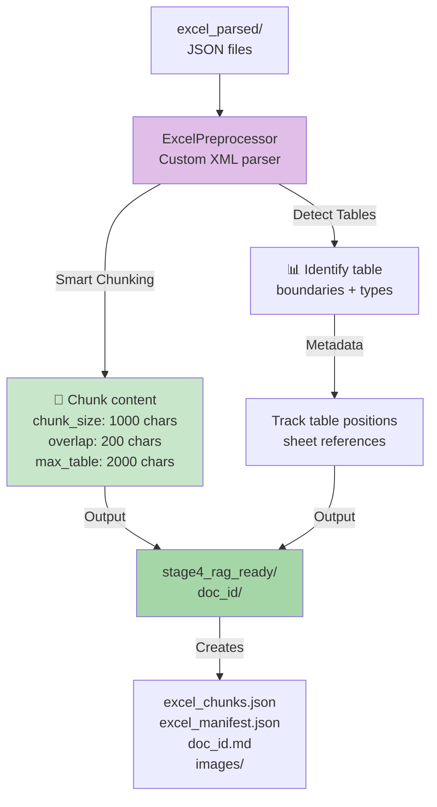

### Output Structure

```
stage4_rag_ready/spreadsheet1/
├── spreadsheet1.md                # Markdown representation
├── excel_chunks.json              # Chunked content {chunks[]}
│                                  # Each chunk tracks: table_id, 
│                                  #                   sheet_name, row_range
├── excel_manifest.json            # Table inventory + structure
└── images/
    └── embedded_charts.png        # Any embedded images
```

---

## Stage 3c: DOCX Processing (Conditional)

### Purpose
Custom XML-based parsing of Word documents with **heading-aware chunking**.

### Trigger Condition
Only runs if `docx_parsed/` directory exists (populated in Stage 1).

### Processing Details

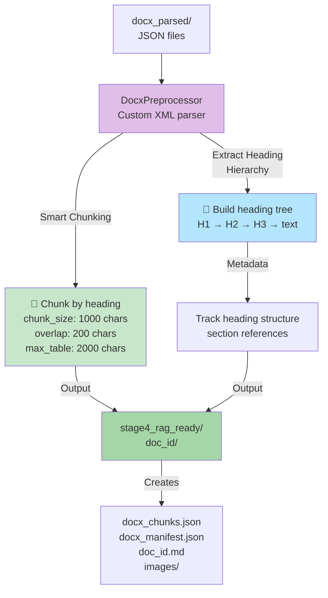

### Output Structure

```
stage4_rag_ready/document1/
├── document1.md                   # Markdown with heading structure
├── docx_chunks.json               # Chunked content {chunks[]}
│                                  # Each chunk tracks: heading_level,
│                                  #                   heading_text, section_id
├── docx_manifest.json             # Heading hierarchy + TOC
└── images/
    └── embedded_images.png        # Any embedded images
```

---

## Stage 3d: PDF Processing (Conditional)

### Purpose
Born-digital custom parser with **heading-aware chunking** for PDFs.

### Trigger Condition
Only runs if `pdf_parsed/` directory exists (populated in Stage 1).

### Processing Details

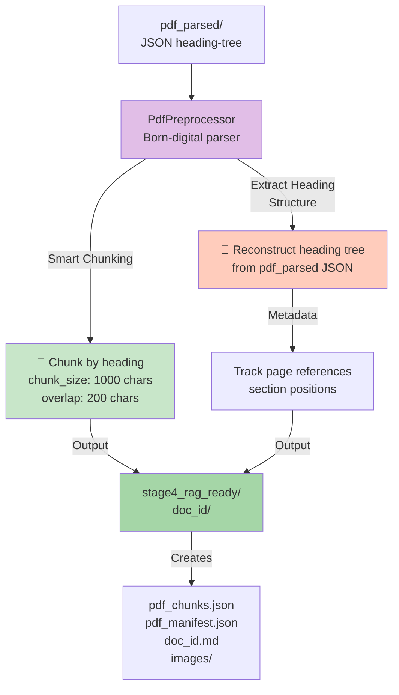

### Output Structure

```
stage4_rag_ready/report.pdf/
├── report.pdf.md                  # Markdown with heading structure
├── pdf_chunks.json                # Chunked content {chunks[]}
│                                  # Each chunk tracks: page_number,
│                                  #                   heading_level, section_id
├── pdf_manifest.json              # Page index + heading hierarchy
└── images/
    └── page_3_extracted.png       # Extracted page images
```

---

## Stage 4: RAG-Ready Consolidation

### Purpose
Combine all Stage 3 outputs (Docling, Excel, DOCX, PDF) plus media data into unified RAG-ready document folders.

### Consolidation Logic

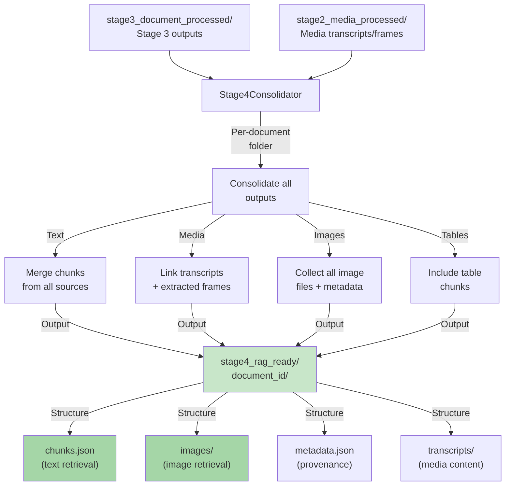

### Stage 4 Output Structure

```
output/stage4_rag_ready/
├── document_id1/
│   ├── chunks.json                # [{chunk_id, text, start_pos, chunk_type, 
│   │                              #   source: docx|pdf|excel|media, ...}]
│   ├── metadata.json              # Document metadata + chunk mapping
│   ├── images/
│   │   ├── image_001.jpg
│   │   ├── image_001_metadata.json
│   │   └── ...
│   ├── transcripts/               # Links to stage2 media outputs
│   │   └── video1_transcript.md
│   ├── tables/
│   │   ├── table_001.md
│   │   └── ...
│   └── pdf.pdf                    # Original PDF (if available)
│
├── document_id2/
│   └── ...
│
└── ...
```

---

## Indexing Pipeline

### Purpose
Create searchable indexes from RAG-ready content using three systems: dense text embeddings (Qdrant), keyword search (BM25), and image embeddings (ColQwen) for visual retrieval.

### Two Retrieval Systems

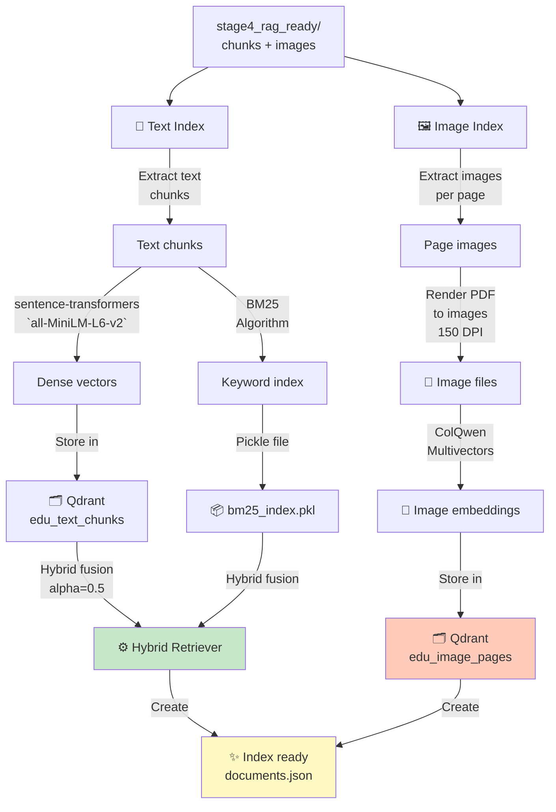

### Reranking (Globally Disabled)

**Current Status**: Reranking is **globally disabled** (`SKIP_RERANKER=true` by default) for latency optimization. The reranker code is retained in the codebase for fast rollback if needed, but is not invoked during search.

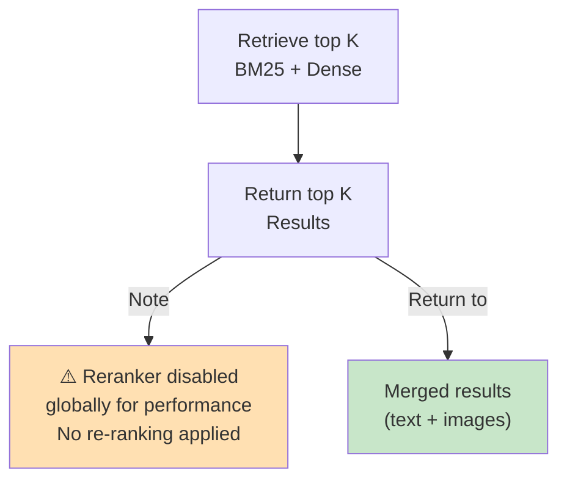

**Historical context**: Earlier implementations supported optional reranking using `bge-large`, `bge-base`, or `minilm-l12` models, but this was disabled globally in favor of latency optimization. The `skip_reranker` parameter in the search API is deprecated and ignored.

### Indexing Output Artifacts

```
output/indexing/
├── documents.json                 # Document metadata + chunk inventory
├── qdrant_collections/
│   ├── edu_text_chunks            # Text embeddings (Qdrant)
│   │   └── points: 10,000+ points
│   └── edu_image_pages            # Image embeddings (Qdrant)
│       └── points: 5,000+ points
└── bm25_indexes/
    └── user_default/
        └── bm25_index.pkl         # BM25 keyword index (pickle)
```

---

## Search & Retrieval Pipeline

### Purpose
Retrieve relevant content from indexes and optionally generate AI-powered answers.

### Search Flow

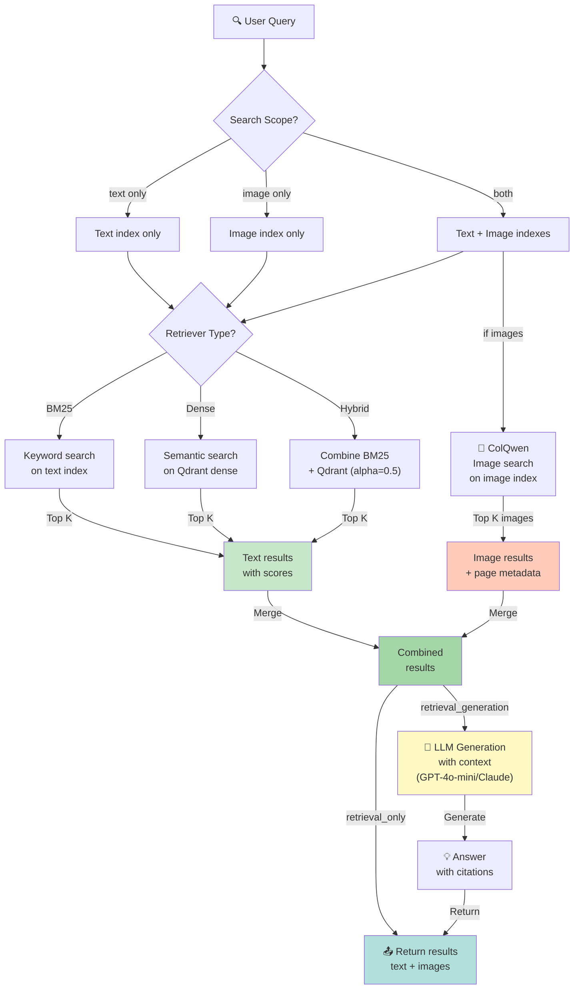

### Response Structure

```json
{
  "query": "What are the key findings?",
  "text_results": [
    {
      "chunk": "The analysis shows...",
      "source_path": "document1.md",
      "storage_uri": "s3://bucket/path/...",
      "score": 0.95,
      "chunk_type": "docx | pdf | excel | media"
    }
  ],
  "image_results": [
    {
      "page": 5,
      "source_path": "document.pdf",
      "confidence": 0.88
    }
  ],
  "answer": "Generated answer using retrieved content...",
  "generation_config": {
    "model": "gpt-4o-mini",
    "temperature": 0.0,
    "max_tokens": 2000
  }
}
```

---

## Storage Architecture

### Local vs Cloud Storage

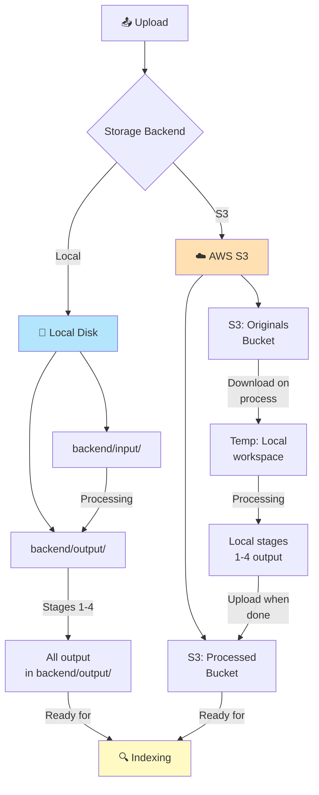

**Explanation:**
- **Local Storage**: All processing happens on local disk (`backend/input/` → `backend/output/stages/*`)
- **S3 Storage**: Two buckets separate originals from processed outputs. Pipeline downloads to temp workspace, processes locally, then uploads results to S3 processed bucket. Both approaches feed the same indexing pipeline.

### Multi-User Isolation

```
S3 Key Structure (when S3_USER_ISOLATION=true):
users/{user_id}/documents/{document_id}/jobs/{job_id}/processing/
  ├── stage1_normalized/
  ├── stage2_media_processed/
  ├── stage3_document_processed/
  └── stage4_rag_ready/

Per-user isolation:
- Each user has isolated temp workspace during processing
- S3 prefixes prevent cross-user data access
- Optional: Qdrant collections per user (QDRANT_ISOLATE_BY_USER=true)
```

---

## Summary Table: All 7 Stages & Processing

| Stage | Name | Input | Processor(s) | Output | Special Features |
|-------|------|-------|--------------|--------|------------------|
| **1** | Normalization | Raw files (all types) | DocumentNormalizer | Normalized PDFs/JSON/MD in separate folders | Format detection + conversion |
| **2** | Media Processing | Video/Audio files | MediaProcessor | Transcripts, frames, audio, metadata | Noise reduction, dedup, frame-chunk binding |
| **3** | Document Processing (V2 Router) | Normalized PDFs, Markdown, original files (except handled by 3b/3c/3d) | DocumentProcessorV2 (Unified Router) | docling_output/ (.md) + docling_additional/ | Intelligent file-type routing. Supports 10 formats (PDF, DOCX, XLSX, PPT, HTML, CSV, AsciiDoc, VTT, Images, MD). SageMaker support + GPU memory management. Smart dedup skips files in 3b/3c/3d. |
| **3b** | Excel Processing | excel_parsed/ JSON files | ExcelPreprocessor (custom XML parser) | Direct to stage4_rag_ready/ | Table-aware chunking (max 2000 characters), sheet tracking |
| **3c** | DOCX Processing | docx_parsed/ JSON files | DocxPreprocessor (custom XML parser) | Direct to stage4_rag_ready/ | Heading-aware chunking, heading hierarchy tracking |
| **3d** | PDF Processing | pdf_parsed/ JSON files | PdfPreprocessor (born-digital parser) | Direct to stage4_rag_ready/ | Heading-aware chunking, page-level tracking |
| **4** | Consolidation | All Stage 3 outputs + Stage 2 media | Stage4Consolidator | stage4_rag_ready/ with chunks + images + metadata | Merges all sources, links media to text, creates per-document folders |
| **Index** | Indexing | RAG-ready documents | Qdrant + BM25 + ColQwen | edu_text_chunks + edu_image_pages collections | Text (dense + keyword) + image indexing. Optional reranking (disabled by default). |
| **Search** | Retrieval & Generation | Query + indexes | TextSearchService + ImageRetriever + LLM | Results with citations | Hybrid fusion, optional LLM generation, multimodal output |

---

## Key Design Principles

✅ **Unified Router (V2):** DocumentProcessorV2 intelligently routes different file types to optimal processors

✅ **Conditional Processing:** Stage 3b/3c/3d variants only run if their specialized input is detected

✅ **Custom XML Parsers:** DOCX, Excel, and PDF get specialized parsing (heading-aware, table-aware, heading-hierarchy)

✅ **Media Integration:** Transcripts and frames are unified with document chunks via timestamp binding

✅ **Metadata Tracking:** All outputs preserve provenance and source information for citations

✅ **Multi-Modal Retrieval:** Text + image search work in parallel with optional LLM generation

✅ **Storage Agnostic:** Works with local disk or AWS S3 with identical logical structure

✅ **Cloud-Ready:** SageMaker support for remote inference + GPU memory management for large files

---

## 📊 Diagram Classification: Presentation vs Appendix

### **ESSENTIAL DIAGRAMS FOR PRESENTATION** (Must Include)

These diagrams are critical for understanding the system in a capstone/conference presentation:

1. **Pipeline Architecture Overview** (Early section)
   - Shows the complete system flow: Upload → 7-Stage Processing → Indexing → Search/Retrieval
   - Gives audience overview of the entire pipeline lifecycle
   - **Why:** Establishes the system's purpose and scope

2. **Complete Pipeline Architecture (7-Stage Model)**
   - Shows all stages in order: 1 (Normalization) → 2 (Media) → 3 (Docling) → 3b/3c/3d (Custom parsers) → 4 (Consolidation)
   - Shows how Stage 3 splits into 4 parallel paths
   - **Why:** Explains the sophisticated multi-path processing architecture

3. **Stage 1: File Type Routing Diagram**
   - Shows how different file types (DOCX, Excel, PDF, Images, etc.) are routed to different processors
   - **Why:** Demonstrates intelligent file-type handling and the breadth of supported formats (10+ types)

4. **Stage 2: Media Processing Flow**
   - Shows audio extraction, noise reduction, transcription, frame extraction, frame deduplication
   - **Why:** Highlights the sophisticated media handling with noise reduction and deduplication

5. **Indexing Pipeline: Text and Image Indexing**
   - Shows dual indexing: text (dense + BM25) + image (ColQwen)
   - Shows storage in Qdrant collections
   - **Why:** Demonstrates the multimodal retrieval capability

6. **Search & Retrieval Pipeline**
   - Shows search options (BM25/Dense/Hybrid), image retrieval, optional LLM generation
   - Shows search_scope and mode options
   - **Why:** Demonstrates the flexible retrieval system with optional AI generation

### **APPENDIX DIAGRAMS** (Reference/Supporting Material)

These diagrams provide details but are not essential for the main presentation narrative:

1. **Stage 1 Processing Details** - Text table details of all file type handlers
2. **Stage 3 Supported Input Formats** - Detailed list of 10 supported formats
3. **Stage 3 Smart Deduplication Logic** - Technical deduplication strategy (complex for presentation)
4. **DocumentProcessorV2 Unified Router** - Technical implementation details (too low-level for presentation)
5. **File Type Routing (Logic Flow)** - Alternative representation of routing (if already showing Stage 1 diagram)
6. **Stage 3 Processing Decision Flow** - Alternative detail diagram
7. **Stage 3b/3c/3d Output Structures** - Table details of Excel/DOCX/PDF outputs (reference only)
8. **Stage 4 Consolidation Process** - Technical consolidation details
9. **Indexing Output Artifacts** - Directory structure (technical detail)
10. **Reranking (Globally Disabled)** - Historical context on reranking (now disabled)
11. **Response Structure** - JSON schema (API detail, not needed for general presentation)
12. **Storage Architecture** - Local vs S3 comparison (infrastructure detail)
13. **Processing Timeline** - Sequential execution explanation (technical detail)

### **PRESENTATION STRATEGY**

For a 20-25 minute capstone presentation:

1. **Opening (2 min):** Use the "Pipeline Architecture Overview" to show the system flow
2. **Architecture Deep-Dive (5 min):** 
   - Show "Complete Pipeline Architecture (7-Stage Model)" to explain the staged approach
   - Show "Stage 1 File Type Routing" to demonstrate format handling
3. **Technical Highlights (3 min):**
   - Show "Stage 2 Media Processing Flow" for media intelligence
   - Show "Indexing Pipeline" to explain retrieval capabilities
4. **Retrieval & Results (2 min):** Show "Search & Retrieval Pipeline" with generation
5. **Appendix:** Include detailed diagrams in presentation appendix for Q&A reference

**Total essential diagrams for presentation:** 6 core diagrams + supporting tables  
**Total appendix diagrams for reference:** 13 detail/technical diagrams

---

**Document prepared:** May 2026  
**Scope:** Complete AI Service pipeline architecture with all 7 processing stages  
**Verification:** All claims verified against Phase 2 implementation codebase
