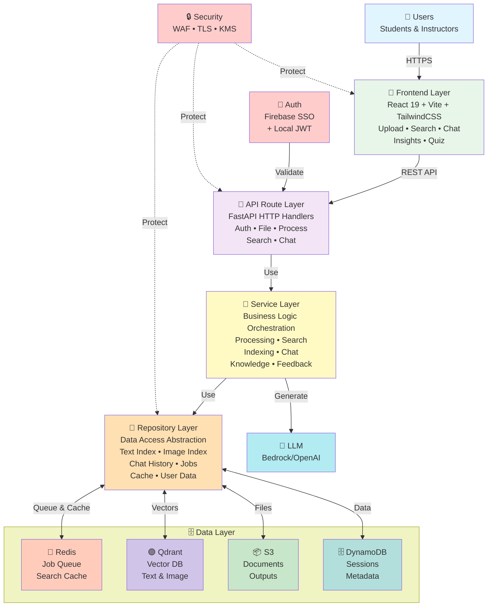

# BK-MInD High-Level System Architecture

This document presents the high-level overview of the BK-MInD system, showing the six-tier Clean Architecture pattern used in the actual implementation.

## System Architecture Diagram

---

## Architecture Tiers (Six-Tier Clean Architecture)

### Tier 1: Frontend Layer (User Interface)

React-based single-page application providing all user-facing features:

- **Technology**: React 19, Vite, TailwindCSS 4.1
- **Features**: Document upload, real-time search, interactive chat, insights generation, quiz creation
- **Communication**: REST API calls to backend via HTTPS
- **Real-Time Updates**: Status polling and Server-Sent Events (SSE) for streaming responses

### Tier 2: API Route Layer (HTTP Interface)

FastAPI route handlers providing REST endpoints for all application features:

- **Auth Routes**: `/api/auth/login`, `/api/auth/register` (Firebase SSO + Local JWT)
- **File Routes**: `/api/files/upload`, `/api/files/list`, `/api/files/delete`
- **Process Routes**: `/api/process` (document processing jobs)
- **Search Routes**: `/api/search` (text and image search with LLM generation)
- **Chat Routes**: `/api/chat` (conversation management)
- **Insights Routes**: `/api/insights`, `/api/quiz`, `/api/summary`

All route handlers depend on Service layer via FastAPI `Depends()` injection.

### Tier 3: Service Layer (Business Logic)

Service classes orchestrate domain logic and coordinate between multiple repositories:

- **ProcessingService**: Manages 7-stage document pipeline
- **SearchOrchestrator**: Coordinates text + image search and LLM generation
- **IndexingService**: Orchestrates embedding generation and storage
- **ChatService**: Manages multi-turn conversations and context
- **KnowledgeService**: Knowledge base and document operations
- **FeedbackService**: User feedback collection and analysis

Services contain the core business rules and call repositories for data access.

### Tier 4: Repository Layer (Data Access Abstraction)

Repository classes abstract data storage and provide clean interfaces for services:

- **TextIndexRepository**: BM25, dense embeddings, hybrid RRF indices in Qdrant
- **ImageIndexRepository**: ColQwen embeddings in Qdrant
- **ChatHistoryRepository**: Conversation storage in DynamoDB
- **FileRepository**: Document artifact storage in S3
- **JobRepository**: Async job state tracking in Redis
- **SearchCacheRepository**: Search result caching in Redis
- **UserRepository**: User data and authentication in DynamoDB

Repositories hide the complexity of multiple storage backends behind unified interfaces.

### Tier 5: Data Layer (Cloud Storage & Services)

Managed cloud services providing actual data persistence and caching:

**Redis** - Job queue and search caching

- Async job management: states (accepted → running → completed/failed)
- Concurrency limits: 3 per-user, 200 global
- Job TTL: 3600 seconds (automatic cleanup)
- Search result caching for performance optimization

**Qdrant Cloud** - Vector database

- Text embeddings (BM25, dense, hybrid RRF indices)
- Image embeddings (ColQwen late-interaction multi-vector)
- Similarity search capability for retrieval

**Amazon S3** - Cloud object storage

- Document storage (canonical source)
- Processed outputs (markdown, images, metadata)
- User-based prefix isolation for multi-tenancy
- Server-side encryption with customer-managed KMS keys

**Amazon DynamoDB** - NoSQL database

- Chat history and sessionsdate
- User metadata and settings
- Feedback and quiz results
- User authentication data (local accounts)

### Tier 6: Cross-Cutting Concerns

Services that apply across all layers:

**Authentication (Dual Mechanism)**

- **Firebase SSO**: Optional Google authentication via Firebase Admin SDK (identity/firebase_auth.py)
- **Local Authentication**: Built-in JWT-style tokens with PBKDF2-SHA256 password hashing (100k iterations, identity/local_auth.py)
- Token TTL: 24 hours (Firebase) or 30 days (Local, configurable)
- Fallback mechanism: Tries local validation first, then Firebase
- Both methods can coexist; users choose preferred method at login

**Security**

- **AWS WAF**: Edge-level protection (SQL injection, XSS, DDoS, rate limiting, bot filtering)
- **CloudFront CDN**: Geographic distribution and DDoS mitigation
- **TLS/HTTPS**: All connections encrypted (minimum TLS 1.2)
- **KMS Encryption**: At-rest encryption for S3 and DynamoDB
- **Multi-tenant Isolation**: User data segregated via S3 prefixes and DynamoDB partition keys
- **API Authentication**: JWT Bearer token validation on every request

**LLM Generation**

- **AWS Bedrock**: Claude 3.5 Sonnet integration for answer generation
- **OpenAI API**: GPT-4o option for alternative LLM providers
- Streaming responses for interactive chat and real-time answer generation

---

## Key Characteristics

| Aspect                         | Details                                                                                                             |
| ------------------------------ | ------------------------------------------------------------------------------------------------------------------- |
| **Architecture Pattern** | Six-tier Clean Architecture (Frontend → Routes → Services → Repositories → Data Layer + Cross-cutting Concerns) |
| **Frontend Framework**   | React 19 with Vite and TailwindCSS 4.1                                                                              |
| **Backend Framework**    | FastAPI (Python 3.10+)                                                                                              |
| **Authentication**       | Dual mechanism: Firebase SSO + Local JWT with PBKDF2-SHA256                                                         |
| **Job Management**       | Redis async queue (3 per-user, 200 global, 3600s TTL)                                                               |
| **Search Caching**       | Redis-based result caching for performance                                                                          |
| **Storage Strategy**     | Cloud-native: S3 (documents) + DynamoDB (metadata/sessions) + Qdrant (vectors) + Redis (jobs/cache)                 |
| **Processing Pipeline**  | 7-stage conditional pipeline (26-28 seconds per document)                                                           |
| **Query Latency**        | Less than 5 seconds (p95)                                                                                           |
| **Concurrent Users**     | 20+ supported                                                                                                       |
| **Availability**         | 99.5% with auto-scaling                                                                                             |
| **Deployment**           | AWS ECS Fargate (frontend & backend) + EC2 (GPU inference)                                                          |

---

## Data Isolation (Multi-Tenancy)

The system enforces strict data isolation for multiple concurrent users:

- **S3 Prefix Isolation**: User documents under `s3://bucket/users/{user_id}/documents/`
- **DynamoDB Partition Keys**: All data queries include user_id filter
- **Redis Namespacing**: Job and cache keys include user_id
- **Qdrant Filtering**: Search queries filter results by user_id metadata

---

## References

- **Detailed Component Architecture**: See Excalidraw-Architecture-Diagram.png
- **Cloud Infrastructure**: See Deployment Diagram_v2.png
- **Full Description**: See Phase 2 Report Section 4.3
