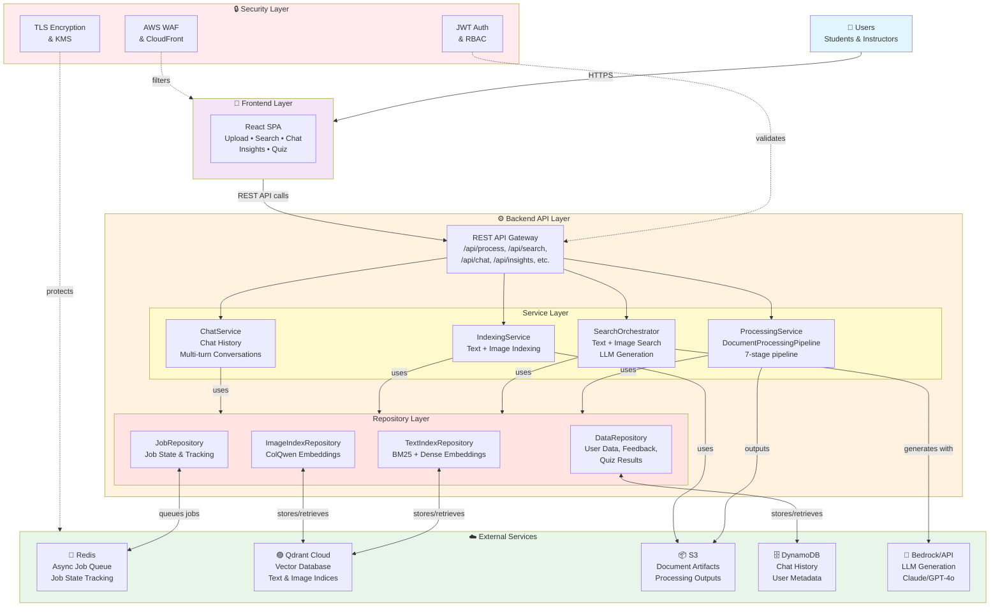
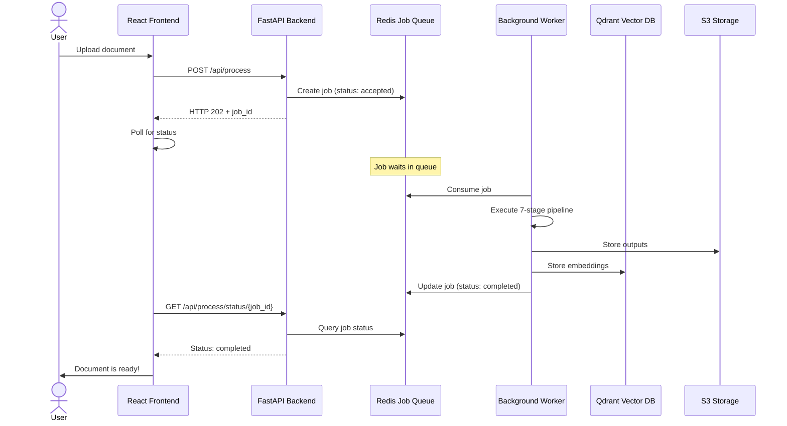
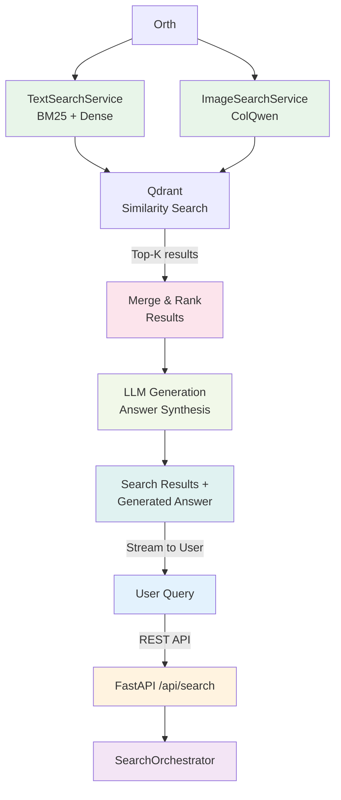

# BK-MInD High-Level System Architecture

This document presents a high-level overview of the BK-MInD Multimodal Retrieval-Augmented Generation (MRAG) system architecture, showing the four main layers and their interactions without detailed implementation specifics.

## System Architecture Diagram

## Architecture Overview

### Layer 1: Frontend (React SPA)
- **Role**: User interface for uploading documents, searching, chatting, generating insights
- **Technology**: React 19 + Vite + TailwindCSS
- **Communication**: All interactions via REST API to the backend
- **Features**: Real-time status updates, streaming chat responses, document preview

### Layer 2: Backend API (FastAPI)

The backend is organized into three logical sub-layers:

#### API Gateway Layer
- Central entry point for all client requests
- Route handlers for processing (`/api/process`), search (`/api/search`), chat (`/api/chat`), indexing (`/api/index`)
- HTTP status management, request validation, authentication

#### Service Layer
- **ProcessingService**: Orchestrates the 7-stage document processing pipeline (see DOCS_PIPELINES_CONSOLIDATED_DOCUMENT.md)
- **SearchOrchestrator**: Handles parallel text and image search, delegates to SearchService instances
- **IndexingService**: Orchestrates text and image indexing into Qdrant
- **ChatService**: Manages multi-turn conversation history and context

#### Repository Layer (Data Access)
- **TextIndexRepository**: Interface to Qdrant for text embeddings (BM25 + dense vectors)
- **ImageIndexRepository**: Interface to Qdrant for image embeddings (ColQwen)
- **DataRepository**: Interface to DynamoDB for user data, chat history, feedback
- **JobRepository**: Interface to Redis for async job queuing and state tracking

### Layer 3: External Services (Cloud Infrastructure)

**Redis** (Async Job Management)
- In-memory data store for job queuing
- Tracks async jobs: process, index_all, index_text
- Job states: `accepted` → `running` → `completed` / `failed`
- Per-user concurrency limit: 3 jobs; Global limit: 200 jobs
- Job TTL: 3600 seconds (auto-cleanup)

**Qdrant Cloud** (Vector Database)
- Stores text embeddings (BM25, dense vectors, hybrid indices)
- Stores image embeddings (ColQwen multi-vector)
- Provides similarity search for retrieval

**Amazon S3** (Document Storage)
- Stores original uploads and processed outputs
- Documents partitioned by user ID
- Encrypted with customer-managed KMS keys

**Amazon DynamoDB** (Persistent Storage)
- Chat history and conversations
- User metadata and settings
- Feedback and quiz results
- Fallback job durability (if Redis unavailable)

**AWS Bedrock / OpenAI API** (LLM Generation)
- Generates answers using retrieved context
- Supports Claude 3.5 Sonnet (via Bedrock) or GPT-4o
- Streaming response for interactive chat

### Layer 4: Security

**Authentication & Authorization**
- JWT tokens for API authentication (24-hour expiration)
- Session management via DynamoDB
- Role-Based Access Control (RBAC): Student, Instructor, Admin
- User identity validation via X-User-Id header

**Network Security**
- AWS CloudFront CDN for edge caching and DDoS protection
- AWS WAF with rules for SQL injection, XSS, rate limiting, bot filtering
- TLS 1.2+ for all HTTPS communication

**Data Security**
- Encryption in-transit: TLS/HTTPS
- Encryption at-rest: S3 (SSE-KMS), DynamoDB (KMS), Qdrant (configured at provisioning)
- Key management: AWS Secrets Manager for credentials
- Multi-tenant isolation: S3 prefix-based isolation, DynamoDB partition keys

---

## Async Job Processing Flow

---

## Search & Retrieval Flow

---

## Technology Stack

| Component | Technology |
|-----------|-----------|
| **Frontend** | React 19, Vite, TailwindCSS 4.1 |
| **API Framework** | FastAPI (Python 3.10+) |
| **Document Processing** | Docling, Whisper, LibreOffice |
| **Text Embeddings** | Sentence Transformers (all-MiniLM-L6-v2) |
| **Sparse Search** | BM25 (rank-bm25) |
| **Dense Search** | FAISS / Qdrant |
| **Image Embeddings** | ColQwen 2.5 |
| **Vector Database** | Qdrant Cloud |
| **Job Queue** | Redis (async jobs) |
| **Persistent Storage** | S3, DynamoDB |
| **LLM** | Bedrock (Claude) or OpenAI API (GPT-4o) |
| **Security** | AWS WAF, CloudFront, KMS |
| **Deployment** | AWS ECS Fargate + EC2 |

---

## Key Performance Metrics

| Metric | Value |
|--------|-------|
| **Max Concurrent Users** | 20+ |
| **Document Processing Time** | 26-28 seconds (per document) |
| **Query Latency (p95)** | <5 seconds |
| **Per-User Job Limit** | 3 concurrent |
| **Global Job Limit** | 200 concurrent |
| **Job TTL** | 3600 seconds |
| **System Availability** | 99.5% (with auto-scaling) |

---

## Design Principles

1. **Asynchronous Processing**: Long-running operations (document processing, indexing) are offloaded to background jobs managed by Redis, allowing the API to remain responsive
2. **Service-Based Architecture**: Clear separation of concerns between processing, indexing, search, and chat services
3. **Multi-Tenancy**: User data is isolated at the storage level (S3 prefixes, DynamoDB partition keys)
4. **Layered Security**: Multiple defensive layers from network edge (WAF) to application (JWT) to data (encryption)
5. **Conditional Pipeline Routing**: Document processing is optimized by routing only through stages necessary for the detected format

---

## References

- **Detailed Component Architecture**: See [Excalidraw-Architecture-Diagram.png](./Excalidraw-Architecture-Diagram.png)
- **Deployment Infrastructure**: See [Deployment Diagram_v2.png](./Deployment%20Diagram_v2.png)
- **Phase 2 Report Section 4.3**: System Architecture Design (this high-level overview)
