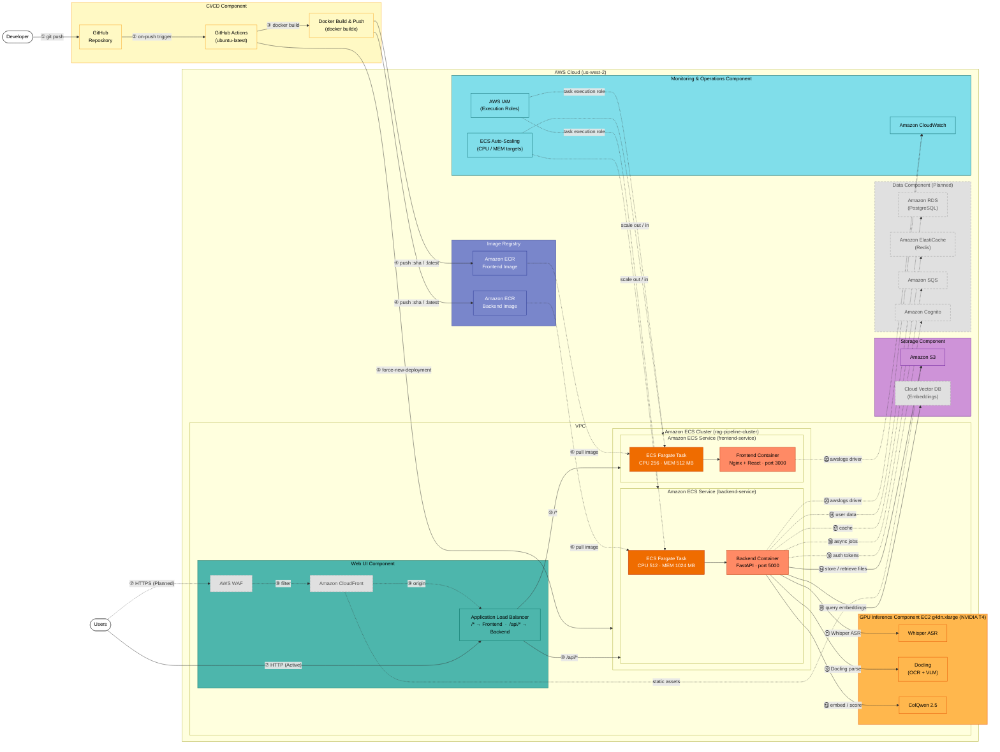

# Diagrams Plan for BK-MInD Capstone Thesis (Updated)

## Overview

For the HCMUT capstone thesis, **6-8 diagrams** are needed in total, split into two categories: **standard software engineering diagrams** (required for any thesis) and **AI/ML-specific diagrams** (needed because the core contribution is a multimodal RAG pipeline).

A **Deployment Diagram** is absolutely needed alongside the **Architecture Diagram** -- they are different diagrams serving different purposes.

---

## Category 1: Standard Software Engineering Diagrams (4-5 diagrams)

### 1. System Architecture Diagram (So do kien truc he thong)

- **What it shows**: High-level view of ALL major software components and how they communicate -- Frontend (React), Backend (FastAPI), Model Server (ColQwen on GPU), Database, Cache, Object Storage
- **Focus**: Logical components, APIs, data flow directions
- **NOT about**: Physical machines or cloud resources -- that is the deployment diagram

### 2. Deployment Diagram (So do trien khai -- UML Deployment Diagram)

- **What it shows**: How software maps to **physical/cloud infrastructure** -- AWS ECS Fargate (backend + frontend), EC2 g4dn.xlarge (GPU model server), ALB, ECR, RDS, S3, CloudWatch
- **Focus**: Nodes, artifacts (Docker images), communication paths (ports, protocols, VPC networking)
- **Why needed**: The system deploys to AWS with Terraform

### 3. Use Case Diagram (So do Use Case)

- **What it shows**: Actors (Student, Admin) and their interactions -- Upload Document, Search/Ask Question, View Summary, Generate Study Roadmap, Process Lecture Video
- **Why needed**: Standard requirement for BKU thesis

### 4. Sequence Diagrams (So do tuan tu) -- 2-3 diagrams for key flows

- **Flow 1**: Document Upload and Processing
- **Flow 2**: RAG Query (Hybrid Retrieval → RRF Reranking → LLM Generation)
- **Flow 3** (optional): Study Roadmap Generation

### 5. Entity-Relationship Diagram - ERD (So do quan he thuc the)

- **What it shows**: Database schema -- Documents, Chunks, Users, Sessions, ProcessingJobs, etc.

---

## Category 2: AI/ML-Specific Diagrams (2-3 diagrams)

### 6. Multimodal RAG Pipeline Architecture Diagram

- **What it shows**: The core AI contribution -- ingestion, indexing, retrieval, generation pipeline
- **This is the MOST IMPORTANT diagram for the thesis**

### 7. Component Diagram (So do thanh phan)

- **What it shows**: Software modules and their dependencies

### 8. Activity Diagram (So do hoat dong)

- **What it shows**: Processing workflow decision logic for document types

---

## Summary Table

| #  | Diagram Name                 | UML Type        | Purpose                                    | Priority   |
|----|------------------------------|-----------------|--------------------------------------------|------------|
| 1  | System Architecture Diagram  | Informal / C4   | High-level components + communication      | Must       |
| 2  | Deployment Diagram           | UML Deployment  | Cloud infrastructure mapping               | Must       |
| 3  | Use Case Diagram             | UML Use Case    | Functional scope + actors                  | Must       |
| 4  | Sequence Diagrams (2-3)      | UML Sequence    | Key flow interactions                      | Must       |
| 5  | ERD                          | ER Diagram      | Database schema                            | Must       |
| 6  | RAG Pipeline Diagram         | Custom/Flowchart| Core AI architecture (main contribution)   | Must       |
| 7  | Component Diagram            | UML Component   | Software module structure                  | Should     |
| 8  | Activity Diagram             | UML Activity    | Processing workflow + decisions             | Should     |

---

## Key Distinction: Architecture Diagram vs. Deployment Diagram

|                    | Architecture Diagram                                     | Deployment Diagram                                                        |
|--------------------|----------------------------------------------------------|---------------------------------------------------------------------------|
| **Shows**          | Logical software components                              | Physical/cloud infrastructure                                             |
| **Focus**          | What the system is made of                               | Where the system runs                                                     |
| **Example**        | "Frontend communicates with Backend via REST API"        | "Frontend runs on ECS Fargate (256 CPU, 512MB) behind ALB in us-west-2"  |
| **Abstraction**    | Technology-agnostic (could run anywhere)                 | Technology-specific (AWS ECS, EC2, ALB, RDS)                              |

They are **complementary** -- both are needed.

---

## Recommended Tools for Drawing

- **draw.io** (free, exports to PDF/PNG) -- good for polished thesis diagrams
- **Mermaid** (code-based, version-controllable) -- good for keeping diagrams in markdown docs
- **Lucidchart** (polished UML output) -- good for formal UML compliance

---
---

## Diagram 1: System Architecture Diagram

This diagram reflects the simplified target application architecture.
All API routes (current and planned) are grouped together for clarity.
The Processing Pipeline, Chunking, Retrieval, and Services modules are shown as
flat peer groups inside the Backend. The GPU Model Server and Storage Layer are
shown as separate top-level components.

```mermaid
graph TB
    %% ── External ──
    User(["User (Student)"])

    %% ── Frontend Layer ──
    subgraph Frontend["Frontend (React + Vite + TailwindCSS)"]
        direction LR
        UI_Upload["Upload UI"]
        UI_Status["Processing Status"]
        UI_Search["Search / Q&A UI"]
        UI_Results["Result Display"]
    end

    %% ── Backend Layer ──
    subgraph Backend["Backend (FastAPI - Python)"]
        direction TB
        API_GW["REST API Gateway"]

        subgraph Routes["API Routes"]
            direction LR
            R_Files["/api/files\nFile Management"]
            R_Processing["/api/processing\nProcessing Control"]
            R_Search["/api/search\nQuery & Retrieval Service"]
            R_Auth["/api/auth\nAuthentication & Users"]
            R_Roadmaps["/api/roadmaps\nLearning Paths"]
            R_Summaries["/api/summaries\nLecture Summaries"]
            R_Sync["/api/sync\nAudio-Slide Sync"]
        end

        URP["Unified RAG Pipeline\n(Orchestrator)"]

        subgraph ProcessingPipeline["Processing Pipeline"]
            direction TB
            MediaProc["Media Processing\n- Convert Video/Audio using MoviePy\n- Convert Audio to Text using Whisper"]
            DocNorm["Document Normalization\n- Normalizing Docs, PPTX, HTML, etc.\n  using LibreOffice Converter"]
            VideoAdv["Video-Audio Advanced Processing\n- Handling Duplicate Frames\n- Handling noise in the Audio\n- Matching Frames with Text extracted"]
            Spreadsheet["Spreadsheet Advanced\nParsing Engine"]
            subgraph DoclingParsing["Multi-format Document Parsing (Docling)"]
                direction LR
                OCR["OCR Engines\n(RapidOCR / Tesseract\n/ EasyOCR)"]
                DoclingConf["Docling Configuration\n(Multiple formats\n+ Images + Tables)"]
                VLM["VLM Image\nDescription"]
            end
        end

        subgraph Chunking["Chunking Module"]
            direction LR
            TextChunker["Text Chunker"]
            MetaEnrich["Metadata Enrichment"]
        end

        subgraph Retrieval["Retrieval Module"]
            direction TB
            Hybrid["Hybrid Retriever"]
            BM25["BM25 Sparse\nRetriever"]
            Dense["Dense\nRetriever"]
            ImgRetriever["Image Retriever\n(Multi-Vector Embeddings)"]
        end

        Services["Services\n(User Management, Authentication,\nLecture Summary Generator, Notification Service...)"]
    end

    %% ── Storage Layer ──
    subgraph Storage["Storage Layer"]
        direction TB
        DB["Database\n(Users, Sessions, Metadata...)"]
        VectorDB["Cloud Vector Database\n(TBD: Qdrant / Pinecone /\nAWS OpenSearch / AWS S3 Vectors)"]
        Cache["Cache"]
        FileSystem["File Systems"]
        JobQueue["Job Queue"]
    end

    %% ── GPU Model Server ──
    subgraph GPUServer["GPU Model Server (FastAPI)"]
        direction LR
        subgraph WhisperSvc["Whisper ASR Service"]
            direction TB
            WhisperModel["Whisper Model\n(GPU Accelerated)"]
            WhisperOut["Output:\nTranscript Text"]
        end
        subgraph DoclingService["Docling Processing Service"]
            direction TB
            DoclingConf2["OCR or VLM\nConfiguration"]
            DoclingOut["Output:\nMarkdown + Images + Tables"]
        end
        subgraph ColQwenSvc["ColQwen Inference Service"]
            direction TB
            Img2Vec["Image to Vector"]
            Q2Vec["Query to Vector"]
            MaxSim["MaxSim Scoring"]
            ColQwenModel["ColQwen 2.5 Model\n(8-bit Quantized)"]
        end
    end

    %% ── Connections ──
    User -->|"HTTP"| Frontend

    UI_Upload -->|"POST /api/files/upload"| API_GW
    UI_Status -->|"GET /api/processing/status"| API_GW
    UI_Search -->|"POST /api/search"| API_GW

    API_GW --> Routes
    API_GW --> URP

    URP --> ProcessingPipeline
    URP --> Chunking
    URP --> Retrieval

    MediaProc -->|"HTTP REST\n(Audio WAV)"| WhisperSvc
    DoclingParsing -->|"HTTP REST\n(Document Parsing)"| DoclingService
    ImgRetriever -->|"HTTP REST\n/embed-images\n/embed-query\n/score"| ColQwenSvc

    Retrieval --> Services
    TextChunker --> BM25
    TextChunker --> Dense
    Hybrid --> BM25
    Hybrid --> Dense

    Dense -->|"Store/Query\nEmbeddings"| VectorDB
    ImgRetriever -->|"Store/Query\nMulti-Vector"| VectorDB
    R_Files -->|"Store Files"| FileSystem
    Services -->|"User Data"| DB
    Services -->|"Sessions / Cache"| Cache
    Services -->|"Async Jobs"| JobQueue

    %% ── Styles ──
    classDef frontend fill:#4FC3F7,stroke:#0277BD,color:#000
    classDef backend fill:#81C784,stroke:#2E7D32,color:#000
    classDef gpu fill:#FFB74D,stroke:#E65100,color:#000
    classDef storage fill:#CE93D8,stroke:#6A1B9A,color:#000
    classDef user fill:#fff,stroke:#333,color:#000
    classDef pipeline fill:#C8E6C9,stroke:#2E7D32,color:#000

    class User user
    class Frontend,UI_Upload,UI_Status,UI_Search,UI_Results frontend
    class Backend,API_GW,Routes,R_Files,R_Processing,R_Search,R_Auth,R_Roadmaps,R_Summaries,R_Sync backend
    class URP,ProcessingPipeline,MediaProc,DocNorm,VideoAdv,Spreadsheet,DoclingParsing,OCR,DoclingConf,VLM pipeline
    class Chunking,TextChunker,MetaEnrich,Retrieval,Hybrid,BM25,Dense,ImgRetriever,Services backend
    class Storage,DB,VectorDB,Cache,FileSystem,JobQueue storage
    class GPUServer,WhisperSvc,WhisperModel,WhisperOut,DoclingService,DoclingConf2,DoclingOut,ColQwenSvc,Img2Vec,Q2Vec,MaxSim,ColQwenModel gpu
```

---
---

## Diagram 2: Deployment Diagram

This diagram organises the full AWS infrastructure into named component groups,
following the AWS reference-architecture style   labelled dashed boxes, numbered
flows ①–⑳, and colour-coded service types.

Active infrastructure is provisioned via Terraform. Planned services (CloudFront,
WAF, RDS, ElastiCache, SQS, Cognito, Vector DB) are shown with grey dashed borders.

