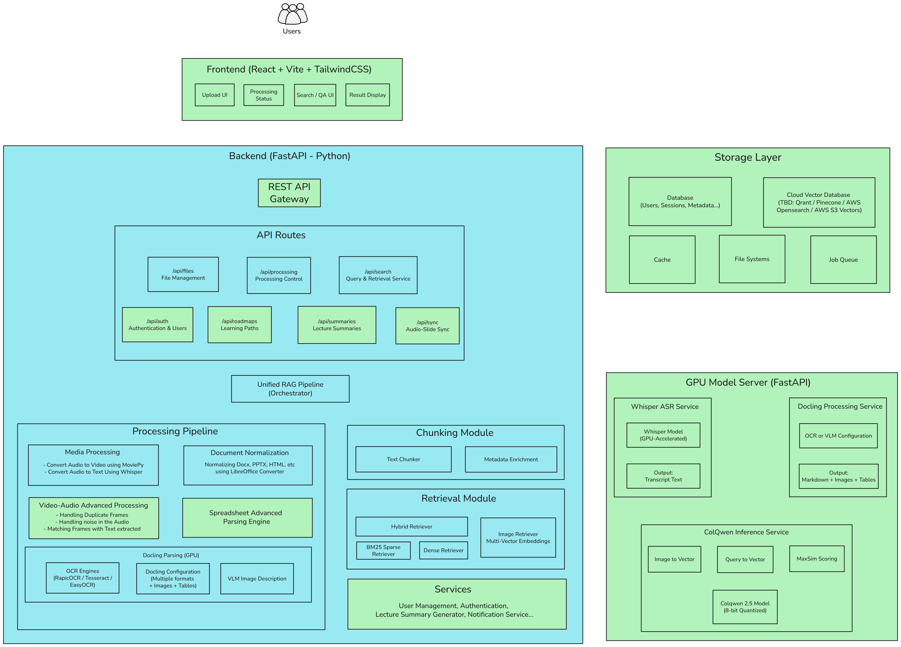

# BK-MInD: AI-Powered Lecture Learning System
# Phase 2 Combined Progress Report

**Reporting Period:** January 2026 - March 2026
**Subject:** Capstone Thesis - BK-MInD: AI-Powered Lecture Learning System
**Phase:** Phase 2 - Requirements Specification, Use Case Development, System Architecture, Backend Processing, Infrastructure, and Deployment Foundation
**Contributors:** Nguyen Minh Khoi (NMK), Nguyen Quang Phu (PDZ), Nguyen Ngoc Khoi (NNK)

---

## Executive Overview

Phase 2 of the BK-MInD capstone thesis project encompasses three parallel and complementary workstreams executed by the project team during January through March 2026. Taken together, these workstreams translate the theoretical research and early prototyping conducted in Phase 1 into a well-documented, architecturally grounded, and substantially operational system.

The first workstream, carried out by Nguyen Minh Khoi, focused on establishing the complete requirements and design foundation of the system. This involved rigorous requirements engineering that produced 35 detailed requirements across functional, non-functional, and technical categories, 10 comprehensive use cases with scenarios and activity diagrams, quantitative project statistics for planning and resource allocation, and detailed system architecture documentation with modular design and technology specifications.

The second workstream, carried out by Nguyen Quang Phu, focused on building and deploying the engineering infrastructure. This involved implementing a complete seven-stage media processing pipeline for lecture video ingestion, automating the build and deployment process with a three-pipeline GitHub Actions CI/CD system, producing formal system architecture and deployment diagrams for the thesis, and provisioning approximately 60% of the target AWS infrastructure using Terraform as Infrastructure as Code.

The third workstream, carried out by Nguyen Ngoc Khoi, focused on the Excel content understanding subsystem. This covered the stakeholder-oriented use case analysis for spreadsheet parsing across six professional domains, and the technical implementation of a zero-dependency native Excel parser, a table-aware chunker, and an end-to-end BM25 and LLM-powered retrieval pipeline for structured tabular data.

---

## Part 1: Requirements Engineering, Use Case Analysis, and Project Documentation

### 1.1 Overview

The primary objective of this workstream was to establish a complete foundation of system specifications, use case documentation, and architectural planning that would guide all subsequent implementation stages. While Phase 1 focused on initial research and prototyping, Phase 2 required systematic analysis of user needs, detailed functional requirements specification, and comprehensive use case development that would serve as the blueprint for development.

Four major deliverables were produced in parallel. The first was comprehensive requirements engineering, translating stakeholder needs into 35 detailed requirements across functional, non-functional, and technical categories. The second was use case development, creating 10 detailed use cases with scenarios, activity diagrams, and integration matrices that document all user interactions with the system. The third was project statistics and analysis, providing quantitative insights into requirements distribution, AI versus software component balance, and implementation priorities. The fourth was system architecture documentation, creating detailed technical specifications and integration patterns to guide the development team.

---

### 1.2 Comprehensive Requirements Engineering and Analysis

#### 1.2.1 Motivation and Background

One of the critical success factors for this capstone project is establishing clear, comprehensive, and implementable requirements that serve as the foundation for all subsequent development work. In Phase 1, the team conducted initial research and identified high-level system capabilities, but there was no systematic requirements engineering process that would translate these concepts into detailed, testable, and prioritized specifications.

Phase 2 therefore required a rigorous requirements engineering process with the following design criteria: requirements must be complete and unambiguous, covering all aspects of system functionality; requirements must be categorized and prioritized to guide implementation sequencing; requirements must be traceable from user needs through to technical implementation; and requirements must be verifiable with clear acceptance criteria. This systematic approach ensures that the development team has clear guidance and that stakeholders can validate that the delivered system meets their expectations.

#### 1.2.2 Requirements Architecture: Three-Tier Specification Framework

The requirements were organized into three distinct tiers, each serving a different purpose in the engineering process. This three-tier approach ensures comprehensive coverage while maintaining clear separation of concerns.

**Tier 1 - Functional Requirements (20 Requirements)**

Functional requirements define what the system must do from a user perspective. These requirements were derived from detailed analysis of educational workflows, student needs, and instructor expectations. The functional requirements are organized into six logical categories that map directly to system capabilities.

Content Processing requirements (8) cover the core data ingestion capabilities including audio extraction from video files using MoviePy, document processing with OCR using Tesseract, image processing with vision-language models, and advanced spreadsheet parsing with merged cell support. These requirements establish the foundation for processing heterogeneous educational materials into a unified knowledge base.

Information Retrieval requirements (3) address the search and discovery capabilities including BM25 sparse retrieval for exact keyword matching, dense semantic retrieval using sentence transformers, and hybrid retrieval combining both approaches. These requirements ensure that students can find relevant content using both precise terminology and conceptual queries.

Question Answering requirements (2) cover the intelligent response generation including LLM-powered answer generation with proper citations and result presentation with relevance scoring and filtering. These requirements ensure that the system provides not just raw content but intelligent, contextual responses to student queries.

User Interface requirements (2) address the human-computer interaction including drag-and-drop file upload interface and natural language search interface with result refinement capabilities. These requirements ensure that the system is accessible and usable for students with varying technical proficiency.

Lecture Summary requirements (2) cover automated content summarization including multi-level summary generation with customizable length and interactive summary navigation with timestamp linking. These requirements provide value-added features that help students quickly review lecture content.

Personalization requirements (3) address adaptive learning capabilities including personalized learning path generation, adaptive assessment creation, and performance analytics dashboard. These requirements differentiate the system from basic content retrieval systems by providing personalized educational experiences.

**Tier 2 - Non-Functional Requirements (8 Requirements)**

Non-functional requirements define how the system must perform rather than what it must do. These requirements are critical for ensuring system reliability, performance, and user satisfaction. They are organized into four categories.

Performance requirements (2) establish quantitative targets including sub-second response times for text retrieval, two-second response times for visual queries, ten-second response times for answer generation, and support for 10,000+ documents with 10+ concurrent users. These requirements ensure that the system can handle realistic educational workloads.

Reliability requirements (2) focus on system availability and data integrity including 99% uptime during business hours, graceful error handling and recovery, automatic retry mechanisms, and comprehensive backup and recovery procedures. These requirements ensure that students can rely on the system for their learning activities.

Usability requirements (2) address user experience quality including intuitive web interface requiring minimal training, responsive design for desktop and mobile, clear error messages and guidance, and accessibility support including screen readers and keyboard navigation. These requirements ensure that the system is inclusive and easy to use.

Security requirements (2) cover data protection and privacy including secure file upload with validation, API key management for external services, user authentication and authorization, data encryption in transit and at rest, and privacy compliance with educational data regulations. These requirements protect student data and ensure institutional compliance.

**Tier 3 - Technical Requirements (7 Requirements)**

Technical requirements define the implementation constraints and technology choices. These requirements provide specific guidance for the development team while ensuring consistency across system components. They are organized into three categories.

System Architecture requirements (3) specify the core technology stack including Python 3.9+ runtime with FastAPI framework, React 18+ frontend with Vite build system, and Vector Database combined with traditional document store. These requirements establish the technical foundation for the system.

Integration requirements (2) address external service dependencies including OpenAI API for GPT models, Google Gemini API for multimodal processing, Hugging Face for model hosting, and cloud storage for file backup. These requirements ensure that the system can leverage best-in-class AI services while maintaining flexibility.

Deployment requirements (2) cover production deployment including Docker support for consistent deployment, Docker Compose for multi-service orchestration, environment-specific configurations, health check endpoints, and support for cloud deployment on AWS, GCP, or Azure. These requirements ensure that the system can be reliably deployed and maintained in production environments.

#### 1.2.3 Requirements Prioritization and Risk Assessment

Each requirement was assigned a priority level based on business impact, technical complexity, and dependency relationships. Critical priority requirements (5) must be implemented in Phase 1 as they form the foundation for all other functionality. Essential priority requirements (15) should be implemented in Phase 2 to provide core value to users. Enhanced priority requirements (10) can be implemented in Phase 3 to improve user experience. Administrative priority requirements (5) can be implemented in Phase 4 to support system maintenance.

Risk assessment identified highest-risk requirements including image processing with vision-language models, visual retrieval with late-interaction embeddings, learning path generation with recommendation algorithms, adaptive assessment with question generation, and scalability requirements for large-scale deployment. Mitigation strategies include prototyping, incremental development, and performance testing.

#### 1.2.4 Requirements Traceability Matrix

A comprehensive traceability matrix was established linking each requirement to its originating stakeholder need, associated use cases, implementation components, and verification criteria. This matrix ensures that every requirement can be traced from business need through to technical implementation and testing. The traceability matrix includes 35 requirements mapped to 10 use cases and 7 system modules, providing complete coverage analysis.

---

### 1.3 Use Case Development and Scenario Analysis

#### 1.3.1 Motivation and Background

Use cases serve as the bridge between abstract requirements and concrete implementation by describing how different actors will interact with the system to achieve their goals. While requirements define what the system must do, use cases provide detailed narratives of user interactions, including main success paths, alternative flows, and exception handling. Phase 2 required developing comprehensive use cases that would guide UI design, API development, and testing scenarios.

The use case development process followed a systematic approach: actor identification to define all user roles and their goals; scenario development to create detailed interaction flows; workflow modeling to visualize processes and identify dependencies; integration analysis to understand cross-use case relationships; and validation to ensure completeness and consistency with requirements.

#### 1.3.2 Use Case Architecture: Core and Extended Features

Ten comprehensive use cases were developed, organized into two logical groups that reflect the system's evolution from basic functionality to advanced learning features.

**Core RAG System Use Cases (4)**

UC-001: Upload and Process Educational Content represents the foundational content ingestion workflow. This use case documents how students and instructors upload lecture materials in various formats (video, audio, documents, images) and how the system processes them through normalization, transcription, and indexing stages. The use case includes detailed scenarios for successful processing, error handling for unsupported formats, and progress tracking for long-running jobs.

UC-002: Search Educational Content covers the primary user interaction pattern. This use case documents how students formulate natural language queries, how the system performs hybrid retrieval across text and visual content, and how results are ranked and presented. Scenarios include simple keyword searches, complex conceptual queries, and multi-modal queries combining text and image input.

UC-003: Generate Answer with Citations represents the core value proposition. This use case documents how the system assembles relevant context from retrieved chunks, generates intelligent responses using LLMs, and provides proper citations back to source materials. Scenarios cover factual questions, conceptual explanations, and step-by-step problem solving.

UC-004: Manage Processing Pipeline addresses administrative functionality. This use case documents how system administrators monitor processing jobs, manage system resources, view performance metrics, and handle error conditions. Scenarios include job monitoring, resource scaling, and system maintenance.

**Extended Learning Features Use Cases (6)**

UC-005: Generate Automated Lecture Summary provides value-added content processing. This use case documents how students request system-generated summaries of processed lectures, with options for brief (2-3 minute), standard (5-7 minute), or comprehensive (10-15 minute) summaries. The use case includes detailed scenarios for summary customization, timestamp linking, and export functionality.

UC-006: Navigate and Interact with Summary covers summary exploration. This use case documents how students interact with generated summaries through clickable sections, timeline navigation, search within summaries, and annotation capabilities. Scenarios include lecture review, exam preparation, and collaborative note-taking.

UC-007: Create Custom Summary with Focus Areas addresses personalization needs. This use case documents how students can request summaries focused on specific topics, difficulty levels, or learning objectives. Scenarios include targeted review, prerequisite learning, and assessment preparation.

UC-008: Generate Personalized Learning Path represents adaptive learning functionality. This use case documents how the system analyzes student performance data, identifies knowledge gaps, and creates customized learning roadmaps. Scenarios include remedial learning, advanced topic exploration, and skill progression planning.

UC-009: Take Adaptive Assessment and Receive Recommendations covers evaluation capabilities. This use case documents how the system generates adaptive questions that adjust difficulty based on student responses, provides immediate feedback, and suggests next learning steps. Scenarios include formative assessment, summative evaluation, and diagnostic testing.

UC-010: View Learning Dashboard and Progress Analytics provides learning analytics. This use case documents how students and instructors view performance metrics, learning progress, strength and weakness analysis, and engagement patterns. Scenarios include progress monitoring, performance review, and learning strategy adjustment.

#### 1.3.3 Activity Diagrams and Workflow Visualization

For each use case, detailed activity diagrams were created using Mermaid syntax to visualize workflows. These diagrams show the sequence of actions, decision points, and system responses for each scenario. The activity diagrams serve multiple purposes: they provide clear visual documentation for developers, they identify integration points between system components, and they serve as the basis for user interface design.

Key activity diagrams include the Lecture Summary Generation Workflow showing the seven-step process from user request through summary delivery; the Personalized Learning Path Generation Workflow illustrating the five-stage process from data collection through path presentation; the Adaptive Assessment Workflow documenting the question-answer-feedback loop; and the Learning Dashboard Interaction Workflow showing the data visualization and user interaction patterns.

#### 1.3.4 Use Case Integration and Dependency Analysis

A comprehensive use case integration matrix was developed showing relationships between use cases, shared components, and implementation dependencies. This analysis revealed that core use cases (UC-001 through UC-004) must be implemented first as they provide the foundation for extended features. Extended use cases (UC-005 through UC-010) depend on core functionality but can be implemented in parallel once the foundation is established.

The integration analysis also identified shared components across use cases, including user authentication, file management, search interface, and notification services. This component-level analysis helps optimize development effort by identifying reusable functionality that can serve multiple use cases.

---

### 1.4 Project Statistics and Resource Allocation Analysis

#### 1.4.1 Motivation and Background

Quantitative analysis of project scope and resource requirements is essential for effective project planning and management. Phase 2 required developing comprehensive statistics that would provide objective measures of project complexity, resource needs, and implementation priorities. These statistics serve multiple purposes: they provide realistic effort estimates for planning, they help balance AI and software engineering resources, and they support data-driven decision making for implementation sequencing.

#### 1.4.2 Statistical Analysis Framework

The statistical analysis was organized around four key dimensions: requirements distribution, complexity assessment, AI versus software balance, and resource allocation planning.

**Requirements Distribution Analysis**

Out of 35 total requirements, 20 are functional (57%), 8 are non-functional (23%), and 7 are technical (20%). This distribution indicates a strong focus on user-facing functionality while maintaining adequate attention to system quality and technical implementation. The functional requirements are further distributed across six categories, with content processing (40% of functional) and personalization (15% of functional) representing the largest areas of focus.

**Use Case Complexity Analysis**

The 10 use cases were classified by complexity based on technical difficulty, integration requirements, and dependency relationships. High complexity use cases (4) include those involving AI model integration and complex data processing: UC-003 (Answer Generation), UC-005 (Summary Generation), UC-008 (Learning Path Generation), and UC-009 (Adaptive Assessment). Medium complexity use cases (5) involve significant user interaction and system coordination: UC-001 (Content Processing), UC-002 (Search), UC-006 (Summary Navigation), UC-007 (Custom Summary), and UC-010 (Dashboard). Low complexity use cases (1) are primarily administrative: UC-004 (Pipeline Management).

**AI versus Software Requirements Balance**

A critical analysis was the balance between AI-heavy and software-heavy requirements. AI-heavy requirements (12, 34%) include those primarily dependent on machine learning models, natural language processing, or computer vision. Software-heavy requirements (23, 66%) include those focused on traditional software engineering, system architecture, and user interface development. This 34/66 split represents a balanced approach that ensures both AI innovation and engineering reliability.

**Resource Allocation Planning**

Based on the requirements analysis, development effort was allocated across four areas: AI development (40% of effort) for the 12 AI-heavy requirements; software engineering (35% of effort) for the 23 software-heavy requirements; frontend development (15% of effort) for user interface and user experience; and testing and quality assurance (10% of effort) for system validation and reliability.

#### 1.4.3 Implementation Priority Matrix

The requirements and use cases were mapped to three implementation stages based on dependency analysis and value delivery.

Stage 1 (MVP) includes 15 functional requirements covering core RAG functionality: content processing, basic search, and answer generation. This stage delivers the minimum viable product that provides core value to students.

Stage 2 (Learning Enhancement) includes 2 functional requirements for lecture summary features: automated summary generation and interactive navigation. This stage adds significant educational value beyond basic content retrieval.

Stage 3 (Personalization) includes 3 functional requirements for adaptive learning features: personalized learning paths, adaptive assessment, and analytics dashboard. This stage provides the full educational experience.

#### 1.4.4 Success Metrics and Quality Targets

Specific success metrics were established for each implementation stage. Stage 1 success is measured by processing accuracy (ASR WER below 15%, OCR accuracy above 90%), retrieval relevance (nDCG@10 above 0.2), and system performance (sub-second response times). Stage 2 success adds summary quality metrics (concept coverage above 85%, user satisfaction above 4.2 out of 5.0). Stage 3 success includes learning outcome metrics (grade improvement above 15%, engagement above 80%).

---

### 1.5 System Architecture Documentation and Technical Specifications

#### 1.5.1 Motivation and Background

System architecture documentation serves as the technical blueprint that guides implementation teams and ensures consistency across system components. Phase 2 required creating comprehensive architecture specifications that would address both logical software design and physical deployment considerations. The architecture documentation needed to be detailed enough to guide development while remaining flexible enough to accommodate technology choices and implementation discoveries.

The architecture documentation process addressed multiple perspectives: logical component organization showing how modules interact; data flow documentation showing how information moves through the system; integration patterns defining how external services are consumed; and scalability considerations ensuring the system can handle growth in users and content.

#### 1.5.2 Modular Architecture Design

The system was designed with seven distinct modules, each with clear responsibilities and well-defined interfaces. This modular approach provides several benefits: parallel development by different team members, independent testing and deployment of components, clear separation of concerns for maintainability, and flexibility for technology choices within modules.

The Content Processing Module handles all data ingestion and transformation. This module includes components for audio extraction, speech recognition, document processing, image analysis, and spreadsheet parsing. It is designed as a high-complexity, critical-priority module that forms the foundation for all other system capabilities.

The Information Retrieval Module manages search and discovery functionality. This module includes sparse retrieval (BM25), dense retrieval (embeddings), and hybrid retrieval combining both approaches. It is designed as a high-complexity, critical-priority module that enables core user interactions.

The Question Answering Module generates intelligent responses to user queries. This module includes context assembly, LLM integration, and answer formatting with citations. It is designed as a medium-complexity, critical-priority module that provides the system's primary value proposition.

The User Interface Module handles all user interactions and presentation. This module includes file upload interface, search interface, result display, and user navigation. It is designed as a medium-complexity, high-priority module that ensures system usability.

The Lecture Summary Module provides automated content summarization. This module includes summary generation, customization options, and interactive navigation. It is designed as a high-complexity, high-priority module that adds significant educational value.

The Personalization Module delivers adaptive learning features. This module includes learning path generation, adaptive assessment, and performance analytics. It is designed as a very high-complexity, high-priority module that differentiates the system from basic retrieval systems.

The System Administration Module provides operational and maintenance capabilities. This module includes system monitoring, resource management, and administrative interfaces. It is designed as a medium-complexity, medium-priority module that ensures system reliability.

#### 1.5.3 Technology Stack Specification

Detailed technology specifications were created for each system component, providing clear guidance for implementation teams.

The AI/ML Technology Stack specifies the artificial intelligence and machine learning components: PyTorch for deep learning models, Transformers for natural language processing, LangChain for LLM orchestration, Whisper for speech recognition, sentence-transformers for embeddings, and ColQwen for visual-language understanding.

The Backend Technology Stack defines the server-side infrastructure: FastAPI for REST API framework, Python 3.9+ runtime environment, async processing for performance, SQLAlchemy for database ORM, and Redis for caching and session management.

The Frontend Technology Stack specifies the client-side technologies: React 18+ with modern hooks for user interface, Vite for build system and development server, TailwindCSS for styling and responsive design, and modern state management for application state.

The Database and Storage Stack covers data persistence: Vector Database for semantic search capabilities, traditional document store for structured data, cloud storage for file backups, and caching layer for performance optimization.

The Deployment and Infrastructure Stack defines the production environment: Docker for containerization, Docker Compose for service orchestration, cloud deployment support on AWS, GCP, or Azure, and monitoring and logging infrastructure for operational visibility.

#### 1.5.4 Integration Patterns and External Dependencies

The system architecture defines clear patterns for integrating with external services and APIs. These patterns ensure consistent, reliable, and maintainable integrations.

The AI Service Integration Pattern defines how external AI services are consumed: API key management through environment variables, retry mechanisms for failed requests, rate limiting for cost control, fallback strategies for service unavailability, and response caching to minimize API calls.

The Data Processing Pipeline Pattern specifies how data flows through processing stages: event-driven architecture for job triggering, message queues for asynchronous processing, state management for long-running jobs, and error handling and recovery mechanisms.

The User Interface Integration Pattern defines how the frontend communicates with the backend: RESTful API design with clear endpoints, WebSocket connections for real-time updates, authentication and authorization patterns, and error handling and user feedback mechanisms.

---

### 1.6 Current Status and Implementation Readiness

#### 1.6.1 Documentation Completeness

All four major workstreams have been completed successfully. The requirements engineering workstream produced 35 comprehensive requirements with full traceability and verification criteria. The use case development workstream delivered 10 detailed use cases with scenarios, activity diagrams, and integration analysis. The project statistics workstream provided quantitative analysis and resource allocation planning. The system architecture workstream created detailed technical specifications and integration patterns.

#### 1.6.2 Implementation Readiness Assessment

The project is now fully ready for implementation Phase 1. All requirements are specified, prioritized, and linked to use cases. All use cases are documented with detailed scenarios and workflow visualizations. The system architecture provides clear technical guidance for development teams. Resource allocation and implementation sequencing are established based on dependency analysis and value delivery.

#### 1.6.3 Quality Assurance and Validation

Multiple quality assurance measures have been implemented throughout Phase 2. Requirements validation ensured stakeholder alignment and completeness. Use case validation verified that all user interactions are covered and workflows are logical. Architecture validation confirmed that technical specifications are feasible and consistent. Cross-document validation ensured traceability and consistency across all deliverables.

#### 1.6.4 Next Steps and Transition Plan

Phase 2 has established a solid foundation for implementation. The immediate next steps include: setting up the development environment with the specified technology stack, implementing core modules following the modular architecture, establishing a CI/CD pipeline for automated testing and deployment, and beginning user acceptance testing with stakeholders.

The comprehensive documentation created during Phase 2 provides clear guidance for implementation teams, ensures alignment between requirements and delivered functionality, and establishes quality criteria for validation. The project is well-positioned for successful implementation and delivery of a high-quality educational content processing system.

---

## Part 2: Multimodal RAG Pipeline - Infrastructure and Media Processing

### 2.1 Overview

The overarching goal of this workstream is to translate the theoretical research and prototyping conducted in Phase 1 into concrete, working, and deployable software components. Phase 2 is notably more engineering-intensive than Phase 1, requiring decisions not only about AI model selection and pipeline design, but also about system architecture, cloud infrastructure, deployment automation, and long-term scalability.

Four major workstreams were executed in parallel during this phase. The first focused on implementing a complete and robust media processing pipeline capable of transforming raw lecture video and audio recordings into a semantically searchable knowledge base, which constitutes the core data ingestion mechanism for the RAG system. The second addressed Continuous Integration and Continuous Deployment (CI/CD) automation, ensuring that any code change pushed to the version control system would be automatically validated, containerized, and deployed to the production environment on AWS without manual intervention. The third involved the systematic analysis and production of architectural diagrams covering both the logical software architecture and the physical deployment topology. The fourth involved provisioning the actual cloud infrastructure on Amazon Web Services using Terraform as Infrastructure as Code, translating the deployment design into a real, operational environment.

---

### 2.2 Enhanced Media Processing Pipeline for Lecture Video Ingestion

#### 2.2.1 Motivation and Background

One of the primary contributions of this thesis is the ability to process raw lecture videos and audio recordings and convert them into a semantically searchable knowledge base that students can query in natural language. In Phase 1, the team investigated individual tools and techniques for audio transcription, frame extraction, and primitive retrieval. However, those experiments were isolated: there was no unified system connecting all the steps end-to-end, nor any standardized output format that downstream retrieval components could rely on.

Phase 2 therefore required building a consolidated, production-quality processing pipeline with the following design requirements: the pipeline must be fully automated from raw video input through to a queryable index without requiring manual intervention between steps; all intermediate and final outputs must carry rich metadata so that retrieved results can be traced back to their exact position in the source video; the pipeline must degrade gracefully when optional dependencies (such as a paid API key) are unavailable; and the design must be modular enough to be integrated into a web server as a background processing job in the next phase.

#### 2.2.2 Pipeline Architecture: Seven Sequential Stages

The pipeline processes a video or audio file through seven well-defined stages. Each stage produces structured outputs consumed by the next, forming a linear but internally rich processing chain.

**Stage 1 - Audio Extraction and Noise Reduction**

The entry point of the pipeline accepts video files in common lecture recording formats such as MP4, AVI, MOV, and MKV, as well as standalone audio formats including WAV, MP3, and M4A. For video inputs, the audio stream is extracted and saved separately as a WAV file. Before the audio is passed to any transcription model, a two-step noise reduction process is applied. The first step trims leading and trailing silence, which is common in recorded lectures that often begin with setup time. The second step applies a high-pass filter to remove low-frequency ambient noise, such as air conditioning hum or microphone rumble, which can degrade transcription accuracy. The choice to include this preprocessing step was motivated by real observations during Phase 1 testing, where unfiltered audio produced meaningfully worse transcription quality on certain recordings.

**Stage 2 - Automatic Speech Recognition with Quality Filtering**

The cleaned audio is fed into OpenAI's Whisper model for transcription. One of the important design choices at this stage was to request word-level timestamps rather than only segment-level timestamps. Word-level timestamps are necessary because the downstream chunk-to-frame alignment step in Stage 5 depends on precise temporal references to associate visual frames with the text being spoken at that moment. This would not be possible with coarse segment-only timestamps.

Beyond this, two quality filters are applied at the segment level to discard low-confidence speech: segments where the model estimates a high probability that no speech was present are filtered out, as are segments where the average log-probability of the predicted tokens falls below an acceptable threshold. These filters help ensure that filler sounds, background noise mistakenly transcribed as words, or heavily muffled speech do not pollute the downstream index. The output of this stage is a complete, structured transcript with timestamps at the word and segment levels, along with several derived formats including plain text subtitles (SRT) and WebVTT, the latter being directly usable by browser-based video players for caption display.

**Stage 3 - Token-Aware Semantic Chunking**

Retrieval-Augmented Generation systems do not index full transcripts as single documents. Instead, a transcript must be divided into chunks small enough for a language model to process within its context window, yet semantically coherent enough to constitute a meaningful answer unit. This stage implements a token-aware chunker that splits the transcript while respecting sentence boundaries. The maximum chunk size is set to 100 tokens, with a configurable overlap between adjacent chunks to preserve cross-sentence context. Importantly, each resulting chunk inherits precise metadata from the segments it was derived from: its token count, the start and end timestamps of the corresponding audio, and references back to the original transcript segments. This metadata is later used during retrieval to display the exact timestamp range in the video to the user when a matching chunk is returned.

**Stage 4 - Frame Extraction with Perceptual Hash Deduplication**

Lecture videos exhibit a particular characteristic that distinguishes them from general video content: long periods of near-static visual content. A lecturer may spend several minutes on a single slide, during which consecutive video frames are visually near-identical. If all frames were naively extracted and indexed, the index would be dominated by redundant visual information, increasing storage costs and degrading retrieval signal quality.

To address this, frames are extracted at one frame per second by default using a video processing library, and then each frame is evaluated against the previous one using perceptual hashing (pHash). Perceptual hashing produces a compact fingerprint of the visual content of an image in a way that is robust to minor pixel-level variations. Two frames with a perceptual hash similarity above 0.95 are considered duplicates; the second frame is discarded. Only visually distinct frames are retained and saved, each with a metadata record containing its timestamp, frame number, perceptual hash value, and storage path. In practice, this deduplication step substantially reduces the number of stored frames for lecture recordings, often by 60% to 80% depending on the pacing of the lecture.

**Stage 5 - LLM-Based Chunk Description Generation**

This stage represents the most technically novel contribution of the media pipeline and reflects a deliberate architectural decision about how to improve retrieval quality. Raw lecture transcripts are often informal in their language: a lecturer might say "so this thing over here, this algorithm we talked about last week" rather than "the Naive Bayes classification algorithm." A student asking "what is Naive Bayes?" would receive a low similarity score against the raw transcript chunk, even though the content is directly relevant.

To bridge this semantic gap, each chunk is enriched with a natural-language description generated by a language model (GPT-4o-mini via the OpenAI API). This description is a concise, formal summary of what the chunk covers conceptually, written in the kind of language a student would use when searching. For example, a raw chunk might be transcribed speech about "this formula here," while the generated description would state "This segment explains the likelihood calculation in Naive Bayes and how prior probabilities are combined with evidence." When the enhanced description is included in the embedding, it dramatically improves the semantic relevance of retrieved chunks.

Alongside description generation, this stage performs frame-to-chunk temporal alignment: each retained frame is associated with the text chunk whose timestamp range contains that frame's timestamp. This builds a direct link between the visual and textual streams of the lecture, enabling a retrieval result to carry both the relevant text passage and the slide or board image from that moment in the lecture.

The entire stage is designed to fail gracefully. If the OpenAI API key is not present in the environment, this stage is skipped without interrupting the pipeline. The system continues with raw chunk text only, producing a functional but less semantically rich index. This design choice was made to ensure the pipeline remains fully testable and demonstrable during development without requiring API costs.

**Stage 6 - Hybrid Retrieval Index Construction**

With enhanced chunks available, the pipeline builds a searchable index using a hybrid retrieval strategy. Two complementary retrieval methods are combined.

The first is sparse retrieval using the BM25 algorithm. BM25 is a well-established term-frequency and inverse-document-frequency ranking function that is particularly effective for exact-match and keyword-focused queries. It handles technical terminology efficiently: if a student searches for "gradient descent," BM25 will rank chunks that literally contain that phrase very highly.

The second is dense retrieval using sentence embeddings. A pre-trained sentence transformer model is used to encode all chunks into fixed-dimensional dense vectors, which are then indexed using FAISS for efficient approximate nearest-neighbor search. Dense retrieval captures semantic similarity: if a chunk talks about "minimizing the loss function by adjusting weights," it may not match the exact phrase "gradient descent" but the dense embeddings will recognize it as semantically related.

A hybrid retriever combines the ranked lists from both methods using a tunable mixing coefficient (default: equal weighting). The final index along with all chunk metadata and document mappings is saved to disk, enabling fast reloading for subsequent queries without reprocessing the original video.

**Stage 7 - Semantic Query Interface**

The final output of the pipeline is a query-ready retrieval interface. When given a natural-language query, the system performs hybrid retrieval over the entire indexed corpus, returns the top-ranked chunks, and attaches to each result the matching text, its generated description, the source video filename, the precise timestamp range, and any associated visual frames. This level of provenance in the results is what allows the frontend to display not just a text answer but also the exact video moment in which the relevant explanation occurred, serving as both an answer and a direct reference into the original lecture.

#### 2.2.3 Dual Execution Modes

The pipeline was implemented with two usage modes to serve different purposes. A batch processing mode enables the pipeline to be pointed at a directory of video files and processes them all sequentially with detailed console progress logging, intended for bulk ingestion of course materials. An interactive web interface, built with Streamlit, allows a user to upload a single video and observe the processing progress through each stage in real time, viewing intermediate outputs such as the transcript, extracted frames, and generated descriptions as they become available. The Streamlit interface was built primarily to support interactive debugging, rapid experimentation, and demonstration to stakeholders during development.

#### 2.2.4 Technical Stack

| Capability | Technology Used |
|---|---|
| Audio extraction from video | MoviePy |
| Audio preprocessing and noise reduction | librosa |
| Automatic Speech Recognition | OpenAI Whisper |
| Video frame extraction | OpenCV |
| Frame perceptual deduplication | imagehash (pHash algorithm) |
| LLM chunk enrichment | OpenAI GPT-4o-mini API |
| Sparse keyword retrieval | rank-bm25 (BM25Okapi) |
| Dense semantic retrieval | sentence-transformers + FAISS |
| Interactive demonstration interface | Streamlit |

#### 2.2.5 Current Status and Integration Readiness

The complete seven-stage pipeline has been implemented and verified end-to-end using real Coursera lecture videos as test inputs. All stages produce the expected output structures including clean audio, structured transcripts with timestamps, deduplicated frames, LLM-enriched chunks with frame associations, and a functional searchable RAG index. Semantic query tests against the index return contextually relevant chunks with correct timestamp metadata. The pipeline is currently self-contained as a standalone module. The next step is to deploy it as an asynchronous background task within the main FastAPI backend, triggered when a user uploads a video file through the web interface.

---

### 2.3 CI/CD Workflow: Automating the GitHub to AWS Deployment Pipeline

#### 2.3.1 Motivation

As the system matures past the prototype stage, the team needs a reliable, repeatable process for taking code changes from developers and getting them running in the production environment. Without automation, every code update requires a developer to manually rebuild Docker images, re-tag and push them to the container registry, update the cloud service configuration, and monitor the rollout. This manual process is slow, inconsistent, and introduces human error into a step that directly affects the stability of the live system. Furthermore, it creates a bottleneck: only team members with the correct cloud credentials and local tooling can deploy.

A Continuous Integration and Continuous Deployment pipeline solves this by making deployment a side effect of code review. When a developer merges code into the main branch, the entire build, test, publish, and deployment sequence runs automatically in the cloud without any further developer action.

#### 2.3.2 Containerization: Packaging Each Service as a Docker Image

Before any deployment automation is meaningful, every service must be packaged in a portable, self-contained format. Docker containers were chosen for this, and a multi-stage build strategy was applied to both services to produce the smallest and most secure possible runtime images.

For the backend, a Python 3.11 Alpine Linux base was used. The build proceeds in two stages: a dependency installation stage that resolves and caches all Python packages from the requirements specification, and a final production stage that copies only the application code and pre-built dependencies without any build tooling. The FastAPI server is exposed on port 5000. Health check endpoints are configured so that the load balancer can probe container readiness after startup. The resulting image is lean and does not carry any compilers, build tools, or unnecessary system utilities that would expand the attack surface.

For the frontend, a two-stage build was used: the first stage uses a full Node.js 20 environment to execute the Vite build process, compiling the React application into optimized static HTML, CSS, and JavaScript assets. The second stage is a minimal Nginx Alpine image, which serves those static assets at roughly 13 megabytes, compared to over 600 megabytes if the Node.js runtime were included. The Nginx configuration was written to handle single-page application routing (directing all unknown paths to the React entry point), proxy API requests to the backend container, apply gzip compression for faster asset delivery, and include security-oriented HTTP headers including HSTS, Content-Security-Policy, and X-Frame-Options.

#### 2.3.3 GitHub Actions Workflow Architecture

Three distinct automated pipelines were designed, each covering a different dimension of the system. Each pipeline is triggered automatically by Git events and executes on GitHub's cloud runners.

**Backend Deployment Pipeline**

This pipeline activates whenever code changes are pushed or a pull request is opened targeting the main or develop branches, specifically when those changes affect the backend application source. The pipeline is organized into two sequential jobs.

The first job handles building and publishing the container image. It begins by authenticating to AWS using OpenID Connect federation, which grants it temporary credentials scoped to exactly the permissions needed for image publishing. It then authenticates to Amazon Elastic Container Registry, builds the backend Docker image with layer caching enabled to minimize build time on repeated runs, and pushes the result to the registry with two tags: one that precisely identifies the triggering Git commit SHA (enabling rollback to any specific release) and one that updates the mutable "latest" pointer. After pushing, it creates or updates an ECS task definition that references the newly published image URI.

The second job handles the actual deployment to the live cluster. This job is conditioned to run only on direct pushes to the main branch (not on pull requests), ensuring that only reviewed and approved code reaches production. It renders the updated task definition and issues a force-new-deployment command to the ECS backend service, replacing running containers with new instances pulling the fresh image. The pipeline then monitors the deployment by polling the ECS service state until all desired tasks are confirmed healthy and running, which verifies that the deployment completed without degradation.

**Frontend Deployment Pipeline**

The frontend pipeline follows the same structural pattern as the backend. The build job includes additional frontend-specific steps: it sets up a Node.js environment with dependency caching to avoid re-downloading packages on every run, installs dependencies reproducibly, runs ESLint as a non-blocking validation step (the build proceeds even if there are warnings, ensuring lint issues do not block deployments while still producing a visible record), and executes the Vite production build to generate the optimized static asset bundle before packaging it into the Nginx-based Docker image. The deployment job follows the same ECS force-new-deployment and stability-monitoring pattern as the backend.

**Infrastructure Management Pipeline**

The third pipeline manages changes to the cloud infrastructure itself. It activates when changes are pushed to the Terraform configuration directory. The pipeline is organized into three sequential jobs representing a structured review-and-apply workflow.

The planning job runs on all triggers, including pull requests. It initializes the Terraform working directory against the configured state backend, validates the configuration syntax and provider schema compliance, and generates a complete execution plan that shows exactly which resources would be created, modified, or destroyed. This plan is saved as a versioned artifact with a retention window for audit purposes. When running against a pull request, the pipeline posts a human-readable summary of the planned changes as a comment directly on the pull request, giving the team visibility into infrastructure impact before any change is approved.

The apply job runs only on direct pushes to the main branch and only if the planning job succeeded. It downloads the exact plan artifact generated in the previous job and applies it, ensuring that the infrastructure change reviewed during the plan phase is precisely what gets executed. Using a saved plan artifact in this way prevents the plan-apply race condition in which the state of AWS resources could drift between the time a plan was generated and the time apply is run.

A post-apply verification job reads all Terraform output values and prints a structured summary of every provisioned resource identifier, the application URLs, and a resource count confirmation, providing a clear record that the apply completed as expected.

#### 2.3.4 AWS Authentication Strategy

A critical security decision in the CI/CD design was how GitHub Actions runners would authenticate to AWS. The naive approach of generating long-lived AWS access keys and storing them as GitHub Secrets carries significant risk: if those secrets were inadvertently exposed, they would grant persistent access to the AWS account until manually rotated.

Instead, the pipeline uses OpenID Connect (OIDC) federated identity. In this model, AWS IAM is configured to trust GitHub's OIDC provider as an identity authority. When a pipeline run starts, GitHub generates a short-lived, cryptographically signed identity token identifying the specific repository and branch. The pipeline presents this token to AWS, which validates it against the trust configuration and issues temporary credentials scoped to a specific IAM role with only the permissions needed for that pipeline. These credentials are valid for the duration of the pipeline run and then expire automatically. No long-lived secrets are stored anywhere.

#### 2.3.5 Current Status

All three workflow definitions are complete, reviewed, and stored in the repository. They are currently maintained in a deactivated state to prevent premature triggering before the initial infrastructure is fully validated by a manual deployment. The activation plan is: first push the initial Docker images to ECR manually, force new deployments in ECS, confirm that all ALB target groups report healthy, and verify that the application responds correctly on both the frontend and backend endpoints. Once this baseline is confirmed, the workflows will be activated and all subsequent deployments will be fully automated through the CI/CD system.

---

### 2.4 System Architecture Diagrams

Two formal diagrams have been produced for the thesis to document the system design: a System Architecture Diagram and a Deployment Diagram. These two diagrams serve fundamentally different purposes and together provide a complete picture of both what the system is made of and where and how it runs.

#### 2.4.1 The Distinction Between Architecture and Deployment Diagrams

A recurring source of confusion in software engineering documentation is treating the system architecture diagram and the deployment diagram as the same artifact. In this thesis, they are deliberately kept separate. The architecture diagram describes the logical structure of the software: what components exist, what responsibilities each component holds, and how they communicate with each other. It is abstracted away from physical infrastructure -- the same architecture could theoretically run on any cloud provider or on-premises. The deployment diagram, by contrast, describes the physical and cloud-level realization: which specific AWS services host which components, how network traffic is routed through security layers, which services are currently designed versus those not yet provisioned, and how the CI/CD system integrates with the infrastructure.

Both diagrams are required for the thesis because the engineering contribution of this project spans both dimensions. The software architecture communicates the AI system design; the deployment architecture demonstrates the engineering rigor of making the system production-ready on AWS.

#### 2.4.2 System Architecture Diagram



The System Architecture Diagram was produced using Excalidraw and shows the full logical component structure of the BK-MInD system. The diagram is divided into four distinct visual areas: the Frontend, the Backend, the Storage Layer, and the GPU Model Server, each drawn as a separate bounded region to clearly communicate the separation of responsibilities.

The Frontend is labeled as a React, Vite, and TailwindCSS application. It contains four labeled sub-components: an Upload UI for submitting lecture materials, a Processing Status panel showing the current state of ingestion jobs, a Search / QA UI through which students pose natural-language questions, and a Result Display panel that presents retrieved answers. Users are positioned at the entry point of the system above the Frontend.

The Backend occupies the largest region and is labeled as a FastAPI Python application. At the top sits a central REST API Gateway box. Below it, an API Routes panel groups seven named route sets with their explicit URL path prefixes: the file management route at `/api/files`, the processing control route at `/api/processing`, the query and retrieval service at `/api/search`, authentication and user management at `/api/auth`, learning path generation at `/api/roadmaps`, lecture summary generation at `/api/summaries`, and audio-slide synchronization at `/api/sync`. All seven route groups feed into a Unified RAG Pipeline Orchestrator, which acts as the central coordinator for all backend operations.

Beneath the orchestrator, the backend is organized into three parallel sub-regions. The first is the Processing Pipeline, which contains five sub-components. Media Processing handles video and audio inputs using MoviePy for audio extraction and Whisper for speech-to-text conversion. Document Normalization handles heterogeneous input formats such as DOCX, PPTX, and HTML by converting them into a uniform intermediate form using LibreOffice. Video-Audio Advanced Processing addresses deduplication and matching work, handling duplicate frames, removing noise from the audio, and aligning extracted frames with the corresponding transcribed text. A Spreadsheet Advanced Parsing Engine handles structured tabular data inputs as a dedicated sub-component. The Docling Parsing (GPU) sub-component contains three nested components: OCR Engines supporting RapidOCR, Tesseract, and EasyOCR for scanned document handling; a Docling Configuration box that covers multiple document formats and handles embedded images and tables; and a VLM Image Description module that calls a vision-language model to generate natural-language descriptions of images found within documents.

The second sub-region is the Chunking Module, which appears as two adjacent components: a Text Chunker that splits normalized text into token-bounded segments, and a Metadata Enrichment component that annotates each chunk with timestamp, source reference, and other structured metadata before indexing.

The third sub-region is the Retrieval Module, containing four retrieval strategies: a Hybrid Retriever as the top-level component that combines the outputs below; a BM25 Sparse Retriever for keyword-based exact matching; a Dense Retriever for semantic embedding-based matching; and an Image Retriever that operates on multi-vector embeddings, specifically the late-interaction ColQwen embeddings used for slide image retrieval. Below all three sub-regions sits a Services box listing: User Management, Authentication, Lecture Summary Generator, and Notification Services as the supporting service layer.

The Storage Layer is drawn as a separate bounded box containing five components: a Database for users, sessions, and metadata; a Cloud Vector Database with an explicit label noting the technology is still to be decided, listing Qdrant, Pinecone, AWS OpenSearch, and AWS S3 Vectors as candidate options; a Cache component; a File Systems component for raw uploaded files; and a Job Queue for asynchronous task management.

The GPU Model Server is drawn as a fourth separate bounded box and is labeled as a FastAPI application running on dedicated GPU hardware. It exposes three named inference services. The Whisper ASR Service contains a Whisper Model (GPU-Accelerated) component and produces Transcript Text as output. The Docling Processing Service contains an OCR or VLM Configuration component and produces Markdown plus Images plus Tables as output. The ColQwen Inference Service is the most detailed of the three, containing four labeled components: Image to Vector, Query to Vector, MaxSim Scoring, and the ColQwen 2.5 Model at 8-bit quantization. This service powers the visual embedding and retrieval capability, encoding both page images and natural-language queries into late-interaction embedding sequences and scoring their relevance using the MaxSim mechanism.

#### 2.4.3 Deployment Diagram


The Deployment Diagram maps the logical architecture onto concrete AWS infrastructure. The diagram uses the standard AWS icon set and organizes all components into labeled bounded regions. The overall layout is divided into three zones: the CI/CD Component sitting outside the AWS boundary, the AWS Cloud Region (us-west-2) occupying the center and right, and an External 3rd Party Cloud VectorDB block representing services hosted outside of AWS entirely.

The CI/CD Component shows the developer workflow that feeds images into AWS. Developers push code to the GitHub Repository, which triggers GitHub Actions running on ubuntu-latest runners to execute a Docker build and push job. The job retrieves environment configuration values from AWS Secrets Manager, builds the Docker image, and pushes it with the latest tag to the AWS ECR repositories in the Image Registry. Container image pulls are routed through private VPC-internal endpoints rather than going out to the public internet.

The Observability Component contains four services: CloudWatch, which receives logs from ECS tasks and EC2 instances; CloudTrail, which captures all AWS API calls and sends them to an S3 audit bucket; X-Ray, which traces requests across the Frontend, Backend, and Inference components for distributed request tracing; and S3, which consolidates audit logs including WAF logs and ALB access logs.

Inside the VPC, the infrastructure is split across two subnet tiers. The Public Subnet contains the AWS WAF Firewall, the AWS CloudFront CDN, the AWS Application Load Balancer, a NAT Gateway, and Amazon ElastiCache. The ALB performs path-based routing: traffic on port 3000 matching root and all non-API paths is forwarded to the Frontend Service, while traffic on port 5000 matching the `/api/` prefix is forwarded to the Backend Service.

The Private Subnets App Tier contains the AWS ECS Cluster running two application services. The Frontend Service group contains an ECS Task Definition with its running Container, IAM Task Role and Execution Role, CloudWatch monitoring into an Alarm, and Application Auto Scaling for task count management. The Backend Service group follows the same structure. Amazon Bedrock appears connected to the Backend Service, indicating that the backend can invoke foundation models through the AWS Bedrock managed service for certain inference tasks.

The Data Component contains five services: an AWS SQS App Queue for general async job management; DynamoDB for fast NoSQL storage; an AWS S3 Bucket for raw uploaded application files (Block Public Access, SSE-KMS encryption); an AWS SQS Inference Queue as the task bus between the backend and the inference tier; and an AWS S3 Bucket for processed inference output results.

The Private Subnets Inference Tier contains a Network Load Balancer, an EC2 Auto Scaling configuration, and an EC2 Auto Scaling Group hosting three inference services: Whisper base/large for ASR, Docling for document parsing, and ColQwen 2.5 for visual embedding and retrieval.

The External 3rd Party Cloud VectorDB block, entirely outside the AWS boundary, lists Qdrant and Pinecone as candidates, representing the deliberate design decision to keep the Vector Database as an externally managed service while the technology choice is still being evaluated.

#### 2.4.4 Remaining Diagrams

In addition to the two completed diagrams, the thesis requires six more diagrams that have been identified and planned but not yet produced. These include a Use Case Diagram showing the actors and their interactions with the system, two or three Sequence Diagrams detailing critical interaction flows (specifically the document upload and processing flow, and the RAG query flow from user input through retrieval to LLM-generated response), an Entity-Relationship Diagram documenting the relational database schema, a Multimodal RAG Pipeline Architecture Diagram that illustrates the core AI contribution of the thesis in a flowchart style from raw input through indexing and retrieval to response generation, and a Component Diagram showing the internal module dependencies of the backend codebase. Among these, the Multimodal RAG Pipeline Architecture Diagram is considered the highest priority as it directly communicates the novel technical contribution of the project to thesis reviewers.

---

### 2.5 Terraform Infrastructure as Code

#### 2.5.1 Overview and Rationale for Infrastructure as Code

The cloud infrastructure for Phase 2 is managed entirely using Terraform, a declarative Infrastructure as Code (IaC) tool. The decision to use IaC rather than provisioning resources manually through the AWS Management Console was driven by several engineering requirements. First, infrastructure defined in code is version-controlled alongside the application code, meaning every change to the cloud environment is traceable, reviewable, and reversible. Second, IaC enables the infrastructure configuration to be reproduced identically in a new environment with a single command. Third, it eliminates configuration drift, the common production problem where the actual state of cloud resources diverges from the documented state because manual changes were made without being recorded.

As of the successful deployment on February 15, 2026, Terraform has provisioned 36 AWS resources into the us-west-2 (Oregon) region. This represents approximately 60% of the complete infrastructure shown in the Deployment Diagram. The remaining 40% consists of the planned services that are architecturally identified but not yet provisioned.

#### 2.5.2 Module Organization

The Terraform configuration is organized into a root module and five child modules, each encapsulating a logically cohesive slice of the infrastructure. This modular structure makes each component independently testable, reusable across environments, and easier to reason about when making targeted changes. The five modules are ECR (container image storage), IAM (access control), ALB (load balancing), ECS (compute orchestration), and autoscaling (dynamic capacity management).

```
terraform/
  main.tf           - Root configuration, module wiring, provider setup
  variables.tf      - All configurable input parameters
  outputs.tf        - Exported values for cross-module consumption and CI/CD
  terraform.tfvars  - Actual environment-specific values (excluded from version control)
  modules/
    ecr/            - ECR repository lifecycle and scanning policies
    iam/            - IAM execution roles and least-privilege policies
    alb/            - Application Load Balancer, listener rules, target groups
    ecs/            - ECS cluster, Fargate task definitions, services, security groups
    autoscaling/    - CPU, memory, and request-count based scaling policies
```

The root configuration sources the default VPC and its associated subnets from AWS account data sources and wires all module outputs together. All resources inherit a consistent set of tags (Environment, Project, ManagedBy) applied via the provider `default_tags` block:

```hcl
provider "aws" {
  region = var.aws_region
  default_tags {
    tags = {
      Environment = var.environment
      Project     = var.project_name
      ManagedBy   = "Terraform"
    }
  }
}
```

#### 2.5.3 Provisioned Resources in Detail

**ECR Repositories**

Two Amazon Elastic Container Registry repositories were created to store versioned Docker images for the backend and frontend services. Both repositories are configured with image tag mutability set to MUTABLE (allowing the `latest` tag to be updated on each deployment), with vulnerability scanning enabled on every image push (scan-on-push), and with a lifecycle policy that retains the 10 most recently pushed images and automatically purges older ones to control storage costs. The resulting image URLs follow the pattern `381492273521.dkr.ecr.us-west-2.amazonaws.com/rag-pipeline-{service}:latest`.

**IAM Roles and Policies**

Separate IAM role pairs (execution role and task role) were created for the backend and frontend services, following the principle of least privilege. The execution role grants ECS the permissions necessary to pull images from ECR and to write log events to CloudWatch Logs on behalf of the container -- these permissions are needed by the ECS control plane before the container starts running. The task role is the identity assumed by the running container itself, and it carries the permissions the application code needs at runtime, such as reading and writing to S3. Separating these two roles ensures that infrastructure management credentials are never exposed to the application code.

**Application Load Balancer**

A single Application Load Balancer named `rag-pipeline-alb` was provisioned across all available subnets in the default VPC to ensure high availability. A security group permits inbound HTTP traffic on port 80 from anywhere and all outbound traffic. Two target groups register the ECS tasks as backends: one for the backend service on port 5000 and one for the frontend service on port 3000. A listener on port 80 with a path-based forwarding rule routes requests beginning with `/api/` to the backend target group and all other requests to the frontend target group. The ALB performs periodic health checks against each target group and removes unhealthy tasks from rotation automatically.

The provisioned ALB DNS name is `rag-pipeline-alb-1719237910.us-west-2.elb.amazonaws.com`, making the application accessible at `http://rag-pipeline-alb-1719237910.us-west-2.elb.amazonaws.com`.

**ECS Cluster and Fargate Services**

An ECS cluster named `rag-pipeline-cluster` was created with Amazon ECS Container Insights enabled, which routes performance metrics and utilization data to CloudWatch for dashboard visualization. Two Fargate services run within this cluster under two separate task definitions.

The backend service (`rag-pipeline-cluster-backend-service`) runs containers from task definition revision `rag-pipeline-cluster-backend:1`. Each task is allocated 512 CPU units (0.5 vCPU) and 1024 megabytes of memory. The desired task count is 2, meaning two container instances run simultaneously behind the ALB for redundancy. The service is deployed in Fargate mode, so no EC2 instances need to be managed.

The frontend service (`rag-pipeline-cluster-frontend-service`) runs containers from task definition revision `rag-pipeline-cluster-frontend:1`. Each task is allocated 256 CPU units (0.25 vCPU) and 512 megabytes of memory with a desired count of 2. The ECS task security group is configured to accept inbound traffic only from the ALB security group on the container port, and permits all outbound traffic for image pulling, API calls, and CloudWatch log delivery.

**CloudWatch Log Groups**

Two CloudWatch Log Groups were created, one per service, to capture all container output. Container logs are delivered using the built-in `awslogs` Docker logging driver, which requires no application-level changes and works automatically for any container writing to standard output or standard error. Log retention is set to 7 days, sufficient for debugging recent deployments while controlling storage costs.

**Auto-Scaling Policies**

Application Auto Scaling targets and scaling policies were attached to both ECS services. The backend service scales between a minimum of 1 task and a maximum of 10 tasks. The frontend service scales between 1 and 5 tasks. Scaling is driven by three metrics per service: CPU utilization (target: 70%), memory utilization (target: 80%), and ALB request count per target. Scale-out triggers after 60 seconds of sustained above-target load. Scale-in waits for 300 seconds of below-target load before reducing capacity, preventing premature scale-in during brief load drops.

#### 2.5.4 Verified Terraform Outputs Recorded After Deployment

| Output Key | Value |
|---|---|
| ALB ARN | arn:aws:elasticloadbalancing:us-west-2:381492273521:loadbalancer/app/rag-pipeline-alb/3a7175f2b74dc665 |
| ALB DNS Name | rag-pipeline-alb-1719237910.us-west-2.elb.amazonaws.com |
| Application URL | http://rag-pipeline-alb-1719237910.us-west-2.elb.amazonaws.com |
| ECS Cluster ARN | arn:aws:ecs:us-west-2:381492273521:cluster/rag-pipeline-cluster |
| ECS Cluster Name | rag-pipeline-cluster |
| Backend ECR URL | 381492273521.dkr.ecr.us-west-2.amazonaws.com/rag-pipeline-backend |
| Frontend ECR URL | 381492273521.dkr.ecr.us-west-2.amazonaws.com/rag-pipeline-frontend |
| Backend Task Definition | arn:aws:ecs:us-west-2:381492273521:task-definition/rag-pipeline-cluster-backend:1 |
| Frontend Task Definition | arn:aws:ecs:us-west-2:381492273521:task-definition/rag-pipeline-cluster-frontend:1 |
| Backend Service URL | http://rag-pipeline-alb-1719237910.us-west-2.elb.amazonaws.com/api |
| Default VPC ID | vpc-06455a7fc73c8d965 |

#### 2.5.5 Components Not Yet Provisioned (Remaining ~40%)

The following components are present in the Deployment Diagram as planned and are not yet provisioned via Terraform. Each represents a distinct Terraform module to be added.

Amazon RDS (PostgreSQL): The relational database for persistent storage of user accounts, uploaded document metadata, processing job status, and session information. This requires a dedicated module that provisions a Multi-AZ database instance, associated subnet groups, and parameter groups. The database must be placed in private subnets, requiring a VPC redesign as a prerequisite.

Amazon ElastiCache (Redis): The in-memory cache for session token storage, API response caching for frequently requested content, and background job state management. A cache module will provision a Redis cluster in private subnets.

Amazon SQS: Message queues for decoupling the asynchronous media processing pipeline from the API endpoint that accepts uploads. When a user uploads a video, the API should immediately respond and enqueue a processing job, rather than blocking the request while the 7-stage pipeline runs. A dedicated module will provision the queue and a dead-letter queue for failed jobs.

Amazon Cognito: User pool and identity pool for authentication, replacing the basic authentication currently stubbed in the FastAPI backend. Cognito handles user registration, login, JWT issuance, and token refresh flows, eliminating the need to implement these security-sensitive features in application code.

AWS CloudFront and WAF: HTTPS termination, DDoS mitigation, and CDN distribution for global performance. CloudFront will sit in front of the ALB and serve frontend static assets from edge caches. WAF will enforce rate limiting and block common web attack patterns.

EC2 g4dn.xlarge GPU Instance: The GPU inference server hosting Whisper ASR, Docling parsing, and ColQwen 2.5. This requires an EC2 module configuring the instance type, Deep Learning AMI, storage, security group, and a startup script deploying the three FastAPI inference services. This component is the most infrastructure-intensive remaining piece of the deployment.

Cloud Vector Database: The technology decision between Qdrant (self-hosted on ECS), AWS OpenSearch with k-NN plugin, and AWS S3 Vectors (the newest managed option) is currently under evaluation. Once finalized, a dedicated module will provision and configure the vector store and integrate it with the backend retrieval module.

#### 2.5.6 Terraform State Backend Migration

The Terraform state is currently stored in a local file. Before the infrastructure CI/CD pipeline can be activated, the state must be migrated to a remote backend hosted on Amazon S3 with a DynamoDB table for state locking. The remote backend is already specified but commented out in the root Terraform configuration, ready to be enabled. This migration is a prerequisite for safe concurrent pipeline runs, because without state locking two simultaneous pipeline executions could corrupt the stored state.

---

### 2.6 Phase 2 Infrastructure Workstream Summary

| Workstream | Status | Notes |
|---|---|---|
| Enhanced Media Processing Pipeline | Complete | All 7 stages operational, tested with real lecture videos |
| Docker Containerization (Backend + Frontend) | Complete | Multi-stage builds producing lean production images |
| GitHub Actions CI/CD Workflows | Designed, pending activation | Deactivated pending baseline manual deployment verification |
| Terraform Infrastructure Provisioning | ~60% complete | 36 resources active; GPU, RDS, SQS, Cognito, CloudFront pending |
| System Architecture Diagram | Complete | Full Excalidraw diagram produced covering all 4 logical layers |
| Deployment Diagram v2 | Complete | Active vs. planned infrastructure clearly distinguished |
| Remaining Thesis Diagrams | Planned, not yet produced | Use Case, Sequence, ERD, RAG Pipeline, Component, Activity diagrams |

The immediate next steps are as follows. The first priority is to push the initial Docker images to ECR, perform a manual force-new-deployment on both ECS services, verify that all ALB target groups report healthy, and confirm that the frontend and API respond correctly on the published ALB URL. Once this baseline deployment is confirmed, the GitHub Actions workflows can be activated and all subsequent code changes will flow automatically through the CI/CD pipeline. In parallel, the media processing pipeline will be integrated into the FastAPI backend as an asynchronous background task, triggered by file upload events. The Terraform state will be migrated to the remote S3 backend before the infrastructure pipeline is enabled. Finally, the six remaining thesis diagrams will be produced, beginning with the Multimodal RAG Pipeline Architecture Diagram as the highest-priority artifact for communicating the core AI contribution of the project.

---

## Part 3: Excel Content Understanding - Use Cases, Current Progress, and Future Work

### 3.1 Overview and Role of the Excel Parsing Feature

The purpose of the Excel parsing feature is to convert spreadsheet workbooks into structured, machine-readable representations while preserving the information that gives the workbook meaning: sheet boundaries, logical tables, formulas, headers, merged cells, comments, visual summaries, and cross-sheet relationships. This matters because Excel is often used not just as a raw data container but also as a lightweight planning, reporting, and decision-support environment. Microsoft's own guidance on PivotTables, PivotCharts, and dashboard construction makes that point rather clearly in spreadsheet dialect.

The target stakeholder groups for this feature are Business Analyst (BA), Data Analyst (DA), Project Manager (PM), Human Resources (HR), Accountant, and Computer Science (CS) / technical student. UAT/QA is not treated as a primary stakeholder group, because it was not part of the original user list. UAT- and QA-related spreadsheets may still appear in practice, but they should be considered adjacent artifacts rather than a replacement for BA-oriented work.

---

### 3.2 Stakeholder-Specific Use Cases and Corresponding Excel File Features

#### 3.2.1 Business Analyst (BA)

**Use case.** A business analyst uses Excel to organize and communicate business analysis artifacts such as stakeholder lists, prioritization matrices, requirement mappings, process-related inventories, RACI-style responsibility views, and traceability-oriented records. IIBA defines business analysis as enabling change by defining needs and recommending solutions that deliver value, and its materials emphasize stakeholder lists, requirement traceability, prioritization, and maintaining relationships between business needs and solution elements.

**Typical Excel file features.** BA-oriented workbooks are usually text-heavy rather than number-heavy. They often contain multiple worksheets, structured identifiers such as requirement IDs or stakeholder IDs, ownership columns, priority/status columns, business-rule notes, dependency references, and sectioned matrices. Compared with analyst or finance files, BA workbooks usually rely less on dense numeric computation and more on semi-structured tables, categorization fields, and mapping relationships across sheets. A professional parser for BA files should therefore be strong at detecting logical tables, multi-column text records, cross-references, and layout cues that separate sections of analysis rather than just reading plain rectangular data.

#### 3.2.2 Data Analyst (DA)

**Use case.** A data analyst uses Excel to clean data, inspect distributions, summarize business performance, build dashboards, and communicate insights through aggregated views. This is closely aligned with the spreadsheet's strengths in summarization and visual analysis: Microsoft explicitly positions PivotTables and PivotCharts as tools to summarize, analyze, explore, and present data, and to build interactive dashboards with slicers, timelines, and linked views. IBM's data analyst training materials also continue to treat Excel spreadsheets as a practical tool in the analyst workflow.

**Typical Excel file features.** DA-oriented workbooks usually have a raw-data sheet plus one or more summary or dashboard sheets. Typical signals include long row-based datasets, typed columns, calculated fields, PivotTables, PivotCharts, KPI blocks, slicers, timelines, filters, conditional formatting, and chart-heavy summary pages. These workbooks are usually more quantitative than BA files and more presentation-oriented than accounting ledgers. A parser for DA files should preserve worksheet roles, detect large tabular regions, retain formula columns, and capture dashboard-linked objects and summary structures without flattening the workbook into CSV mush.

#### 3.2.3 Project Manager (PM)

**Use case.** A project manager uses Excel to coordinate schedules, milestones, budgets, resource assignments, risks, issue logs, and progress reporting. PMI and BLS both describe project management work in terms of coordinating budget, schedule, staffing, and other project details, while PMI materials repeatedly refer to work breakdown structures, schedules, Gantt-style planning, and risk-oriented tracking artifacts.

**Typical Excel file features.** PM workbooks often contain task tables, owner columns, start and end dates, milestone flags, dependency references, percent-complete fields, cost columns, issue logs, and risk registers. Visually, they may include Gantt-like timeline layouts, milestone charts, or schedule summary sheets. They are often multi-sheet workbooks, with one sheet for the work plan, another for risks or issues, and another for status reporting. A parser for PM files should therefore handle date-rich structures, hierarchical task plans, progress metrics, and logs/registers that are operational rather than purely financial or analytical.

#### 3.2.4 Human Resources (HR)

**Use case.** HR teams use Excel for employee records, attendance monitoring, workforce planning, performance-cycle support, recruitment tracking, training matrices, and HR information management. SHRM highlights attendance management, HRIS design, record-keeping, and performance management as core HR operational areas, while BLS describes HR specialists as working across recruiting, screening, interviewing, placement, and related HR activities.

**Typical Excel file features.** HR workbooks typically contain entity-record tables: one row per employee, applicant, department member, attendance entry, training record, or review cycle entry. Common patterns include date-heavy columns, status categories, department/team fields, note columns, compliance-related fields, and moderate use of conditional formatting to highlight absences, overdue reviews, or candidate stages. Compared with finance workbooks, HR files are less formula-dense; compared with BA files, they are more record-oriented and operational. A parser for HR spreadsheets should prioritize stable row-level extraction, date normalization, category handling, and preservation of comments or notes.

#### 3.2.5 Accountant

**Use case.** Accountants use Excel to prepare and examine financial records, reconcile accounts, assemble statements, review balances, track payroll-related entries, and support reporting. The U.S. Bureau of Labor Statistics describes accountants and auditors as preparing and examining financial records, while AICPA/CIMA job postings emphasize reconciliations, general ledger work, sub-ledger checks, payroll-related entries, and financial reporting.

**Typical Excel file features.** Accounting workbooks are usually the most regular and ledger-like of the stakeholder groups. Common signals include transaction tables, account codes, debit/credit columns, posting dates, reference numbers, subtotal and total rows, roll-up formulas, reconciliation sections, and statement-style sheets. They often use strong border formatting and carefully positioned totals because the workbook is part calculation engine, part report. A parser for accountant files should be good at detecting repeated financial row schemas, subtotal logic, formula-based rollups, and relationships between detailed transaction sheets and summary statement sheets.

#### 3.2.6 Computer Science (CS) / Technical Student

**Use case.** This category is less standardized than the others. CS students and technical users may use Excel for benchmark tracking, experiment logging, grade calculations, bug or issue summaries, lightweight dataset inspection, resource planning, or project status tracking. There is no single canonical "CS spreadsheet" artifact in the way there is for a ledger or attendance table. Research on spreadsheet benchmarks emphasizes that real-world spreadsheet use cases are highly diverse rather than neatly uniform, and Microsoft's student-oriented spreadsheet pages also lean toward planning, assignment tracking, and lightweight organization rather than one fixed technical format.

**Typical Excel file features.** CS-oriented workbooks are therefore best described as heterogeneous. They may contain experiment tables, runtime or accuracy comparisons, grading matrices, issue trackers, task lists, or mixed technical logs. Typical patterns include metric columns, scenario/run identifiers, comparison tables, date/version fields, and occasional charts used to compare results across algorithms or iterations. A parser should not overfit to one structure here. Instead, it should be robust to semi-structured technical tables, sparse metadata, multiple small worksheets, and ad hoc layouts created by students or engineering teams in a hurry.

---

### 3.3 Technical Progress

#### 3.3.1 Excel Parser (xlsx_reader_v2.py)

The parser is built to aggressively interpret the underlying XML of document objects without relying on bloated generic libraries. It translates raw Excel files into highly structured JSON representations optimized for LLM processing.

**Completed Features:**

Zero-Dependency Native Parsing (.xlsx): Unzips raw Excel streams and directly builds DOMs from the underlying XML (`xl/worksheets/sheet*.xml`).

Comprehensive Cell Data Types: Robust resolution of shared strings (`sharedStrings.xml`), numbers, inline strings, booleans, and evaluated formula strings.

Merged Cell Value Propagation: Automatically identifies `<mergeCells>` and dynamically propagates the value of the top-left cell across all spanned sub-cells. This ensures that when the table is eventually chunked, no cells are left "empty" due to structural merging.

Styling and Render Semantics: Extracts `styles.xml` data including fonts (bold, italic), fills/backgrounds, and specific `numFmt` codes (dates, currencies, percentages). This is attached to cells as a compact styling summary to give the LLM visual context cues.

Formal Excel Tables (`xl/tables/`): Explicit extraction of designated XML tables, identifying defined column headers independently of the cell grid.

Hyperlink Extraction: Captures `xl/_rels/` logic to properly link URLs back to standard cell references (e.g., `= HYPERLINK(...)`).

Multimodal Artifacts (Drawings): Parses `xl/drawings/` structures. Media items are embedded into the layout utilizing positional markers such as `[START_IMAGE]path/to/media[END_IMAGE]` and `[START_SHAPE]text[END_SHAPE]` accurately mapped by reading their internal `<xdr:from>` properties.

#### 3.3.2 Table-Aware Chunker (excel_chunker.py)

Because naive text splitting destroys tabular arrangements, the pipeline uses a custom `ExcelTableChunker` that acts intelligently on the parser's structured JSON.

**Completed Features:**

Markdown-to-Entity Structural Parsing: Converts parsed markdown grids into explicit `TableBlock`, `Row`, and `Cell` datatypes.

Key-Value Serialization (Embedding Optimized): Reconstructs standard tables into localized Key-Value paragraphs instead of markdown. For example: `Sheet: ĐẠI CƯƠNG. Section: TOÁN. Course: MT1003. Title: Giải tích 1. Lecturer: Võ Trần An.` This radically improves dense vector embeddings which often fail to interpret pipe-delimited text grids.

Granular "Row Entity" Documents: Generates atomic micro-documents for each row (`type: row_entity`). This guarantees high precision for lookup questions based around specific identifiers (e.g. searching a specific course code).

Header Repetition on Large Tables: Enforces strict row limits per chunk (`max_rows_per_chunk`). When tables exceed limits, they are split horizontally, but the column headers and `[Sheet/Section]` contexts are repeated on every chunk.

Image Artifact Passthrough: Explicitly identifies `[START_IMAGE]` blocks and attaches the image paths directly to chunk metadata (`metadata.image_paths`) ensuring compatibility with multimodal embedding paths.

#### 3.3.3 LLM Integration and Retrieval (run_excel_e2e.py)

The retrieval phase operates on the JSON outputs from the chunker, feeding targeted semantic chunks directly to language models to answer user queries.

**Completed Features:**

End-to-End Search Pipeline: Scripted processes run seamlessly from raw `.xlsx` through Parse, Chunk, Search, and Generate (via `run_excel_e2e.py`).

BM25 and Keyword Pre-Retrieval: Integrated BM25 implementation for hard keyword matching. Structured spreadsheet data often demands strict terminology lookup (e.g. course codes, explicit names) rather than fuzzy semantic concepts.

RAG Generation Layer (`src/generation/generator.py`): Hands the LLM deeply contextualized text snippets (with Sheet Names and Table Header contexts attached to each snippet). Supports multiple LLM providers seamlessly (OpenAI, AWS Bedrock).

Built-in Source Citation: Final generation explicitly outputs provenance traces (`[1.2]`) allowing users to track the origin of any returned data directly back to its worksheet name and row ID.

Full Web UI Capability: Fully integrated end-to-end via the FastAPI backend and Vite frontend (Upload, Process, Index, Query).

#### 3.3.4 Future Work and Next Steps

Reliable .xls and .xlsm Handling: Currently relies on LibreOffice conversions for legacy formats which may introduce formatting bugs or data loss. Exploring native binary readers (like `xlrd`) or python converters to eliminate dependencies on headless office suites.

Hybrid Retrieval Fine-Tuning: Finding the optimum weighting ratio between Dense Embedding searches (semantic reasoning) and Sparse Vectors / BM25 (exact text/code lookups), which is critical for highly distinct table data.

Complex Multi-level Headers: Expand `ExcelTableChunker` to handle deeply nested and multi-tiered hierarchical headers intelligently, likely utilizing more advanced semantic tagging.

Full Multimodal RAG Queries: Upgrade the final LLM step to accept the embedded `[START_IMAGE]` charts directly as base64 images into GPT-4o rather than limiting retrieval to textual data only.

Format Extension (Docx and Born-Digital PDFs): Extend content understanding to docx and born-digital PDFs without relying on Docling. Keep Docling strictly for scanned PDFs (not born-digital) to reduce API calls and improve speed and performance.

Advanced Chunking and Retrieval Strategies: Develop and research more methods of chunking for each type of format (text, tables, charts, diagrams) and corresponding retrieval strategies.

---

## Part 4: Application Performance Testing and Capacity Analysis

### 4.1 Motivation and Testing Strategy

Before Phase 2 closes, the platform must be subjected to realistic load testing to answer a critical business and technical question: what concurrency levels can BK-MInD safely support without performance degradation or failure? This section documents a comprehensive capacity test suite built and executed using Apache JMeter, measuring the performance of core APIs, synchronous uploads, asynchronous processing jobs, and AI-backed learning insights under varying concurrent user and job loads.

The test strategy was designed around two key dimensions. First, it measures interactive endpoints (authentication, search, chat, insights) using sustained concurrent load patterns where multiple simultaneous users send requests continuously over a test duration. Second, it measures asynchronous background jobs (document processing, full indexing) using one-job-per-thread patterns where the system initiates a batch of jobs and tracks their completion via background job records.

### 4.2 Test Scope and Methodology

The performance test suite covers twelve API groups representing the full user journey. Apache JMeter 5.6.3 was used with parameterized thread groups, CSV data set configuration, and JTL result file exports. For asynchronous jobs, Python post-processing scripts extracted job IDs and cross-referenced them with DynamoDB job status records to measure true end-to-end duration.

| Test ID | API / Workload | Concurrency Tested | Test Type |
|---|---|---:|---|
| 01 | Authentication (`POST /api/auth/login-local`) | 50 users | Sustained load |
| 02 | User Profile (`GET /api/users/me`) | 50 users | Sustained load |
| 03 | Processing Stats (`GET /api/processing-stats`) | 50 users | Sustained load |
| 04 | File Upload (`POST /api/upload`) | 30, 40, 50 users | Per-user |
| 05 | Document Processing (background jobs) | 20, 30, 40 jobs | Job tracking |
| 06 | Full Indexing (background jobs) | 20, 30, 40 jobs | Job tracking |
| 08 | Search (`POST /api/search`) | 20, 30, 40, 50 users | Sustained load |
| 09 | Chat Stream (`POST /api/chat/stream`) | 20, 30, 40, 50 users | SSE with latency |
| 10 | Summary (`POST /api/summary`) | 20, 30, 40, 50 users | Sustained load |
| 11 | MCQ (`POST /api/mcq`) | 20, 30, 40, 50 users | Sustained load |
| 12 | Roadmap (`POST /api/learning-roadmap`) | 20, 30, 40, 50 users | Sustained load |

### 4.3 Interactive API Results: Baseline and Insight Endpoints

**Baseline APIs — 0% error rate at 50 concurrent users**

| Endpoint | Samples | Mean (ms) | P95 (ms) | P99 (ms) |
|---|---:|---:|---:|---:|
| Auth Login | 357 | 1,891.6 | 2,418 | 2,628 |
| User Profile | 201 | 1,372.3 | 1,919 | 1,980 |
| Stats | 291 | 590.0 | 1,033 | 1,112 |

Authentication and profile calls remained under 2.5 seconds at P95, confirming the API layer and identity management are reliable under production load.

**File Upload API — 0% errors across all concurrency levels**

| Concurrent Users | Mean (ms) | P95 (ms) |
|---:|---:|---:|
| 30 | 7,404.1 | 9,895 |
| 40 | 4,919.9 | 7,781 |
| 50 | 6,198.9 | 9,363 |

Upload latency remained under 10 seconds at P95 with 0 errors, confirming correct per-user S3 isolation and reliable file handling.

**Search API — 0% errors, increasing latency with load**

| Concurrent Users | P50 (ms) | P95 (ms) | P99 (ms) |
|---:|---:|---:|---:|
| 20 | 17,455 | 18,040 | 18,067 |
| 30 | 22,266 | 24,751 | 25,748 |
| 40 | 20,502 | 27,725 | 28,177 |
| 50 | 22,112 | 30,119 | 30,162 |

Search P95 increased 67% from 18s to 30.1s (20→50 users), reflecting hybrid retrieval cost: Qdrant vectors, BM25 keyword matching, and LLM-based reranking all contend for shared resources. This scaling is acceptable because error rate remained 0%.

**Chat Stream — Responsive first response, longer completion**

| Concurrent Users | Mean First Byte (ms) | P95 First Byte (ms) | Mean Elapsed (ms) | P95 Elapsed (ms) |
|---:|---:|---:|---:|---:|
| 20 | 479.5 | 755 | 21,070.5 | 27,412 |
| 30 | 653.6 | 1,378 | 30,835.8 | 40,621 |
| 40 | 1,018.6 | 3,365 | 38,540.8 | 50,352 |
| 50 | 1,434.3 | 4,223 | 45,318.6 | 61,150 |

Chat completed all requests with 0 errors. First-byte latency (1.4s average at 50 users) is excellent for streaming AI, indicating responsive UX. Full stream duration (45s average) reflects LLM generation, tool execution, and retrieval latency—expected for AI workflows.

**Learning Insight Endpoints — All 0% errors at 50 users**

| API | 20 Users | 30 Users | 40 Users | 50 Users |
|---|---:|---:|---:|---:|
| Summary | 6,145.9 ms | 6,248.3 ms | 6,608.5 ms | 6,866.9 ms |
| MCQ | 3,358.7 ms | 3,644.0 ms | 3,835.2 ms | 4,295.2 ms |
| Roadmap | 2,507.2 ms | 2,678.3 ms | 3,323.6 ms | 3,178.6 ms |

All three insight endpoints remained stable with 0 errors and manageable latency. MCQ is the fastest (under 4.3s at 50 users), ideal for high-traffic quizzes and practice.

### 4.4 Background Job Results: The Critical Indexing Bottleneck

**Document Processing — Moderate resource contention**

| Requested Jobs | Completed | Failed | Avg Duration (s) | P95 (s) |
|---:|---:|---:|---:|---:|
| 20 | 16 | 4 | 36.2 | 38 |
| 30 | 25 | 5 | 41.5 | 44 |
| 40 | 29 | 11 | 50.8 | 56 |

Processing duration rises gradually from 36s to 51s (20→40 jobs), failure rate increases (4→11 jobs). This indicates expected resource contention as parallelism increases.

**Full Indexing Jobs — CRITICAL FINDING: Complete failure at 40 jobs**

| Requested Jobs | Completed | Failed | Avg Duration (s) |
|---:|---:|---:|---:|
| 20 | 20 | 0 | 98.1 |
| 30 | 30 | 0 | 161.7 |
| **40** | **0** | **40** | **274.6** |

**This is the most critical finding in the entire test suite.** Indexing succeeded perfectly at 20 and 30 jobs (0% failure), but failed completely at 40 jobs (100% failure after very long execution times). This indicates resource exhaustion rather than graceful degradation.

**Root cause:** Indexing chains embedding model calls (throughput-limited), Qdrant vector writes (throughput-limited), and document conversion. At 40 concurrent jobs, these resources are exceeded and the system breaks instead of slowing down.

**Safe operating point:** 20–30 concurrent indexing jobs. The system must NOT allow 40+ concurrent indexing operations without job queueing.

### 4.5 Understanding Performance Scaling Behavior

Response time increases as concurrency rises—this is **expected and fundamental** to any system with shared resources. The key distinction is between acceptable scaling and critical failure.

#### Why Response Times Increase

1. **External API concurrency limits** – Embedding model, LLM API, Vector Database all have throughput ceilings. At high concurrency, requests queue.
2. **Operation chains** – Chat chains: session → retrieval → prompt → LLM → stream. One slow step blocks the entire chain.
3. **Backend resource sharing** – CPU, memory, I/O split across threads. More threads = less per-thread throughput.

**This is not a code quality issue; it is inherent to distributed systems.**

#### Acceptable vs. Critical Patterns

**Acceptable:** Search P95: 18s → 30s (+67%)
- Error rate: 0% at all concurrency levels
- All requests complete successfully
- Users experience slower responses, not failures

**CRITICAL:** Indexing at 40 jobs: 98s → 274s (+180%) with **100% failure**
- All 40 jobs failed
- System exceeded capacity and broke
- Indicates resource exhaustion, not graceful degradation

### 4.6 Deployment Implications

**For Capstone Classroom Deployment (20–30 students):**
All measured APIs are reliable. If students trigger indexing, limit to 20–30 concurrent indexing jobs maximum.

**For Production Beyond Capstone:**
Implement job queue (AWS SQS, Bull, Celery):
- Enqueue indexing requests instead of executing immediately
- Process jobs from queue at controlled rate (3–5 concurrent jobs)
- Convert traffic spikes into backlogs instead of failures
- Monitor and increase model API concurrency limits
- Scale Qdrant write capacity separately
- Add worker pool autoscaling

### 4.7 Cross-API Summary

| Finding | Evidence | Meaning |
|---|---|---|
| User-facing APIs stable | 01-04, 08-12: all 0% errors | API layer, auth, user scoping reliable |
| Upload reliable | 30/40/50: 0% errors | Per-user S3 isolation correct |
| Search scales predictably | P95: 18s→30s (+67%) | Expected for hybrid retrieval; cache+tuning needed for production |
| Chat is responsive | First-byte: 1.4s at 50 users | Streaming UX excellent; full completion driven by LLM latency |
| Insights scale well | Summary, MCQ, Roadmap all 0% errors | Ready for concurrent classroom usage |
| **Indexing is bottleneck** | **40 jobs: 100% failure** | **CRITICAL: Requires job queue before production deployment** |
