# System Modeling and Design

## Educational Content Processing & Retrieval-Augmented Generation System

---

### 1. System Architecture Overview

This document provides comprehensive system modeling including architecture diagrams, sequence diagrams, and class diagrams for the Educational Content Processing & RAG System.

---

### 2. High-Level System Architecture

#### 2.1 System Context Diagram

```mermaid
graph TB
    subgraph "External Actors"
        User[Student/Researcher]
        Admin[System Administrator]
    end
  
        subgraph "External Services"
            OpenAI[OpenAI API]
            Gemini[Google Gemini]
            HuggingFace[Hugging Face]
            S3[(AWS S3 Storage)]
            SageMaker[AWS SageMaker Inference]
            QdrantCloud[Qdrant Cloud]
            DynamoDB[(AWS DynamoDB)]
        end
  
    subgraph "Educational RAG System"
        subgraph "Frontend Layer"
            WebUI[React Web Interface]
            MobileUI[Mobile Interface]
        end
  
        subgraph "API Gateway"
            FastAPI[FastAPI Server]
            Auth[Authentication]
            RateLimit[Rate Limiting]
        end
  
        subgraph "Core Services"
            ProcessSvc[Processing Service]
            RetrievalSvc[Retrieval Service]
            QASvc[Question Answering Service]
            IndexSvc[Indexing Service]
            SummarySvc[Summary Generation Service]
            ChatSvc[Chat Assistant Service]
            LearningPathSvc[Learning Path Service]
            AnalyticsSvc[Analytics Service]
        end
  
        subgraph "Data Layer"
            VectorDB[(Vector Database)]
            DocStore[(Document Store)]
            MetaStore[(Metadata Store)]
            FileStorage[(File Storage)]
            HistoryStore[(Chat History Store)]
            SummaryStore[(Summary Store)]
            PathStore[(Learning Path Store)]
            AnalyticsStore[(Analytics Store)]
        end
    end
  
    User --> WebUI
    Admin --> WebUI
    WebUI --> FastAPI
    MobileUI --> FastAPI
  
    FastAPI --> Auth
    FastAPI --> RateLimit
    FastAPI --> ProcessSvc
    FastAPI --> RetrievalSvc
    FastAPI --> QASvc
    FastAPI --> IndexSvc
    FastAPI --> SummarySvc
    FastAPI --> ChatSvc
    FastAPI --> LearningPathSvc
    FastAPI --> AnalyticsSvc
  
    ProcessSvc --> VectorDB
    ProcessSvc --> DocStore
    ProcessSvc --> MetaStore
    ProcessSvc --> FileStorage
  
    RetrievalSvc --> VectorDB
    RetrievalSvc --> DocStore
  
    QASvc --> OpenAI
    QASvc --> Gemini
    QASvc --> HuggingFace
  
    ChatSvc --> DynamoDB
    ChatSvc --> QASvc
  
    IndexSvc --> VectorDB
    IndexSvc --> DocStore
  
    SummarySvc --> DocStore
    SummarySvc --> SummaryStore
    SummarySvc --> OpenAI
  
    LearningPathSvc --> PathStore
    LearningPathSvc --> AnalyticsStore
  
    AnalyticsSvc --> AnalyticsStore
    AnalyticsSvc --> PathStore
  
    ProcessSvc --> S3
    ProcessSvc --> SageMaker
    RetrievalSvc --> QdrantCloud
    IndexSvc --> QdrantCloud
    ChatSvc --> DynamoDB
```

#### 2.2 Backend Modular Architecture

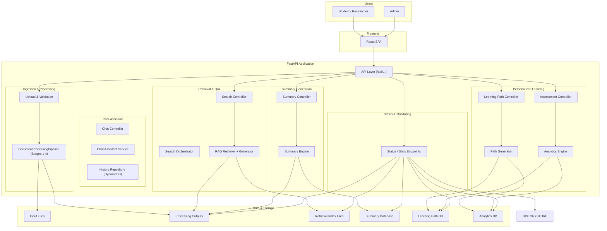

---

### 3. Processing Pipeline Architecture

#### 3.1 Five-Stage Processing Pipeline (Local/Cloud)

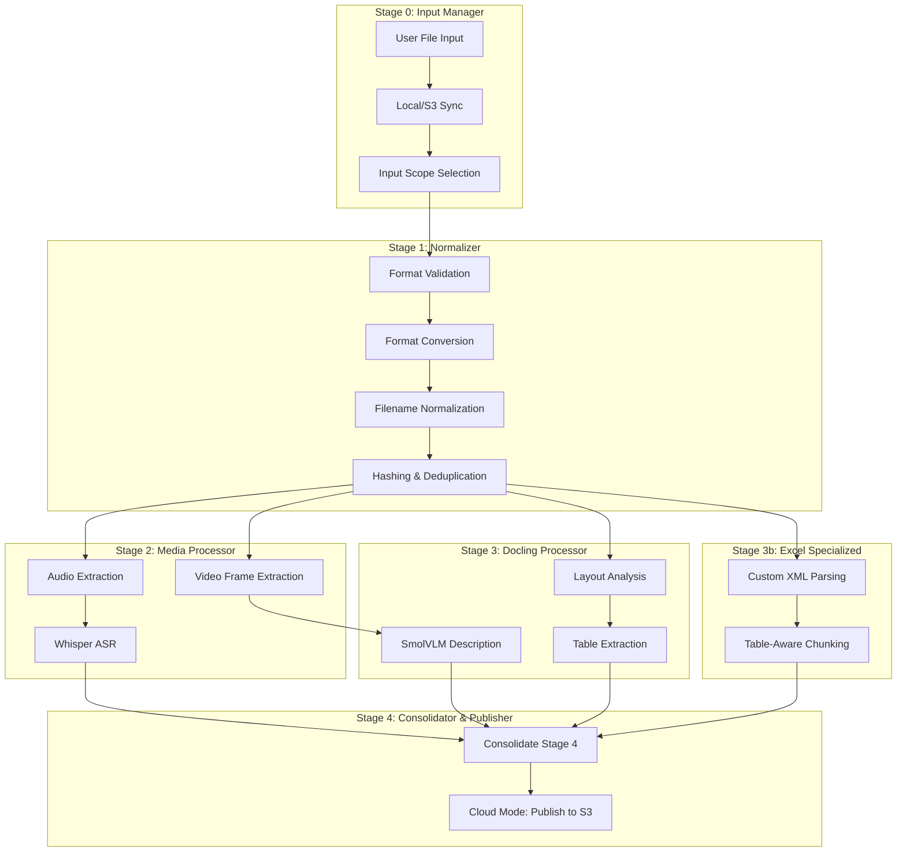

#### 3.2 Retrieval System Architecture

```mermaid
graph TB
    subgraph "Query Processing"
        QueryInput[User Query]
    end
  
    subgraph "Multi-Modal Retrieval"
        subgraph "Text Retrieval"
            BM25[BM25 / Sparse]
            DenseIndex[Dense Vector Index]
        end
  
        subgraph "Visual Retrieval"
            ColQwen[ColQwen Index]
        end
    end
  
    subgraph "Result Processing"
        HybridSearch[Hybrid Search / Reranking]
        Reranker[Search Orchestrator (RRF/Score Fusion)]
    end
  
    subgraph "Answer Generation"
        LLM_Call[RAG Generator]
    end
  
    QueryInput --> BM25
    QueryInput --> DenseIndex
    QueryInput --> ColQwen
  
    BM25 --> HybridSearch
    DenseIndex --> HybridSearch
    ColQwen --> HybridSearch
  
    HybridSearch --> Reranker
    Reranker --> LLM_Call
```

---

### 4. Sequence Diagrams

#### 4.1 Document Processing Sequence

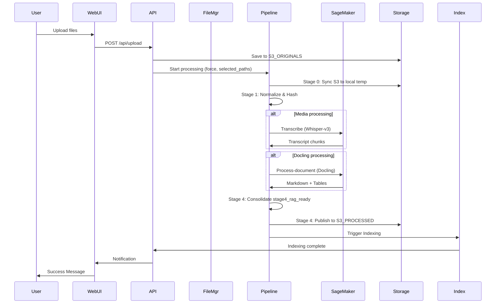

#### 4.2 Search and Q&A Sequence

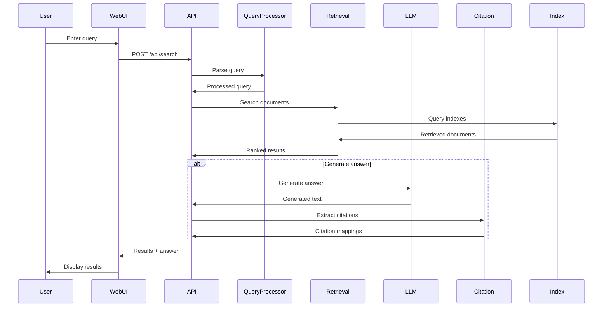

#### 4.3 Multimodal Retrieval Sequence

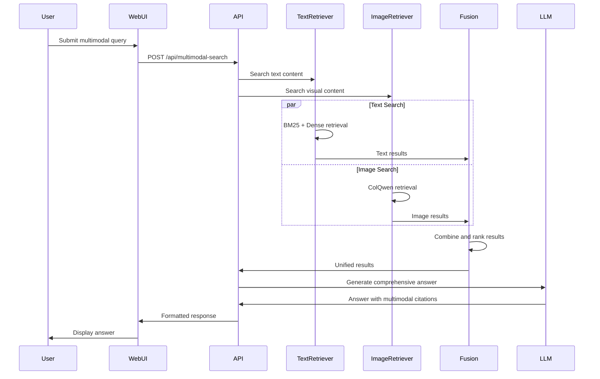

#### 4.4 Lecture Summary Generation Sequence

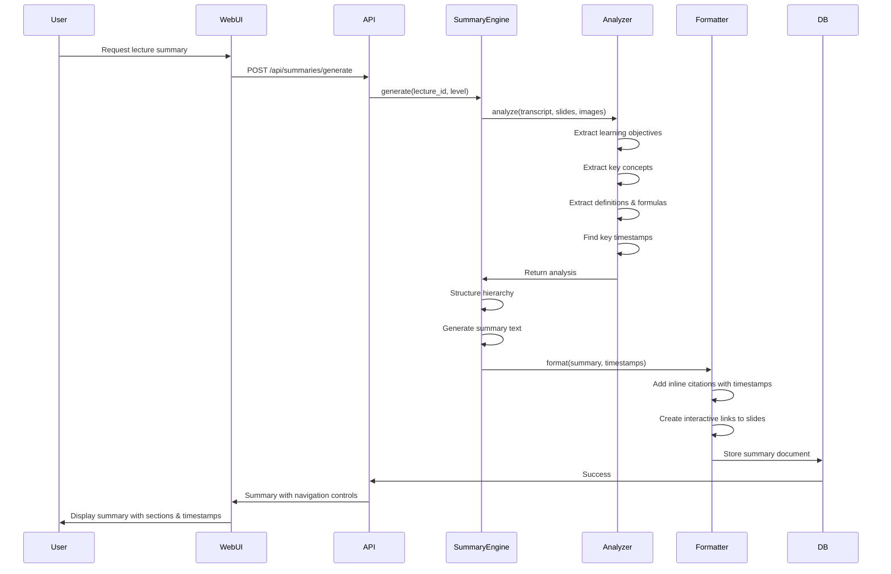

---

### 5. Class Diagrams

#### 5.1 Core System Classes


#### 5.2 Retrieval System Classes

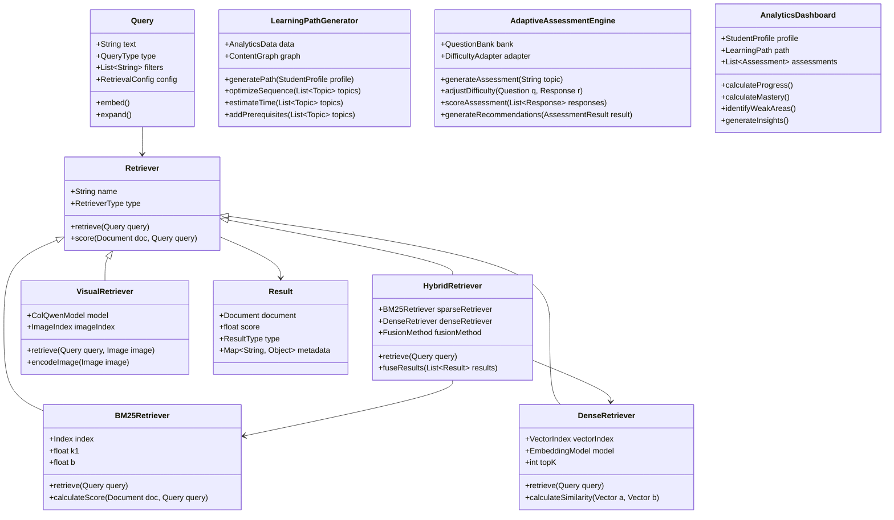

#### 5.3 API and Service Classes

```mermaid
classDiagram
    class APIService {
        +FastAPI app
        +AuthService auth
        +RateLimiter limiter
        +uploadFiles()
        +search()
        +generateAnswer()
        +getStatus()
    }
  
    class ProcessingService {
        +Pipeline pipeline
        +FileQueue queue
        +ProcessManager manager
        +submitJob(Document doc)
        +getJobStatus(String jobId)
        +cancelJob(String jobId)
    }
  
    class RetrievalService {
        +List~Retriever~ retrievers
        +QueryProcessor queryProcessor
        +search(Query query)
        +multimodalSearch(Query query, Image image)
        +rerank(List~Result~ results)
    }
  
    class QAService {
        +LLMService llm
        +CitationExtractor citationExtractor
        +AnswerGenerator generator
        +generateAnswer(Query query, List~Result~ context)
        +extractCitations(String answer, List~Result~ context)
    }
  
    class IndexService {
        +VectorIndex textIndex
        +VectorIndex imageIndex
        +MetadataStore metadataStore
        +buildIndex(List~Document~ documents)
        +updateIndex(Document doc)
        +deleteIndex(String docId)
    }
  
    class FileService {
        +StorageBackend storage
        +FileValidator validator
        +uploadFile(File file)
        +downloadFile(String fileId)
        +deleteFile(String fileId)
        +validateFile(File file)
    }
  
    class SummaryService {
        +SummaryEngine engine
        +ContentAnalyzer analyzer
        +SummaryFormatter formatter
        +generateSummary(String docId, SummaryLevel level)
        +updateSummary(String summaryId)
        +getSummary(String summaryId)
        +deleteSummary(String summaryId)
    }
  
    class LearningPathService {
        +PathGenerator pathGenerator
        +AnalyticsEngine analytics
        +RecommendationEngine recommender
        +generateLearningPath(StudentProfile profile)
        +updatePath(String pathId)
        +getProgress(String pathId)
        +getRecommendations(String studentId)
    }
  
    class AssessmentService {
        +AdaptiveAssessmentEngine engine
        +QuestionBank questionBank
        +ResponseEvaluator evaluator
        +startAssessment(String topic, DifficultyLevel level)
        +submitAnswer(String assessmentId, Answer answer)
        +completeAssessment(String assessmentId)
        +generateReport(String assessmentId)
    }
  
    class AnalyticsService {
        +AnalyticsDashboard dashboard
        +DataAggregator aggregator
        +TrendAnalyzer trendAnalyzer
        +getStudentAnalytics(String studentId)
        +getStrengthWeakness(String studentId)
        +getLearningCurve(String studentId)
        +generateRecommendations(String studentId)
    }
  
    APIService --> ProcessingService
    APIService --> RetrievalService
    APIService --> QAService
    APIService --> SummaryService
    APIService --> LearningPathService
    APIService --> AssessmentService
    APIService --> AnalyticsService
    ProcessingService --> FileService
    RetrievalService --> IndexService
    QAService --> LLMService
    SummaryService --> LLMService
    LearningPathService --> AnalyticsService
    AssessmentService --> AnalyticsService
```

---

### 6. Data Model

#### 6.1 Entity Relationship Diagram

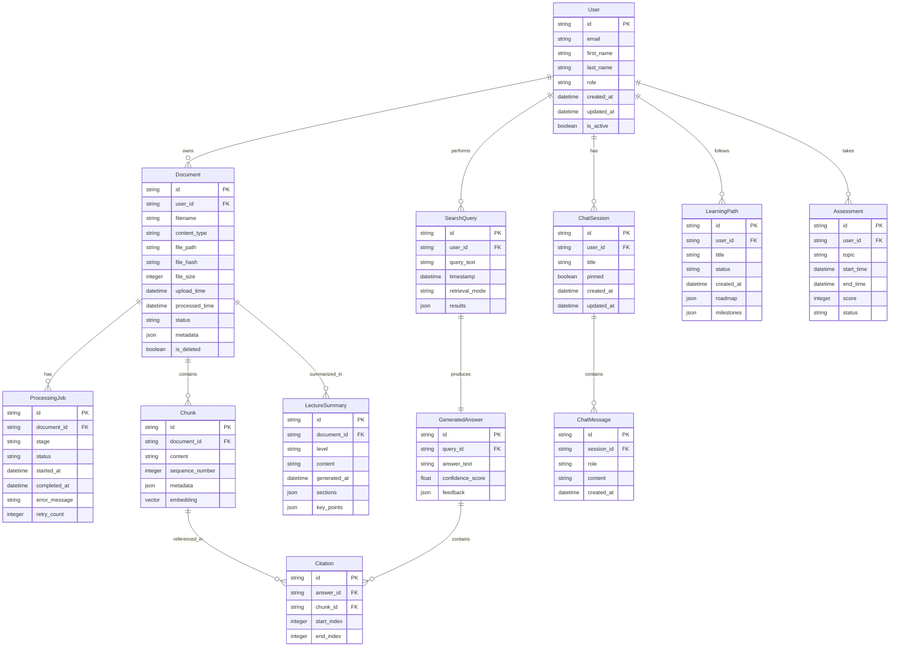

---

### 7. Global State and Multitenancy Architecture

#### 7.1 Multi-tenant Vector Search (Qdrant)

| Feature             | Specification                                        | Deployment     |
| ------------------- | ---------------------------------------------------- | -------------- |
| Collection Strategy | Shared collections (`text`, `image`)                 | Qdrant Cloud   |
| Tenant Isolation     | Payload filtering on `user_id`                     | Mandatory      |
| Quantization        | Scalar Quantization (`int8`)                         | Default        |
| Storage Mode        | `on_disk=true` for vectors and payloads              | Default        |
| Indices             | Keyword index on `user_id`, `source`, `chunk_id`     | Primary        |
| BM25 Storage        | Sidecar pickle files in S3 (`retrieval/bm25_index.pkl`) | Cloud Mode     |

---

### 8. Technology Stack Summary

#### 8.1 Component Technology Mapping

| Layer      | Component       | Technology      | Version  | Notes                   |
| ---------- | --------------- | --------------- | -------- | ----------------------- |
| Frontend   | Web Framework   | React           | 19.x     | Latest stable           |
| Frontend   | API Client      | Axios           | Latest   | With Bearer interceptor |
| Frontend   | Build Tool      | Vite            | 6.x      | Next-gen bundling       |
| Frontend   | Styling         | TailwindCSS     | 4.1+     | Modern aesthetics       |
| Frontend   | Animations      | Framer Motion   | Latest   | Premium UX              |
| Backend    | API Framework   | FastAPI         | 0.115+   | Async REST endpoints    |
| Backend    | Auth/Identity   | Firebase        | Latest   | Google OAuth 2.0        |
| Backend    | Language        | Python          | 3.11+    | High performance        |
| Database   | Vector DB       | Qdrant          | 1.12+    | Multitenancy (Payload)  |
| Database   | NoSQL           | DynamoDB        | Latest   | User profiles & Quiz    |
| Storage    | Object Storage  | AWS S3          | Latest   | Originals & Processed   |
| AI/ML      | ASR             | Whisper         | Latest   | ASR / Audio extraction  |
| AI/ML      | Document Parser | Docling         | 2.0+     | Layout & Tables         |
| AI/ML      | VLM             | SmolVLM         | 256M     | Image understanding     |
| AI/ML      | LLM             | GPT-4o / Gemini | Latest   | RAG generation          |
| AI/ML      | Embeddings      | ColQwen         | Latest   | Visual retrieval        |
| Processing | Audio           | FFmpeg          | 6.1+     | Media processing        |
| Processing | PDF             | Poppler         | Latest   | PDF handling            |
| Processing | Document        | Docling         | Latest   | Document analysis       |
| Deployment | Container       | Docker          | 25.0+    | Containerization        |
| Deployment | Orchestration   | Docker Compose  | 2.20+    | Multi-service           |
| Monitoring | Logging         | Python logging  | Built-in | Structured logging      |
| Monitoring | Metrics         | Prometheus      | Optional | Advanced monitoring     |
| Security   | Authentication  | Firebase Auth   | Managed  | Google Account SSO      |
| Security   | Tokens          | JWT / Bearer    | Latest   | Stateless auth          |

---

### 9. Future Integration Patterns

#### 9.1 LMS Integration Patterns

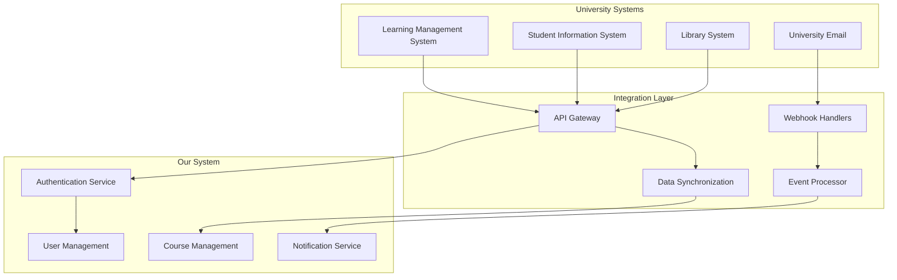
