# System Modeling and Design

## Educational Content Processing & Retrieval-Augmented Generation System

---

### 1. System Architecture Overview

This document provides comprehensive system modeling including architecture diagrams, sequence diagrams, and class diagrams for the Educational Content Processing & RAG System.

---

### 2. High-Level System Architecture

#### 2.1 System Context Diagram

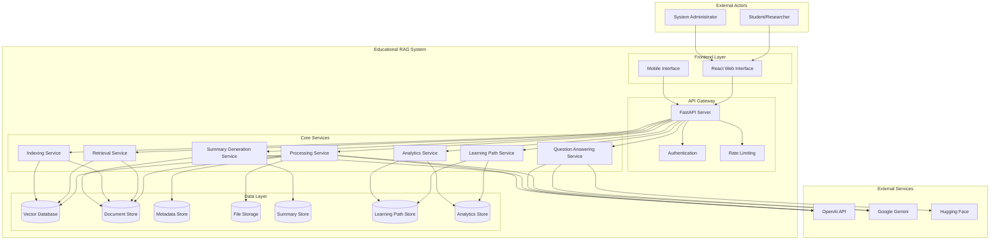
```mermaid
graph TB
    subgraph "External Actors"
        User[Student/Researcher]
        Admin[System Administrator]
    end
  
    subgraph "External Services"
        OpenAI[OpenAI API]
        Gemini[Google Gemini]
        HuggingFace[Hugging Face]
    end
  
    subgraph "Educational RAG System"
        subgraph "Frontend Layer"
            WebUI[React Web Interface]
            MobileUI[Mobile Interface]
        end
  
        subgraph "API Gateway"
            FastAPI[FastAPI Server]
            Auth[Authentication]
            RateLimit[Rate Limiting]
        end
  
        subgraph "Core Services"
            ProcessSvc[Processing Service]
            RetrievalSvc[Retrieval Service]
            QASvc[Question Answering Service]
            IndexSvc[Indexing Service]
            SummarySvc[Summary Generation Service]
            LearningPathSvc[Learning Path Service]
            AnalyticsSvc[Analytics Service]
        end
  
        subgraph "Data Layer"
            VectorDB[(Vector Database)]
            DocStore[(Document Store)]
            MetaStore[(Metadata Store)]
            FileStorage[(File Storage)]
            SummaryStore[(Summary Store)]
            PathStore[(Learning Path Store)]
            AnalyticsStore[(Analytics Store)]
        end
    end
  
    User --> WebUI
    Admin --> WebUI
    WebUI --> FastAPI
    MobileUI --> FastAPI
  
    FastAPI --> Auth
    FastAPI --> RateLimit
    FastAPI --> ProcessSvc
    FastAPI --> RetrievalSvc
    FastAPI --> QASvc
    FastAPI --> IndexSvc
    FastAPI --> SummarySvc
    FastAPI --> LearningPathSvc
    FastAPI --> AnalyticsSvc
  
    ProcessSvc --> VectorDB
    ProcessSvc --> DocStore
    ProcessSvc --> MetaStore
    ProcessSvc --> FileStorage
  
    RetrievalSvc --> VectorDB
    RetrievalSvc --> DocStore
  
    QASvc --> OpenAI
    QASvc --> Gemini
    QASvc --> HuggingFace
  
    IndexSvc --> VectorDB
    IndexSvc --> DocStore
  
    SummarySvc --> DocStore
    SummarySvc --> SummaryStore
    SummarySvc --> OpenAI
  
    LearningPathSvc --> PathStore
    LearningPathSvc --> AnalyticsStore
  
    AnalyticsSvc --> AnalyticsStore
    AnalyticsSvc --> PathStore
  
    ProcessSvc --> OpenAI
    ProcessSvc --> Gemini
```

#### 2.2 Backend Modular Architecture

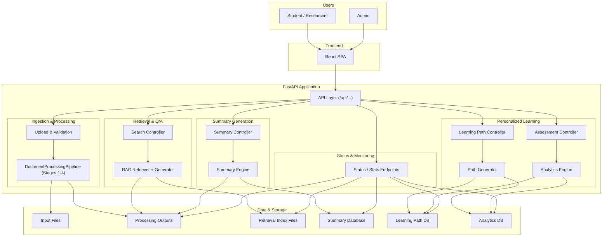
```mermaid
graph TB
    subgraph Users
        U1[Student / Researcher]
        U2[Admin]
    end

    subgraph Frontend
        FE[React SPA]
    end

    subgraph Backend["FastAPI Application"]
        API["API Layer (/api/...)"]

        subgraph Ingestion["Ingestion & Processing"]
            UP["Upload & Validation"]
            PIPE["DocumentProcessingPipeline (Stages 1-4)"]
        end

        subgraph Retrieval["Retrieval & Q/A"]
            QCTRL["Search Controller"]
            QMOD["RAG Retriever + Generator"]
        end

        subgraph Summaries["Summary Generation"]
            SUMCTRL["Summary Controller"]
            SUMENG["Summary Engine"]
        end

        subgraph Learning["Personalized Learning"]
            PATHCTRL["Learning Path Controller"]
            PATHGEN["Path Generator"]
            ASSESSCTRL["Assessment Controller"]
            ANALYTICS["Analytics Engine"]
        end

        subgraph Status["Status & Monitoring"]
            STAT["Status / Stats Endpoints"]
        end
    end

    subgraph Storage["Data & Storage"]
        IN[Input Files]
        PROC["Processing Outputs"]
        IDX["Retrieval Index Files"]
        SUMMARYDB["Summary Database"]
        PATHDB["Learning Path DB"]
        ANALYTICDB["Analytics DB"]
    end

    U1 --> FE
    U2 --> FE
    FE --> API

    API --> UP
    API --> QCTRL
    API --> SUMCTRL
    API --> PATHCTRL
    API --> ASSESSCTRL
    API --> STAT

    UP --> PIPE
    PIPE --> PROC
    PIPE --> IN

    QCTRL --> QMOD
    QMOD --> PROC
    QMOD --> IDX

    SUMCTRL --> SUMENG
    SUMENG --> PROC
    SUMENG --> SUMMARYDB

    PATHCTRL --> PATHGEN
    PATHGEN --> ANALYTICDB
    PATHGEN --> PATHDB

    ASSESSCTRL --> ANALYTICS
    ANALYTICS --> ANALYTICDB
    ANALYTICS --> PATHDB

    STAT --> PROC
    STAT --> IDX
    STAT --> SUMMARYDB
    STAT --> PATHDB
    STAT --> ANALYTICDB
```

---

### 3. Processing Pipeline Architecture

#### 3.1 Four-Stage Processing Pipeline

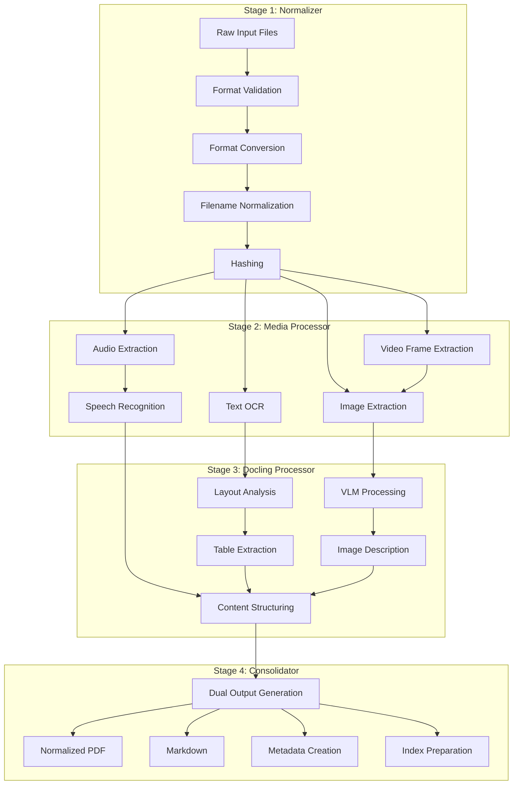
```mermaid
flowchart TD
    subgraph "Stage 1: Normalizer"
        Input[Raw Input Files]
        Validate[Format Validation]
        Convert[Format Conversion]
        Normalize[Filename Normalization]
        Hash[Hashing]
    end
  
    subgraph "Stage 2: Media Processor"
        AudioExtract[Audio Extraction]
        ASR[Speech Recognition]
        VideoFrame[Video Frame Extraction]
        OCR_Text[Text OCR]
        ImageExtract[Image Extraction]
    end
  
    subgraph "Stage 3: Docling Processor"
        LayoutAnalysis[Layout Analysis]
        TableExtract[Table Extraction]
        VLM_Processing[VLM Processing]
        ImageDesc[Image Description]
        ContentStruct[Content Structuring]
    end
  
    subgraph "Stage 4: Consolidator"
        DualOutput[Dual Output Generation]
        PDF_Norm[Normalized PDF]
        Markdown[Markdown]
        Metadata[Metadata Creation]
        IndexPrep[Index Preparation]
    end
  
    Input --> Validate
    Validate --> Convert
    Convert --> Normalize
    Normalize --> Hash
  
    Hash --> AudioExtract
    Hash --> VideoFrame
    Hash --> OCR_Text
    Hash --> ImageExtract
  
    AudioExtract --> ASR
    VideoFrame --> ImageExtract
    OCR_Text --> LayoutAnalysis
    ImageExtract --> VLM_Processing
  
    ASR --> ContentStruct
    VLM_Processing --> ImageDesc
    LayoutAnalysis --> TableExtract
    TableExtract --> ContentStruct
    ImageDesc --> ContentStruct
  
    ContentStruct --> DualOutput
    DualOutput --> PDF_Norm
    DualOutput --> Markdown
    DualOutput --> Metadata
    DualOutput --> IndexPrep
```

#### 3.2 Retrieval System Architecture

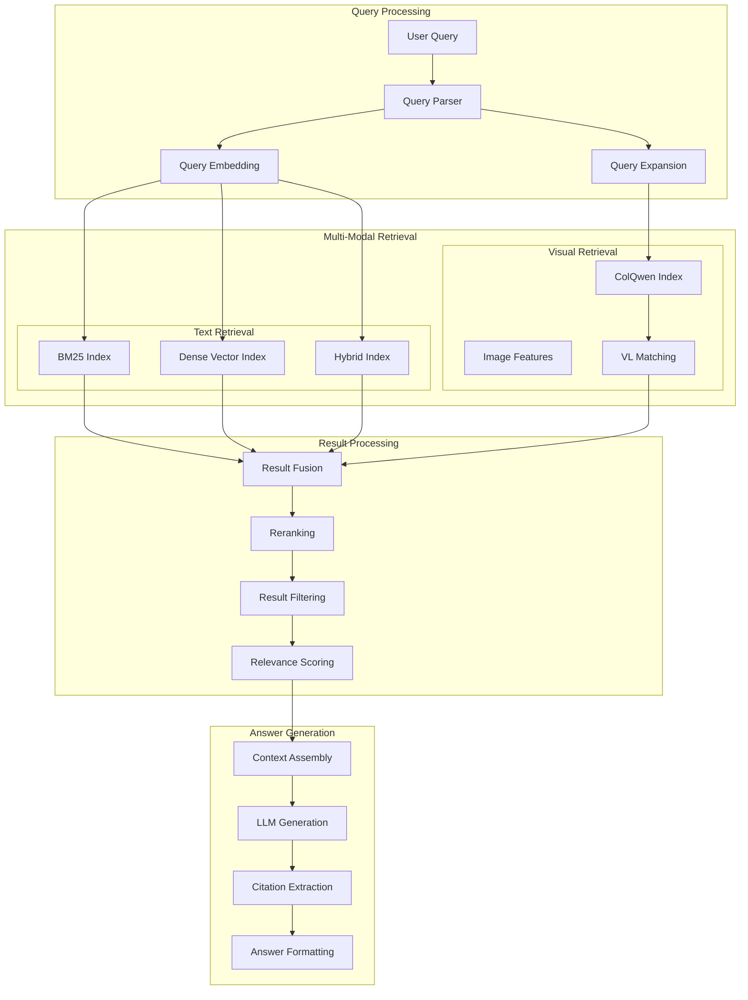
```mermaid
graph TB
    subgraph "Query Processing"
        QueryInput[User Query]
        QueryParser[Query Parser]
        QueryEmbed[Query Embedding]
        QueryExpansion[Query Expansion]
    end
  
    subgraph "Multi-Modal Retrieval"
        subgraph "Text Retrieval"
            BM25[BM25 Index]
            DenseIndex[Dense Vector Index]
            HybridIndex[Hybrid Index]
        end
  
        subgraph "Visual Retrieval"
            ColQwen[ColQwen Index]
            ImageFeatures[Image Features]
            VL_Matching[VL Matching]
        end
    end
  
    subgraph "Result Processing"
        ResultFusion[Result Fusion]
        Reranking[Reranking]
        Filtering[Result Filtering]
        Scoring[Relevance Scoring]
    end
  
    subgraph "Answer Generation"
        ContextAssembly[Context Assembly]
        LLM_Call[LLM Generation]
        CitationExtraction[Citation Extraction]
        AnswerFormatting[Answer Formatting]
    end
  
    QueryInput --> QueryParser
    QueryParser --> QueryEmbed
    QueryParser --> QueryExpansion
  
    QueryEmbed --> BM25
    QueryEmbed --> DenseIndex
    QueryEmbed --> HybridIndex
    QueryExpansion --> ColQwen
  
    BM25 --> ResultFusion
    DenseIndex --> ResultFusion
    HybridIndex --> ResultFusion
    ColQwen --> VL_Matching
    VL_Matching --> ResultFusion
  
    ResultFusion --> Reranking
    Reranking --> Filtering
    Filtering --> Scoring
    Scoring --> ContextAssembly
  
    ContextAssembly --> LLM_Call
    LLM_Call --> CitationExtraction
    CitationExtraction --> AnswerFormatting
```

---

### 4. Sequence Diagrams

#### 4.1 Document Processing Sequence

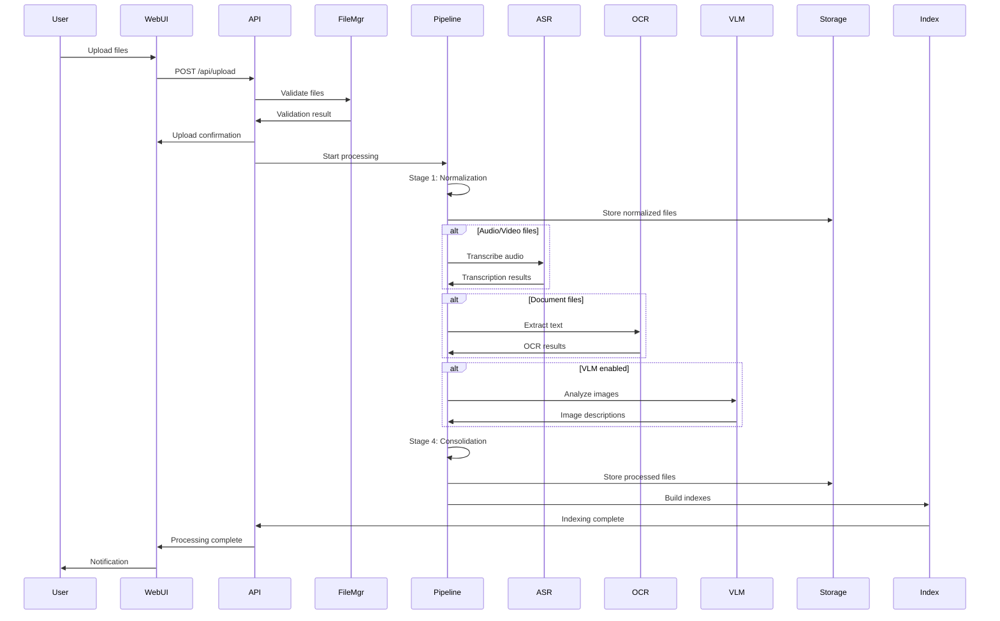
```mermaid
sequenceDiagram
    participant User
    participant WebUI
    participant API
    participant FileMgr
    participant Pipeline
    participant ASR
    participant OCR
    participant VLM
    participant Storage
    participant Index
  
    User->>WebUI: Upload files
    WebUI->>API: POST /api/upload
    API->>FileMgr: Validate files
    FileMgr->>API: Validation result
    API->>WebUI: Upload confirmation
  
    API->>Pipeline: Start processing
    Pipeline->>Pipeline: Stage 1: Normalization
    Pipeline->>Storage: Store normalized files
  
    alt Audio/Video files
        Pipeline->>ASR: Transcribe audio
        ASR->>Pipeline: Transcription results
    end
  
    alt Document files
        Pipeline->>OCR: Extract text
        OCR->>Pipeline: OCR results
    end
  
    alt VLM enabled
        Pipeline->>VLM: Analyze images
        VLM->>Pipeline: Image descriptions
    end
  
    Pipeline->>Pipeline: Stage 4: Consolidation
    Pipeline->>Storage: Store processed files
    Pipeline->>Index: Build indexes
  
    Index->>API: Indexing complete
    API->>WebUI: Processing complete
    WebUI->>User: Notification
```

#### 4.2 Search and Q&A Sequence

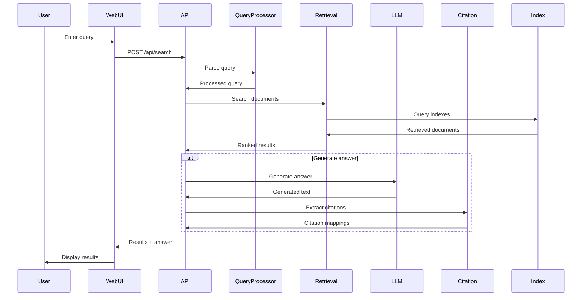
```mermaid
sequenceDiagram
    participant User
    participant WebUI
    participant API
    participant QueryProcessor
    participant Retrieval
    participant LLM
    participant Citation
    participant Index
  
    User->>WebUI: Enter query
    WebUI->>API: POST /api/search
    API->>QueryProcessor: Parse query
    QueryProcessor->>API: Processed query
  
    API->>Retrieval: Search documents
    Retrieval->>Index: Query indexes
    Index->>Retrieval: Retrieved documents
    Retrieval->>API: Ranked results
  
    alt Generate answer
        API->>LLM: Generate answer
        LLM->>API: Generated text
        API->>Citation: Extract citations
        Citation->>API: Citation mappings
    end
  
    API->>WebUI: Results + answer
    WebUI->>User: Display results
```

#### 4.3 Multimodal Retrieval Sequence

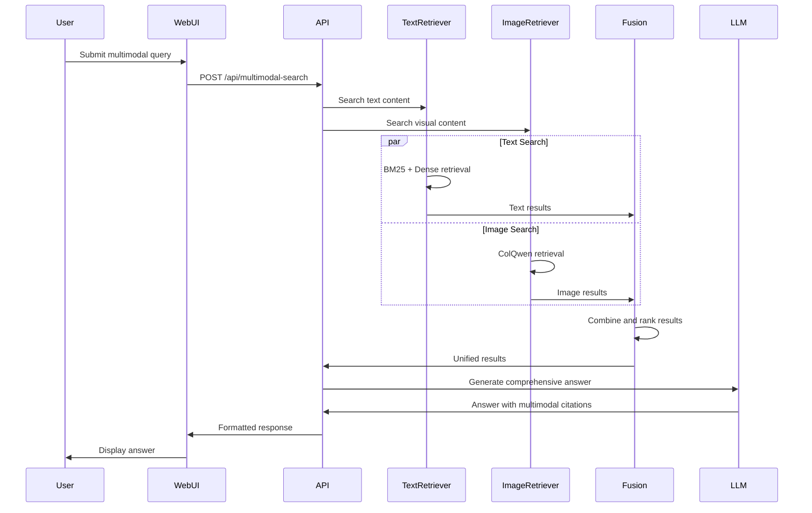
```mermaid
sequenceDiagram
    participant User
    participant WebUI
    participant API
    participant TextRetriever
    participant ImageRetriever
    participant Fusion
    participant LLM
  
    User->>WebUI: Submit multimodal query
    WebUI->>API: POST /api/multimodal-search
    API->>TextRetriever: Search text content
    API->>ImageRetriever: Search visual content
  
    par Text Search
        TextRetriever->>TextRetriever: BM25 + Dense retrieval
        TextRetriever->>Fusion: Text results
    and Image Search
        ImageRetriever->>ImageRetriever: ColQwen retrieval
        ImageRetriever->>Fusion: Image results
    end
  
    Fusion->>Fusion: Combine and rank results
    Fusion->>API: Unified results
  
    API->>LLM: Generate comprehensive answer
    LLM->>API: Answer with multimodal citations
    API->>WebUI: Formatted response
    WebUI->>User: Display answer
```

#### 4.4 Lecture Summary Generation Sequence

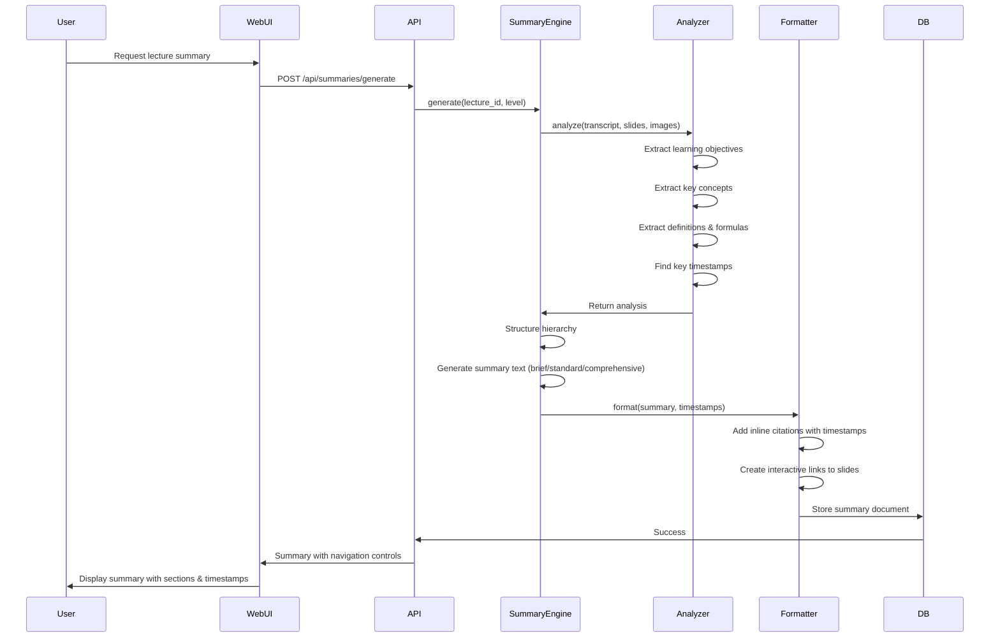
```mermaid
sequenceDiagram
    participant User
    participant WebUI
    participant API
    participant SummaryEngine
    participant Analyzer
    participant Formatter
    participant DB
  
    User->>WebUI: Request lecture summary
    WebUI->>API: POST /api/summaries/generate
    API->>SummaryEngine: generate(lecture_id, level)
  
    SummaryEngine->>Analyzer: analyze(transcript, slides, images)
    Analyzer->>Analyzer: Extract learning objectives
    Analyzer->>Analyzer: Extract key concepts
    Analyzer->>Analyzer: Extract definitions & formulas
    Analyzer->>Analyzer: Find key timestamps
    Analyzer->>SummaryEngine: Return analysis
  
    SummaryEngine->>SummaryEngine: Structure hierarchy
    SummaryEngine->>SummaryEngine: Generate summary text (brief/standard/comprehensive)
    SummaryEngine->>Formatter: format(summary, timestamps)
  
    Formatter->>Formatter: Add inline citations with timestamps
    Formatter->>Formatter: Create interactive links to slides
    Formatter->>DB: Store summary document
  
    DB->>API: Success
    API->>WebUI: Summary with navigation controls
    WebUI->>User: Display summary with sections & timestamps
```

#### 4.5 Personalized Learning Path Generation Sequence

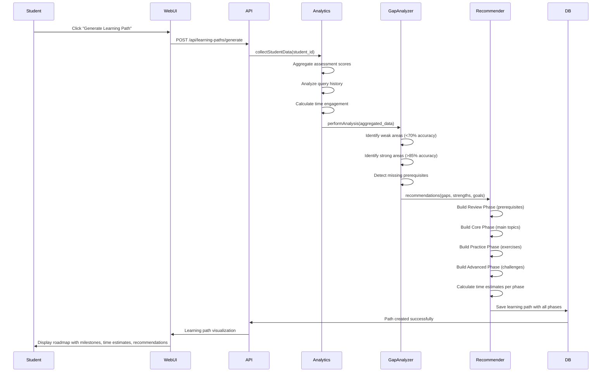
```mermaid
sequenceDiagram
    participant Student
    participant WebUI
    participant API
    participant Analytics
    participant GapAnalyzer
    participant Recommender
    participant DB
  
    Student->>WebUI: Click "Generate Learning Path"
    WebUI->>API: POST /api/learning-paths/generate
    API->>Analytics: collectStudentData(student_id)
  
    Analytics->>Analytics: Aggregate assessment scores
    Analytics->>Analytics: Analyze query history
    Analytics->>Analytics: Calculate time engagement
    Analytics->>GapAnalyzer: performAnalysis(aggregated_data)
  
    GapAnalyzer->>GapAnalyzer: Identify weak areas (<70% accuracy)
    GapAnalyzer->>GapAnalyzer: Identify strong areas (>85% accuracy)
    GapAnalyzer->>GapAnalyzer: Detect missing prerequisites
    GapAnalyzer->>Recommender: recommendations(gaps, strengths, goals)
  
    Recommender->>Recommender: Build Review Phase (prerequisites)
    Recommender->>Recommender: Build Core Phase (main topics)
    Recommender->>Recommender: Build Practice Phase (exercises)
    Recommender->>Recommender: Build Advanced Phase (challenges)
    Recommender->>Recommender: Calculate time estimates per phase
    Recommender->>DB: Save learning path with all phases
  
    DB->>API: Path created successfully
    API->>WebUI: Learning path visualization
    WebUI->>Student: Display roadmap with milestones, time estimates, recommendations
```

#### 4.6 Adaptive Assessment Sequence

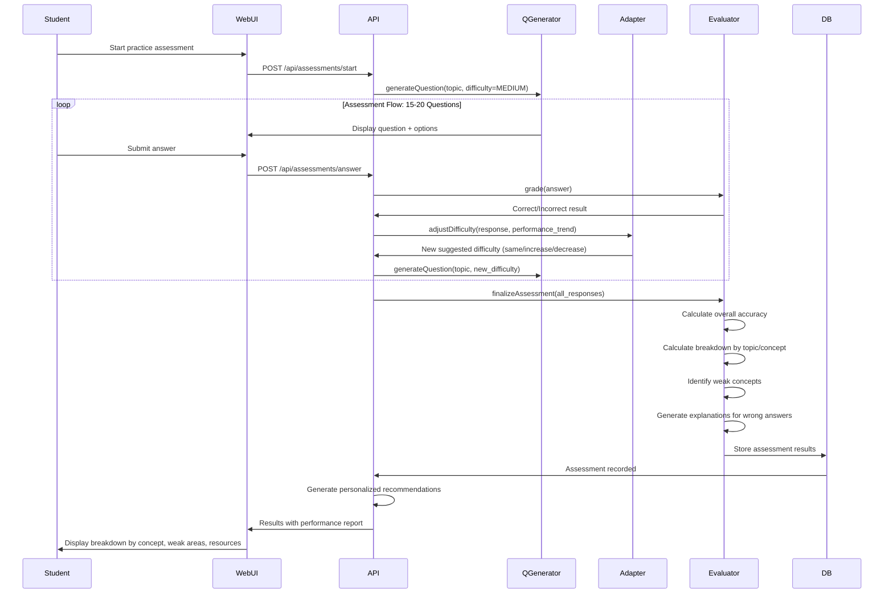
```mermaid
sequenceDiagram
    participant Student
    participant WebUI
    participant API
    participant QGenerator
    participant Adapter
    participant Evaluator
    participant DB
  
    Student->>WebUI: Start practice assessment
    WebUI->>API: POST /api/assessments/start
    API->>QGenerator: generateQuestion(topic, difficulty=MEDIUM)
  
    loop Assessment Flow: 15-20 Questions
        QGenerator->>WebUI: Display question + options
        Student->>WebUI: Submit answer
        WebUI->>API: POST /api/assessments/answer
        API->>Evaluator: grade(answer)
        Evaluator->>API: Correct/Incorrect result
        API->>Adapter: adjustDifficulty(response, performance_trend)
        Adapter->>API: New suggested difficulty (same/increase/decrease)
        API->>QGenerator: generateQuestion(topic, new_difficulty)
    end
  
    API->>Evaluator: finalizeAssessment(all_responses)
    Evaluator->>Evaluator: Calculate overall accuracy
    Evaluator->>Evaluator: Calculate breakdown by topic/concept
    Evaluator->>Evaluator: Identify weak concepts
    Evaluator->>Evaluator: Generate explanations for wrong answers
    Evaluator->>DB: Store assessment results
  
    DB->>API: Assessment recorded
    API->>API: Generate personalized recommendations
    API->>WebUI: Results with performance report
    WebUI->>Student: Display breakdown by concept, weak areas, resources
```

#### 4.7 Analytics Dashboard Interaction Sequence

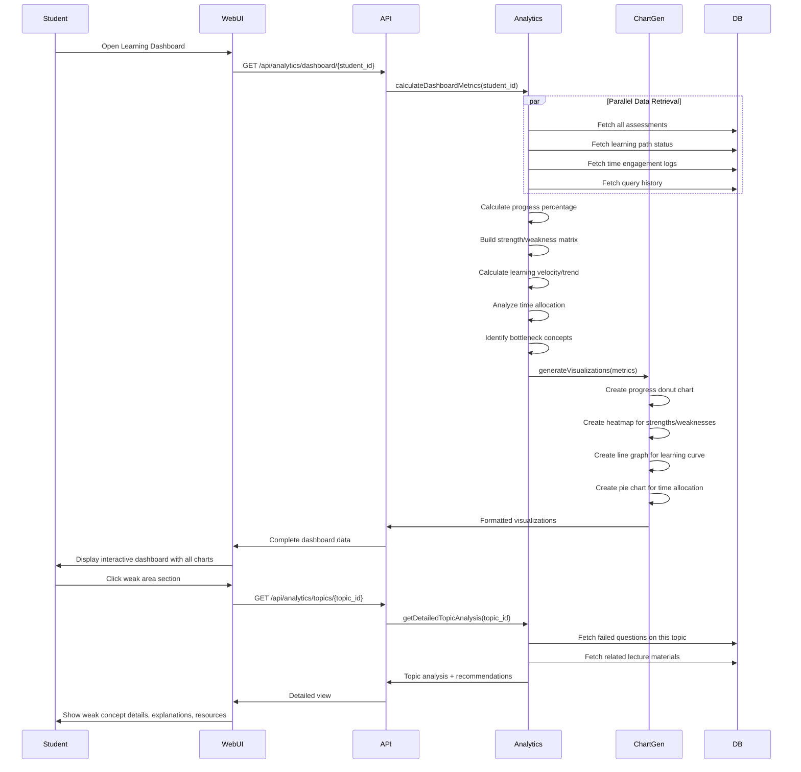
```mermaid
sequenceDiagram
    participant Student
    participant WebUI
    participant API
    participant Analytics
    participant ChartGen
    participant DB
  
    Student->>WebUI: Open Learning Dashboard
    WebUI->>API: GET /api/analytics/dashboard/{student_id}
    API->>Analytics: calculateDashboardMetrics(student_id)
  
    par Parallel Data Retrieval
        Analytics->>DB: Fetch all assessments
        Analytics->>DB: Fetch learning path status
        Analytics->>DB: Fetch time engagement logs
        Analytics->>DB: Fetch query history
    end
  
    Analytics->>Analytics: Calculate progress percentage
    Analytics->>Analytics: Build strength/weakness matrix
    Analytics->>Analytics: Calculate learning velocity/trend
    Analytics->>Analytics: Analyze time allocation
    Analytics->>Analytics: Identify bottleneck concepts
  
    Analytics->>ChartGen: generateVisualizations(metrics)
    ChartGen->>ChartGen: Create progress donut chart
    ChartGen->>ChartGen: Create heatmap for strengths/weaknesses
    ChartGen->>ChartGen: Create line graph for learning curve
    ChartGen->>ChartGen: Create pie chart for time allocation
    ChartGen->>API: Formatted visualizations
  
    API->>WebUI: Complete dashboard data
    WebUI->>Student: Display interactive dashboard with all charts
  
    Student->>WebUI: Click weak area section
    WebUI->>API: GET /api/analytics/topics/{topic_id}
    API->>Analytics: getDetailedTopicAnalysis(topic_id)
    Analytics->>DB: Fetch failed questions on this topic
    Analytics->>DB: Fetch related lecture materials
    Analytics->>API: Topic analysis + recommendations
    API->>WebUI: Detailed view
    WebUI->>Student: Show weak concept details, explanations, resources
```

---

### 5. Class Diagrams

#### 5.1 Core System Classes

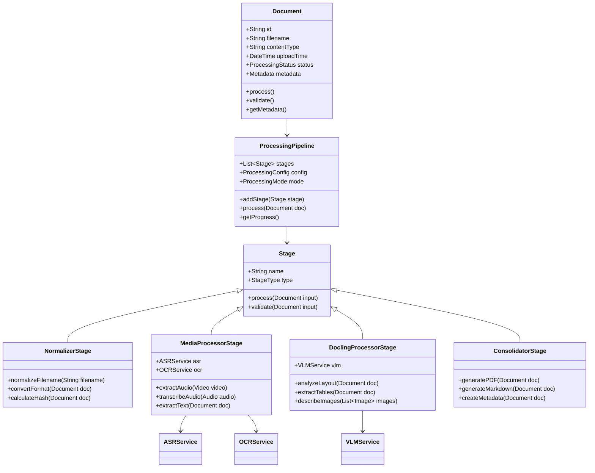
```mermaid
classDiagram
    class Document {
        +String id
        +String filename
        +String contentType
        +DateTime uploadTime
        +ProcessingStatus status
        +Metadata metadata
        +process()
        +validate()
        +getMetadata()
    }
  
    class ProcessingPipeline {
        +List~Stage~ stages
        +ProcessingConfig config
        +ProcessingMode mode
        +addStage(Stage stage)
        +process(Document doc)
        +getProgress()
    }
  
    class Stage {
        +String name
        +StageType type
        +process(Document input)
        +validate(Document input)
    }
  
    class NormalizerStage {
        +normalizeFilename(String filename)
        +convertFormat(Document doc)
        +calculateHash(Document doc)
    }
  
    class MediaProcessorStage {
        +ASRService asr
        +OCRService ocr
        +extractAudio(Video video)
        +transcribeAudio(Audio audio)
        +extractText(Document doc)
    }
  
    class DoclingProcessorStage {
        +VLMService vlm
        +analyzeLayout(Document doc)
        +extractTables(Document doc)
        +describeImages(List~Image~ images)
    }
  
    class ConsolidatorStage {
        +generatePDF(Document doc)
        +generateMarkdown(Document doc)
        +createMetadata(Document doc)
    }
  
    Document --> ProcessingPipeline
    ProcessingPipeline --> Stage
    Stage <|-- NormalizerStage
    Stage <|-- MediaProcessorStage
    Stage <|-- DoclingProcessorStage
    Stage <|-- ConsolidatorStage
    MediaProcessorStage --> ASRService
    MediaProcessorStage --> OCRService
    DoclingProcessorStage --> VLMService
```

#### 5.2 Retrieval System Classes

```mermaid
classDiagram
    class Query {
        +String text
        +QueryType type
        +List~String~ filters
        +RetrievalConfig config
        +embed()
        +expand()
    }
  
    class Retriever {
        +String name
        +RetrieverType type
        +retrieve(Query query)
        +score(Document doc, Query query)
    }
  
    class BM25Retriever {
        +Index index
        +float k1
        +float b
        +retrieve(Query query)
        +calculateScore(Document doc, Query query)
    }
  
    class LearningPathGenerator {
        +AnalyticsData data
        +ContentGraph graph
        +generatePath(StudentProfile profile)
        +optimizeSequence(List~Topic~ topics)
        +estimateTime(List~Topic~ topics)
        +addPrerequisites(List~Topic~ topics)
    }
  
    class AdaptiveAssessmentEngine {
        +QuestionBank bank
        +DifficultyAdapter adapter
        +generateAssessment(String topic)
        +adjustDifficulty(Question q, Response r)
        +scoreAssessment(List~Response~ responses)
        +generateRecommendations(AssessmentResult result)
    }
  
    class AnalyticsDashboard {
        +StudentProfile profile
        +LearningPath path
        +List~Assessment~ assessments
        +calculateProgress()
        +calculateMastery()
        +identifyWeakAreas()
        +generateInsights()
    }
  
    class DenseRetriever {
        +VectorIndex vectorIndex
        +EmbeddingModel model
        +int topK
        +retrieve(Query query)
        +calculateSimilarity(Vector a, Vector b)
    }
  
    class HybridRetriever {
        +BM25Retriever sparseRetriever
        +DenseRetriever denseRetriever
        +FusionMethod fusionMethod
        +retrieve(Query query)
        +fuseResults(List~Result~ results)
    }
  
    class VisualRetriever {
        +ColQwenModel model
        +ImageIndex imageIndex
        +retrieve(Query query, Image image)
        +encodeImage(Image image)
    }
  
    class Result {
        +Document document
        +float score
        +ResultType type
        +Map~String, Object~ metadata
    }
  
    Query --> Retriever
    Retriever <|-- BM25Retriever
    Retriever <|-- DenseRetriever
    Retriever <|-- HybridRetriever
    Retriever <|-- VisualRetriever
    Retriever --> Result
    HybridRetriever --> BM25Retriever
    HybridRetriever --> DenseRetriever
```

#### 5.3 API and Service Classes

```mermaid
classDiagram
    class APIService {
        +FastAPI app
        +AuthService auth
        +RateLimiter limiter
        +uploadFiles()
        +search()
        +generateAnswer()
        +getStatus()
    }
  
    class ProcessingService {
        +Pipeline pipeline
        +FileQueue queue
        +ProcessManager manager
        +submitJob(Document doc)
        +getJobStatus(String jobId)
        +cancelJob(String jobId)
    }
  
    class RetrievalService {
        +List~Retriever~ retrievers
        +QueryProcessor queryProcessor
        +search(Query query)
        +multimodalSearch(Query query, Image image)
        +rerank(List~Result~ results)
    }
  
    class QAService {
        +LLMService llm
        +CitationExtractor citationExtractor
        +AnswerGenerator generator
        +generateAnswer(Query query, List~Result~ context)
        +extractCitations(String answer, List~Result~ context)
    }
  
    class IndexService {
        +VectorIndex textIndex
        +VectorIndex imageIndex
        +MetadataStore metadataStore
        +buildIndex(List~Document~ documents)
        +updateIndex(Document doc)
        +deleteIndex(String docId)
    }
  
    class FileService {
        +StorageBackend storage
        +FileValidator validator
        +uploadFile(File file)
        +downloadFile(String fileId)
        +deleteFile(String fileId)
        +validateFile(File file)
    }
  
    class SummaryService {
        +SummaryEngine engine
        +ContentAnalyzer analyzer
        +SummaryFormatter formatter
        +generateSummary(String docId, SummaryLevel level)
        +updateSummary(String summaryId)
        +getSummary(String summaryId)
        +deleteSummary(String summaryId)
    }
  
    class LearningPathService {
        +PathGenerator pathGenerator
        +AnalyticsEngine analytics
        +RecommendationEngine recommender
        +generateLearningPath(StudentProfile profile)
        +updatePath(String pathId)
        +getProgress(String pathId)
        +getRecommendations(String studentId)
    }
  
    class AssessmentService {
        +AdaptiveAssessmentEngine engine
        +QuestionBank questionBank
        +ResponseEvaluator evaluator
        +startAssessment(String topic, DifficultyLevel level)
        +submitAnswer(String assessmentId, Answer answer)
        +completeAssessment(String assessmentId)
        +generateReport(String assessmentId)
    }
  
    class AnalyticsService {
        +AnalyticsDashboard dashboard
        +DataAggregator aggregator
        +TrendAnalyzer trendAnalyzer
        +getStudentAnalytics(String studentId)
        +getStrengthWeakness(String studentId)
        +getLearningCurve(String studentId)
        +generateRecommendations(String studentId)
    }
  
    APIService --> ProcessingService
    APIService --> RetrievalService
    APIService --> QAService
    APIService --> SummaryService
    APIService --> LearningPathService
    APIService --> AssessmentService
    APIService --> AnalyticsService
    ProcessingService --> FileService
    RetrievalService --> IndexService
    QAService --> LLMService
    SummaryService --> LLMService
    LearningPathService --> AnalyticsService
    AssessmentService --> AnalyticsService
```

---

### 6. Data Model

#### 6.1 Entity Relationship Diagram

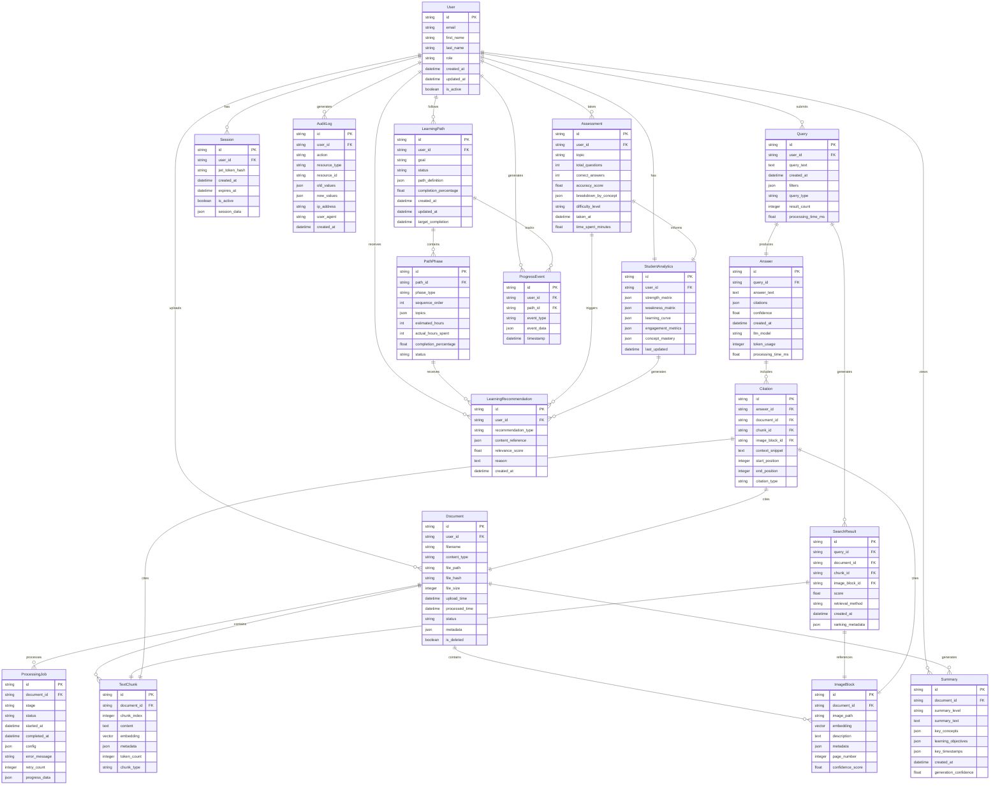
```mermaid
erDiagram
    User {
        string id PK
        string email
        string first_name
        string last_name
        string role
        datetime created_at
        datetime updated_at
        boolean is_active
    }
  
    Document {
        string id PK
        string user_id FK
        string filename
        string content_type
        string file_path
        string file_hash
        integer file_size
        datetime upload_time
        datetime processed_time
        string status
        json metadata
        boolean is_deleted
    }
  
    ProcessingJob {
        string id PK
        string document_id FK
        string stage
        string status
        datetime started_at
        datetime completed_at
        json config
        string error_message
        integer retry_count
        json progress_data
    }
  
    TextChunk {
        string id PK
        string document_id FK
        integer chunk_index
        text content
        vector embedding
        json metadata
        integer token_count
        string chunk_type
    }
  
    ImageBlock {
        string id PK
        string document_id FK
        string image_path
        vector embedding
        text description
        json metadata
        integer page_number
        float confidence_score
    }
  
    SearchResult {
        string id PK
        string query_id FK
        string document_id FK
        string chunk_id FK
        string image_block_id FK
        float score
        string retrieval_method
        datetime created_at
        json ranking_metadata
    }
  
    Query {
        string id PK
        string user_id FK
        text query_text
        datetime created_at
        json filters
        string query_type
        integer result_count
        float processing_time_ms
    }
  
    Answer {
        string id PK
        string query_id FK
        text answer_text
        json citations
        float confidence
        datetime created_at
        string llm_model
        integer token_usage
        float processing_time_ms
    }

    Citation {
        string id PK
        string answer_id FK
        string document_id FK
        string chunk_id FK
        string image_block_id FK
        text context_snippet
        integer start_position
        integer end_position
        string citation_type
    }
  
    Session {
        string id PK
        string user_id FK
        string jwt_token_hash
        datetime created_at
        datetime expires_at
        boolean is_active
        json session_data
    }
  
    AuditLog {
        string id PK
        string user_id FK
        string action
        string resource_type
        string resource_id
        json old_values
        json new_values
        string ip_address
        string user_agent
        datetime created_at
    }
  
    Summary {
        string id PK
        string document_id FK
        string summary_level
        text summary_text
        json key_concepts
        json learning_objectives
        json key_timestamps
        datetime created_at
        float generation_confidence
    }
  
    LearningPath {
        string id PK
        string user_id FK
        string goal
        string status
        json path_definition
        float completion_percentage
        datetime created_at
        datetime updated_at
        datetime target_completion
    }
  
    PathPhase {
        string id PK
        string path_id FK
        string phase_type
        int sequence_order
        json topics
        int estimated_hours
        int actual_hours_spent
        float completion_percentage
        string status
    }
  
    Assessment {
        string id PK
        string user_id FK
        string topic
        int total_questions
        int correct_answers
        float accuracy_score
        json breakdown_by_concept
        string difficulty_level
        datetime taken_at
        float time_spent_minutes
    }
  
    StudentAnalytics {
        string id PK
        string user_id FK
        json strength_matrix
        json weakness_matrix
        json learning_curve
        json engagement_metrics
        json concept_mastery
        datetime last_updated
    }
  
    LearningRecommendation {
        string id PK
        string user_id FK
        string recommendation_type
        json content_reference
        float relevance_score
        text reason
        datetime created_at
    }
  
    ProgressEvent {
        string id PK
        string user_id FK
        string path_id FK
        string event_type
        json event_data
        datetime timestamp
    }
  
    %% Relationships
    User ||--o{ Document : uploads
    User ||--o{ Query : submits
    User ||--o{ Session : has
    User ||--o{ AuditLog : generates
    User ||--o{ Summary : views
    User ||--o{ LearningPath : follows
    User ||--o{ Assessment : takes
    User ||--|| StudentAnalytics : has
    User ||--o{ LearningRecommendation : receives
    User ||--o{ ProgressEvent : generates
  
    Document ||--o{ ProcessingJob : processes
    Document ||--o{ TextChunk : contains
    Document ||--o{ ImageBlock : contains
    Document ||--o{ Summary : generates
  
    Query ||--o{ SearchResult : generates
    Query ||--|| Answer : produces
    Answer ||--o{ Citation : includes
  
    SearchResult ||--|| TextChunk : references
    SearchResult ||--|| ImageBlock : references
  
    Citation ||--|| Document : cites
    Citation ||--|| TextChunk : cites
    Citation ||--|| ImageBlock : cites
  
    LearningPath ||--o{ PathPhase : contains
    LearningPath ||--o{ ProgressEvent : tracks
    PathPhase ||--o{ LearningRecommendation : receives
  
    Assessment ||--|| StudentAnalytics : informs
    Assessment ||--o{ LearningRecommendation : triggers
    StudentAnalytics ||--o{ LearningRecommendation : generates
```

---

### 7. Lecture Summary Generation Architecture

#### 7.1 Summary Generation System Overview

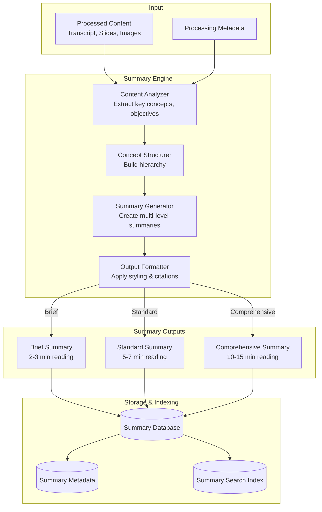
```mermaid
graph TB
    subgraph "Input"
        ProcessedContent[Processed Content<br/>Transcript, Slides, Images]
        ProcessedMetadata[Processing Metadata]
    end
  
    subgraph "Summary Engine"
        Analyzer[Content Analyzer<br/>Extract key concepts, objectives]
        Structurer[Concept Structurer<br/>Build hierarchy]
        Generator[Summary Generator<br/>Create multi-level summaries]
        Formatter[Output Formatter<br/>Apply styling & citations]
    end
  
    subgraph "Summary Outputs"
        Brief[Brief Summary<br/>2-3 min reading]
        Standard[Standard Summary<br/>5-7 min reading]
        Comprehensive[Comprehensive Summary<br/>10-15 min reading]
    end
  
    subgraph "Storage & Indexing"
        SummaryDB[(Summary Database)]
        MetaStore[(Summary Metadata)]
        SearchIndex[(Summary Search Index)]
    end
  
    ProcessedContent --> Analyzer
    ProcessedMetadata --> Analyzer
    Analyzer --> Structurer
    Structurer --> Generator
    Generator --> Formatter
  
    Formatter -->|Brief| Brief
    Formatter -->|Standard| Standard
    Formatter -->|Comprehensive| Comprehensive
  
    Brief --> SummaryDB
    Standard --> SummaryDB
    Comprehensive --> SummaryDB
  
    SummaryDB --> MetaStore
    SummaryDB --> SearchIndex
```

#### 7.2 Summary Component Class Diagram

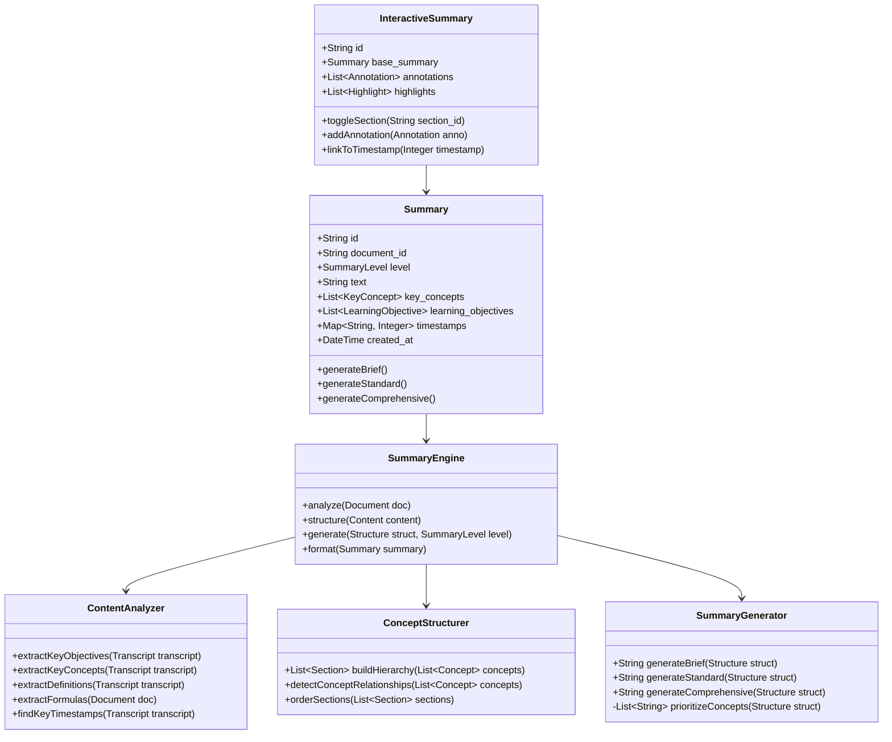
```mermaid
classDiagram
    class Summary {
        +String id
        +String document_id
        +SummaryLevel level
        +String text
        +List~KeyConcept~ key_concepts
        +List~LearningObjective~ learning_objectives
        +Map~String, Integer~ timestamps
        +DateTime created_at
        +generateBrief()
        +generateStandard()
        +generateComprehensive()
    }
  
    class SummaryEngine {
        +analyze(Document doc)
        +structure(Content content)
        +generate(Structure struct, SummaryLevel level)
        +format(Summary summary)
    }
  
    class ContentAnalyzer {
        +extractKeyObjectives(Transcript transcript)
        +extractKeyConcepts(Transcript transcript)
        +extractDefinitions(Transcript transcript)
        +extractFormulas(Document doc)
        +findKeyTimestamps(Transcript transcript)
    }
  
    class ConceptStructurer {
        +List~Section~ buildHierarchy(List~Concept~ concepts)
        +detectConceptRelationships(List~Concept~ concepts)
        +orderSections(List~Section~ sections)
    }
  
    class SummaryGenerator {
        +String generateBrief(Structure struct)
        +String generateStandard(Structure struct)
        +String generateComprehensive(Structure struct)
        -List~String~ prioritizeConcepts(Structure struct)
    }
  
    class InteractiveSummary {
        +String id
        +Summary base_summary
        +List~Annotation~ annotations
        +List~Highlight~ highlights
        +toggleSection(String section_id)
        +addAnnotation(Annotation anno)
        +linkToTimestamp(Integer timestamp)
    }
  
    Summary --> SummaryEngine
    SummaryEngine --> ContentAnalyzer
    SummaryEngine --> ConceptStructurer
    SummaryEngine --> SummaryGenerator
    InteractiveSummary --> Summary
```

#### 7.3 Summary Generation Sequence Diagram

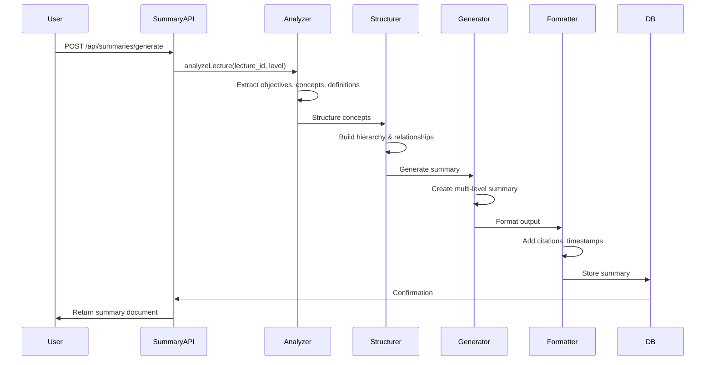
```mermaid
sequenceDiagram
    participant User
    participant SummaryAPI
    participant Analyzer
    participant Structurer
    participant Generator
    participant Formatter
    participant DB
  
    User->>SummaryAPI: POST /api/summaries/generate
    SummaryAPI->>Analyzer: analyzeLecture(lecture_id, level)
    Analyzer->>Analyzer: Extract objectives, concepts, definitions
    Analyzer->>Structurer: Structure concepts
  
    Structurer->>Structurer: Build hierarchy & relationships
    Structurer->>Generator: Generate summary
  
    Generator->>Generator: Create multi-level summary
    Generator->>Formatter: Format output
  
    Formatter->>Formatter: Add citations, timestamps
    Formatter->>DB: Store summary
  
    DB->>SummaryAPI: Confirmation
    SummaryAPI->>User: Return summary document
```

---

### 8. Personalized Learning Path & Analytics Architecture

#### 8.1 Learning Path System Overview

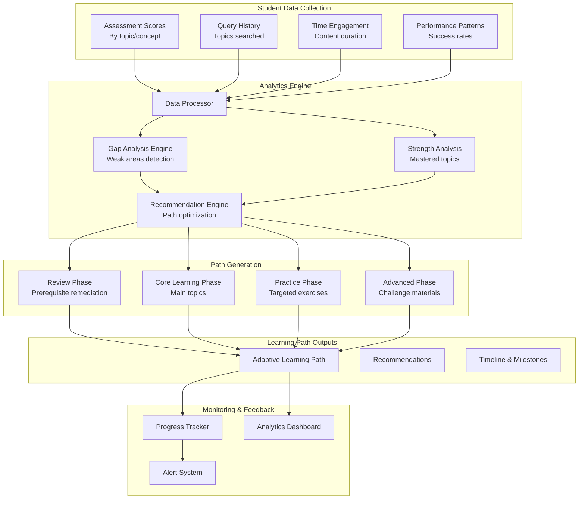
```mermaid
graph TB
    subgraph "Student Data Collection"
        AssessmentData[Assessment Scores<br/>By topic/concept]
        QueryHistory[Query History<br/>Topics searched]
        TimeData[Time Engagement<br/>Content duration]
        PerformanceData[Performance Patterns<br/>Success rates]
    end
  
    subgraph "Analytics Engine"
        DataProcessor[Data Processor]
        GapAnalyzer[Gap Analysis Engine<br/>Weak areas detection]
        StrengthAnalyzer[Strength Analysis<br/>Mastered topics]
        Recommender[Recommendation Engine<br/>Path optimization]
    end
  
    subgraph "Path Generation"
        ReviewPhase[Review Phase<br/>Prerequisite remediation]
        CorePhase[Core Learning Phase<br/>Main topics]
        PracticePhase[Practice Phase<br/>Targeted exercises]
        AdvancedPhase[Advanced Phase<br/>Challenge materials]
    end
  
    subgraph "Learning Path Outputs"
        AdaptivePath[Adaptive Learning Path]
        Recommendations[Recommendations]
        Timeline[Timeline & Milestones]
    end
  
    subgraph "Monitoring & Feedback"
        ProgressTracker[Progress Tracker]
        AnalyticsDash[Analytics Dashboard]
        Alerts[Alert System]
    end
  
    AssessmentData --> DataProcessor
    QueryHistory --> DataProcessor
    TimeData --> DataProcessor
    PerformanceData --> DataProcessor
  
    DataProcessor --> GapAnalyzer
    DataProcessor --> StrengthAnalyzer
  
    GapAnalyzer --> Recommender
    StrengthAnalyzer --> Recommender
  
    Recommender --> ReviewPhase
    Recommender --> CorePhase
    Recommender --> PracticePhase
    Recommender --> AdvancedPhase
  
    ReviewPhase --> AdaptivePath
    CorePhase --> AdaptivePath
    PracticePhase --> AdaptivePath
    AdvancedPhase --> AdaptivePath
  
    AdaptivePath --> ProgressTracker
    AdaptivePath --> AnalyticsDash
    ProgressTracker --> Alerts
```

#### 8.2 Adaptive Assessment System

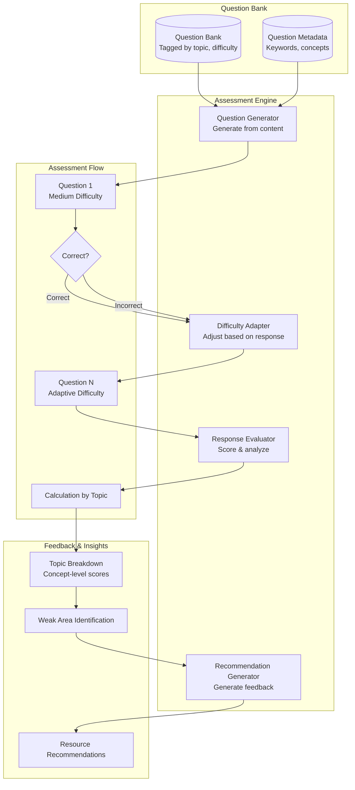
```mermaid
graph TB
    subgraph "Assessment Engine"
        QGenerator[Question Generator<br/>Generate from content]
        Adapter[Difficulty Adapter<br/>Adjust based on response]
        Evaluator[Response Evaluator<br/>Score & analyze]
        RecommendEngine[Recommendation Generator<br/>Generate feedback]
    end
  
    subgraph "Question Bank"
        Questions[(Question Bank<br/>Tagged by topic, difficulty)]
        Metadata[(Question Metadata<br/>Keywords, concepts)]
    end
  
    subgraph "Assessment Flow"
        Q1["Question 1<br/>Medium Difficulty"]
        Response1{Correct?}
        Q2["Question N<br/>Adaptive Difficulty"]
        ScoreCalc["Calculation by Topic"]
    end
  
    subgraph "Feedback & Insights"
        TopicBreakdown["Topic Breakdown<br/>Concept-level scores"]
        WeakAreas["Weak Area Identification"]
        Resources["Resource Recommendations"]
    end
  
    Questions --> QGenerator
    Metadata --> QGenerator
  
    QGenerator --> Q1
    Q1 --> Response1
    Response1 -->|Correct| Adapter
    Response1 -->|Incorrect| Adapter
  
    Adapter --> Q2
    Q2 --> Evaluator
    Evaluator --> ScoreCalc
  
    ScoreCalc --> TopicBreakdown
    TopicBreakdown --> WeakAreas
    WeakAreas --> RecommendEngine
    RecommendEngine --> Resources
```

#### 8.3 Learning Path & Analytics Data Model

```mermaid
erDiagram
    LEARNING_PATH {
        string id PK
        string student_id FK
        string goal
        datetime created_at
        datetime updated_at
        string status
        json path_definition
    }
  
    PATH_PHASE {
        string id PK
        string path_id FK
        string phase_type
        int sequence_order
        int estimated_hours
        int actual_hours
        json topics
        float completion_percentage
        string status
    }
  
    ASSESSMENT {
        string id PK
        string student_id FK
        string topic
        datetime taken_at
        int total_questions
        int correct_answers
        float accuracy_score
        json breakdown_by_concept
        string difficulty_level
    }
  
    STUDENT_ANALYTICS {
        string id PK
        string student_id FK
        json strength_matrix
        json weakness_matrix
        json learning_curve
        json engagement_metrics
        datetime last_updated
    }
  
    LEARNING_RECOMMENDATION {
        string id PK
        string student_id FK
        string recommendation_type
        json content_id
        float relevance_score
        string reason
        datetime created_at
    }
  
    PROGRESS_EVENT {
        string id PK
        string student_id FK
        string path_id FK
        string event_type
        json event_data
        datetime timestamp
    }
  
    LEARNING_PATH ||--o{ PATH_PHASE : contains
    LEARNING_PATH ||--o{ PROGRESS_EVENT : tracks
    ASSESSMENT ||--o{ STUDENT_ANALYTICS : generates
    STUDENT_ANALYTICS ||--o{ LEARNING_RECOMMENDATION : produces
    PATH_PHASE ||--o{ LEARNING_RECOMMENDATION : receives
```

#### 8.4 Analytics Dashboard Architecture

```mermaid
graph TB
    subgraph "Data Sources"
        AssessmentScores[Assessment Scores]
        ActivityLogs[Activity Logs]
        TimeTracking[Time Tracking]
        EngagementMetrics[Engagement Metrics]
    end
  
    subgraph "Analytics Processors"
        ProgressCalculator[Progress Calculator]
        MasteryCalculator[Mastery Calculator]
        TrendAnalyzer[Trend Analyzer]
        CohortAnalyzer[Cohort Analyzer]
    end
  
    subgraph "Dashboard Components"
        ProgressOverview[Progress Overview<br/>Completion %, Pace]
        StrengthWeakness[Strength/Weakness Matrix<br/>Topic mastery heatmap]
        LearningCurve[Learning Curve Graph<br/>Score trends over time]
        TimeAllocation[Time Allocation<br/>How time spent]
        ConceptMap[Concept Map<br/>Topic relationships]
        NextSteps[Recommended Next Steps]
    end
  
    subgraph "Visualization Engine"
        ChartGen[Chart Generator]
        GraphGen[Graph Generator]
        HeatmapGen[Heatmap Generator]
    end
  
    AssessmentScores --> ProgressCalculator
    ActivityLogs --> MasteryCalculator
    TimeTracking --> TrendAnalyzer
    EngagementMetrics --> CohortAnalyzer
  
    ProgressCalculator --> ProgressOverview
    MasteryCalculator --> StrengthWeakness
    TrendAnalyzer --> LearningCurve
    ProgressCalculator --> TimeAllocation
    MasteryCalculator --> ConceptMap
    CohortAnalyzer --> NextSteps
  
    ProgressOverview --> ChartGen
    LearningCurve --> GraphGen
    StrengthWeakness --> HeatmapGen
```

---

### 9. Component Architecture (Edit)

#### 9.1 System Component Diagram

```mermaid
graph TB
    subgraph "Presentation Layer"
        WebUI[React Web UI]
    end
  
    subgraph "Backend (FastAPI App)"
        APILayer["API Layer (/api/...)"]

        subgraph "Ingestion & Processing"
            UploadCtrl[Upload Controller]
            DocPipeline[DocumentProcessingPipeline]
        end

        subgraph "Retrieval & Q/A"
            SearchCtrl[Search Controller]
            RetrieverMgr[RAG Retriever Manager]
            Generator[Answer Generator]
        end

        subgraph "Summary Generation"
            SummaryCtrl[Summary Controller]
            SummaryEngine[Summary Engine]
        end

        subgraph "Learning & Analytics"
            PathCtrl[Learning Path Controller]
            PathGen[Path Generator]
            AssessCtrl[Assessment Controller]
            AnalyticsEng[Analytics Engine]
        end

        subgraph "Status & Metrics"
            StatusCtrl[Status & Stats]
        end
    end
  
    subgraph "Data & Storage Layer"
        ProcDirs[(Processing Outputs)]
        RetrievalIdx[(Retrieval Index Files)]
        InputDir[(Input Files)]
        SummaryDir[(Summary Store)]
        PathDB[(Learning Path DB)]
        AnalyticsDB[(Analytics DB)]
    end
  
    WebUI --> APILayer

    APILayer --> UploadCtrl
    APILayer --> SearchCtrl
    APILayer --> SummaryCtrl
    APILayer --> PathCtrl
    APILayer --> AssessCtrl
    APILayer --> StatusCtrl

    UploadCtrl --> DocPipeline
    DocPipeline --> ProcDirs
    DocPipeline --> InputDir

    SearchCtrl --> RetrieverMgr
    RetrieverMgr --> RetrievalIdx
    SearchCtrl --> Generator
    Generator --> RetrievalIdx

    SummaryCtrl --> SummaryEngine
    SummaryEngine --> ProcDirs
    SummaryEngine --> SummaryDir

    PathCtrl --> PathGen
    PathGen --> AnalyticsDB
    PathGen --> PathDB

    AssessCtrl --> AnalyticsEng
    AnalyticsEng --> AnalyticsDB
    AnalyticsEng --> PathDB

    StatusCtrl --> ProcDirs
    StatusCtrl --> RetrievalIdx
    StatusCtrl --> SummaryDir
    StatusCtrl --> PathDB
    StatusCtrl --> AnalyticsDB
```

#### 9.2 Component Interaction Patterns

**Pattern 1: Document Upload & Processing Pipeline**

```mermaid
sequenceDiagram
    participant UI as Web UI
    participant GW as API Gateway
    participant Upload as Upload Controller
    participant Pipeline as Doc Processing Pipeline
    participant ASR as ASR Service
    participant VLM as VLM Service
    participant Storage as File Storage
    participant DB as Metadata DB
  
    UI->>GW: Upload files
    GW->>GW: Authenticate & validate
    GW->>Upload: POST /api/upload
    Upload->>Upload: Validate formats & sizes
    Upload->>Storage: Save raw files
    Upload->>Pipeline: Trigger 4-stage processing
  
    Pipeline->>Pipeline: Stage 1: Normalize filenames & hash
    Pipeline->>Storage: Save normalized versions
  
    Pipeline->>ASR: Transcribe audio
    ASR->>Pipeline: Return transcript + timestamps
    Pipeline->>VLM: Analyze images
    VLM->>Pipeline: Return descriptions
  
    Pipeline->>Pipeline: Stage 3-4: Structure & consolidate
    Pipeline->>Storage: Save PDF & Markdown outputs
    Pipeline->>DB: Store metadata & chunks
    Pipeline->>GW: Processing complete
    GW->>UI: Show progress update
```

**Pattern 2: Summary Generation on Demand**

```mermaid
sequenceDiagram
    participant UI as Web UI
    participant SummaryCtrl as Summary Controller
    participant Analyzer as Content Analyzer
    participant Structurer as Concept Structurer
    participant Generator as Summary Generator
    participant Formatter as Output Formatter
    participant DB as Summary Store
  
    UI->>SummaryCtrl: POST /api/summaries/generate
    SummaryCtrl->>SummaryCtrl: Validate lecture_id & level
    SummaryCtrl->>Analyzer: analyze(doc_id, transcript, slides)
  
    Analyzer->>Analyzer: Extract learning objectives
    Analyzer->>Analyzer: Extract key concepts & definitions
    Analyzer->>Analyzer: Extract formulas & timestamps
    Analyzer->>SummaryCtrl: Return analysis results
  
    SummaryCtrl->>Structurer: structure(analysis)
    Structurer->>Structurer: Build hierarchy & relationships
    Structurer->>SummaryCtrl: Return structured content
  
    SummaryCtrl->>Generator: generate(structure, level)
    Generator->>Generator: Create brief/standard/comprehensive
    Generator->>SummaryCtrl: Return summary text
  
    SummaryCtrl->>Formatter: format(summary, timestamps)
    Formatter->>Formatter: Add citations & interactive links
    Formatter->>DB: Store summary document
    DB->>SummaryCtrl: Confirmation
    SummaryCtrl->>UI: Return formatted summary
```

**Pattern 3: Personalized Learning Path Generation**

```mermaid
sequenceDiagram
    participant UI as Web UI
    participant PathCtrl as Learning Path Controller
    participant Analytics as Analytics Engine
    participant GapAnalyzer as Gap Analysis
    participant Recommender as Recommendation Engine
    participant PathGen as Path Generator
    participant PathDB as Learning Path DB
  
    UI->>PathCtrl: POST /api/learning-paths/generate
    PathCtrl->>Analytics: Collect student data (student_id)
  
    Analytics->>Analytics: Aggregate assessments by topic
    Analytics->>Analytics: Analyze query history & patterns
    Analytics->>Analytics: Calculate engagement metrics
    Analytics->>PathCtrl: Return aggregated data
  
    PathCtrl->>GapAnalyzer: Analyze(student_data)
    GapAnalyzer->>GapAnalyzer: Identify weak areas (<70%)
    GapAnalyzer->>GapAnalyzer: Identify strengths (>85%)
    GapAnalyzer->>GapAnalyzer: Detect missing prerequisites
    GapAnalyzer->>PathCtrl: Return analysis
  
    PathCtrl->>Recommender: Generate recommendations
    Recommender->>Recommender: Create Review Phase
    Recommender->>Recommender: Build Core Learning Phase
    Recommender->>Recommender: Add Practice Phase
    Recommender->>Recommender: Include Advanced Phase
    Recommender->>Recommender: Calculate time estimates
    Recommender->>PathCtrl: Return path structure
  
    PathCtrl->>PathGen: Build final path
    PathGen->>PathDB: Save learning path with phases
    PathDB->>PathCtrl: Confirmation
    PathCtrl->>UI: Return roadmap with visualization
```

**Pattern 4: Adaptive Assessment & Difficulty Adjustment**

```mermaid
sequenceDiagram
    participant UI as Web UI
    participant AssessCtrl as Assessment Controller
    participant QGen as Question Generator
    participant Adapter as Difficulty Adapter
    participant Evaluator as Response Evaluator
    participant AnalyticsDB as Analytics DB
  
    UI->>AssessCtrl: POST /api/assessments/start
    AssessCtrl->>QGen: Generate first question (topic, MEDIUM)
    QGen->>UI: Display Question 1
  
    loop Assessment Loop: 15-20 Questions
        UI->>AssessCtrl: Submit answer
        AssessCtrl->>Evaluator: Grade response
        Evaluator->>Evaluator: Check correctness
        Evaluator->>AssessCtrl: Result (correct/incorrect)
  
        AssessCtrl->>Adapter: Adjust difficulty
        Adapter->>Adapter: Analyze performance trend
        Adapter->>Adapter: Determine new difficulty
        Adapter->>AssessCtrl: Return new difficulty level
  
        AssessCtrl->>QGen: Generate next question(topic, adaptive_difficulty)
        QGen->>UI: Display next question
    end
  
    AssessCtrl->>Evaluator: Finalize assessment
    Evaluator->>Evaluator: Calculate topic breakdowns
    Evaluator->>Evaluator: Identify weak concepts
    Evaluator->>Evaluator: Generate explanations
    Evaluator->>AnalyticsDB: Store results
  
    AnalyticsDB->>AssessCtrl: Confirmation
    AssessCtrl->>UI: Return performance report & recommendations
```

**Pattern 5: Analytics Dashboard & Real-Time Updates**

```mermaid
sequenceDiagram
    participant UI as Web UI
    participant AnalyticsCtrl as Analytics Controller
    participant DataAgg as Data Aggregator
    participant TrendAnalyzer as Trend Analyzer
    participant ChartGen as Chart Generator
    participant AnalyticsDB as Analytics DB
  
    UI->>AnalyticsCtrl: GET /api/analytics/dashboard/{student_id}
    AnalyticsCtrl->>DataAgg: Collect all student metrics
  
    par Parallel Data Retrieval
        DataAgg->>AnalyticsDB: Fetch all assessments
        DataAgg->>AnalyticsDB: Fetch learning path status
        DataAgg->>AnalyticsDB: Fetch engagement logs
        DataAgg->>AnalyticsDB: Fetch query history
    end
  
    DataAgg->>AnalyticsCtrl: Return aggregated data
  
    AnalyticsCtrl->>TrendAnalyzer: Analyze metrics
    TrendAnalyzer->>TrendAnalyzer: Calculate progress %
    TrendAnalyzer->>TrendAnalyzer: Build strength/weakness matrix
    TrendAnalyzer->>TrendAnalyzer: Plot learning curve
    TrendAnalyzer->>TrendAnalyzer: Analyze time allocation
    TrendAnalyzer->>AnalyticsCtrl: Return analysis
  
    AnalyticsCtrl->>ChartGen: Generate visualizations
    ChartGen->>ChartGen: Create progress charts
    ChartGen->>ChartGen: Create heatmaps
    ChartGen->>ChartGen: Create trend graphs
    ChartGen->>AnalyticsCtrl: Return formatted visuals
  
    AnalyticsCtrl->>ChartGen: Generate recommendations
    ChartGen->>AnalyticsCtrl: Return next steps
    AnalyticsCtrl->>UI: Display dashboard
```

**Pattern 6: Multi-Service Orchestration (End-to-End Student Learning Journey)**

```mermaid
sequenceDiagram
    participant Student as Student
    participant UI as Web UI
    participant Upload as Upload Pipeline
    participant Summary as Summary Service
    participant Assessment as Assessment Service
    participant Path as Learning Path Service
    participant Analytics as Analytics Service
  
    Student->>UI: Upload lecture video
    UI->>Upload: Trigger processing
    Upload->>Upload: Process 4 stages
    Note over Upload: ASR, OCR, VLM, consolidation
  
    Student->>UI: Request summary
    UI->>Summary: Generate summary (level=STANDARD)
    Summary->>Summary: Analyze processed content
    Summary->>UI: Display summary with navigation
  
    Student->>UI: Take practice assessment
    UI->>Assessment: Start adaptive assessment
    Assessment->>Assessment: Adjust difficulty per response
    Assessment->>UI: Display performance report
  
    Assessment->>Analytics: Record assessment results
    Analytics->>Analytics: Update student profile
  
    Student->>UI: Request learning path
    UI->>Path: Generate personalized path
    Path->>Analytics: Fetch student analytics
    Analytics->>Path: Return computed metrics
    Path->>Path: Build customized roadmap
    Path->>UI: Display learning path
  
    Student->>UI: View dashboard
    UI->>Analytics: Get dashboard metrics
    Analytics->>Analytics: Compute all visualizations
    Analytics->>UI: Display interactive dashboard
```

#### 9.3 Key Services Integration

| Service                                | Responsibility                     | Data Inputs       | Data Outputs                           |
| -------------------------------------- | ---------------------------------- | ----------------- | -------------------------------------- |
| **Upload & Validation**          | File acceptance, format validation | Raw files         | Validated file metadata                |
| **Document Processing Pipeline** | 4-stage content processing         | Validated files   | Processed PDFs, Markdown, metadata     |
| **Search Controller**            | Query routing and retrieval        | User queries      | Ranked results, multimodal matches     |
| **RAG Retriever**                | Content retrieval                  | Query embeddings  | Top-K documents, images, chunks        |
| **Answer Generator**             | LLM-based answers                  | Retrieved context | Formatted answers with citations       |
| **Summary Engine**               | Multi-level summary generation     | Processed content | Brief/Standard/Comprehensive summaries |
| **Learning Path Generator**      | Adaptive path creation             | Student analytics | Personalized learning roadmap          |
| **Assessment Engine**            | Difficulty-adaptive testing        | Student responses | Scores, performance breakdown          |
| **Analytics Engine**             | Progress & performance analytics   | All student data  | Dashboard metrics, recommendations     |

---

### 9. Technology Stack (Edit)

#### 9.1 Component Technology Mapping

| Layer      | Component        | Technology     | Version  | Notes                |
| ---------- | ---------------- | -------------- | -------- | -------------------- |
| Frontend   | Web Framework    | React          | 19.2+    | Latest stable        |
| Frontend   | State Management | Redux Toolkit  | Latest   | Feature-based slices |
| Frontend   | Build Tool       | Vite           | 5.0+     | Fast HMR             |
| Frontend   | Styling          | TailwindCSS    | 3.4+     | Utility-first        |
| Frontend   | Icons            | Lucide React   | Latest   | Consistent icon set  |
| Backend    | API Framework    | FastAPI        | 0.115+   | Latest stable        |
| Backend    | Language         | Python         | 3.11+    | With type hints      |
| Backend    | Async            | asyncio        | Built-in | Async processing     |
| Database   | Vector DB        | Milvus         | 2.3+     | Semantic search      |
| Database   | Relational       | PostgreSQL     | 18.x     | Latest stable        |
| Database   | Cache            | Redis          | 7.2+     | Session & queue      |
| AI/ML      | ASR              | Whisper        | Latest   | Multi-language       |
| AI/ML      | OCR              | Tesseract      | 5.3+     | Text extraction      |
| AI/ML      | VLM              | SmolVLM        | Latest   | Image understanding  |
| AI/ML      | LLM              | OpenAI GPT     | 4.0+     | Answer generation    |
| AI/ML      | Embeddings       | Sentence-BERT  | Latest   | Vector embeddings    |
| Processing | Audio            | FFmpeg         | 6.1+     | Media processing     |
| Processing | PDF              | Poppler        | Latest   | PDF handling         |
| Processing | Document         | Docling        | Latest   | Document analysis    |
| Deployment | Container        | Docker         | 25.0+    | Containerization     |
| Deployment | Orchestration    | Docker Compose | 2.20+    | Multi-service        |
| Monitoring | Logging          | Python logging | Built-in | Structured logging   |
| Monitoring | Metrics          | Prometheus     | Optional | Advanced monitoring  |
| Security   | Authentication   | University SSO | OAuth2   | FERPA compliant      |
| Security   | Tokens           | JWT            | Latest   | Stateless auth       |

### 14. Integration with University Systems (Future)

#### 14.1 SSO Integration Architecture

```mermaid
sequenceDiagram
    participant User as University User
    participant SSO as University SSO
    participant App as Our Application
    participant DB as User Database
  
    User->>SSO: Login with university credentials
    SSO->>SSO: Authenticate user
    SSO->>App: Redirect with OAuth code
    App->>SSO: Exchange code for tokens
    SSO->>App: Return access tokens + user info
    App->>DB: Create/update user record
    App->>User: Issue JWT session token
  
    Note over App: FERPA compliant data handling
    Note over DB: Minimal user data stored
```

#### 14.2 LMS Integration Patterns

```mermaid
graph TB
    subgraph "University Systems"
        LMS[Learning Management System]
        SIS[Student Information System]
        Library[Library System]
        Email[University Email]
    end
  
    subgraph "Integration Layer"
        APIGateway[API Gateway]
        Webhooks[Webhook Handlers]
        DataSync[Data Synchronization]
        EventProcessor[Event Processor]
    end
  
    subgraph "Our System"
        Auth[Authentication Service]
        UserMgmt[User Management]
        CourseMgmt[Course Management]
        Notifications[Notification Service]
    end
  
    LMS --> APIGateway
    SIS --> APIGateway
    Library --> APIGateway
    Email --> Webhooks
  
    APIGateway --> Auth
    APIGateway --> DataSync
    Webhooks --> EventProcessor
  
    Auth --> UserMgmt
    DataSync --> CourseMgmt
    EventProcessor --> Notifications
```

---

