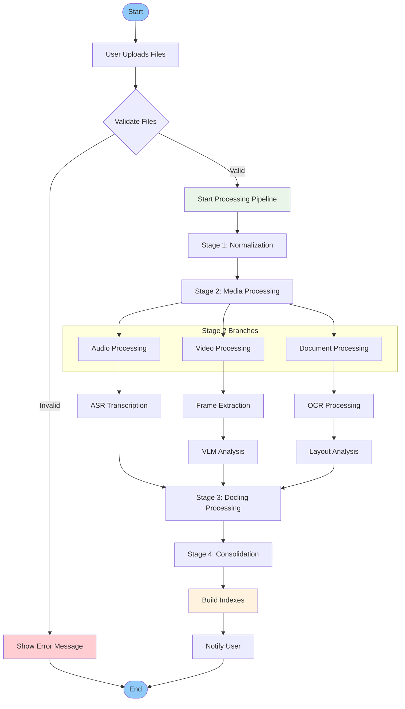
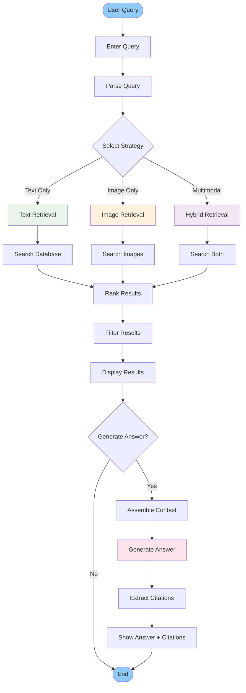
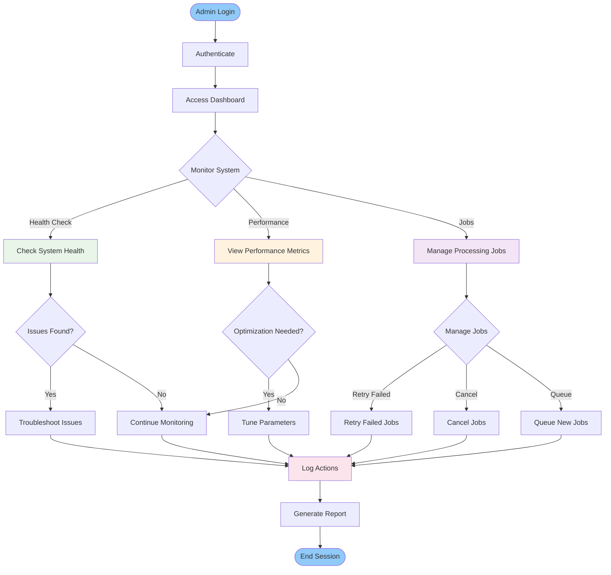
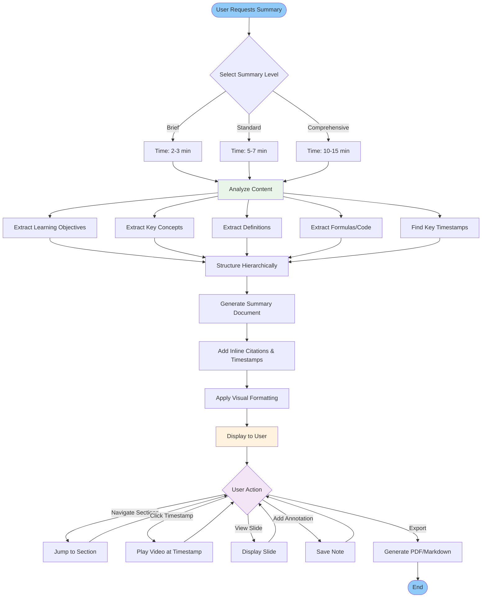
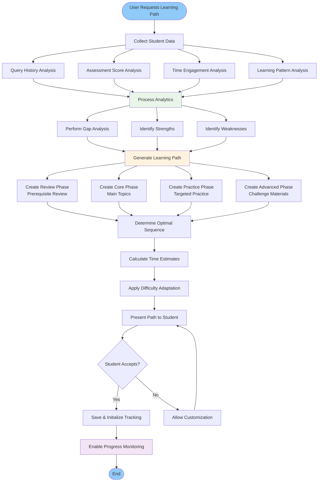
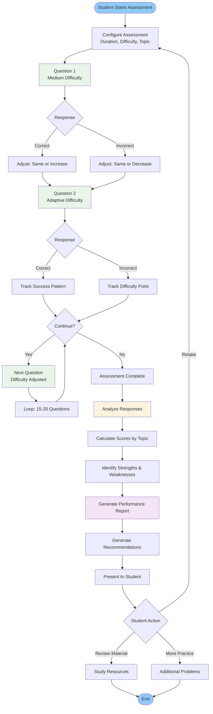
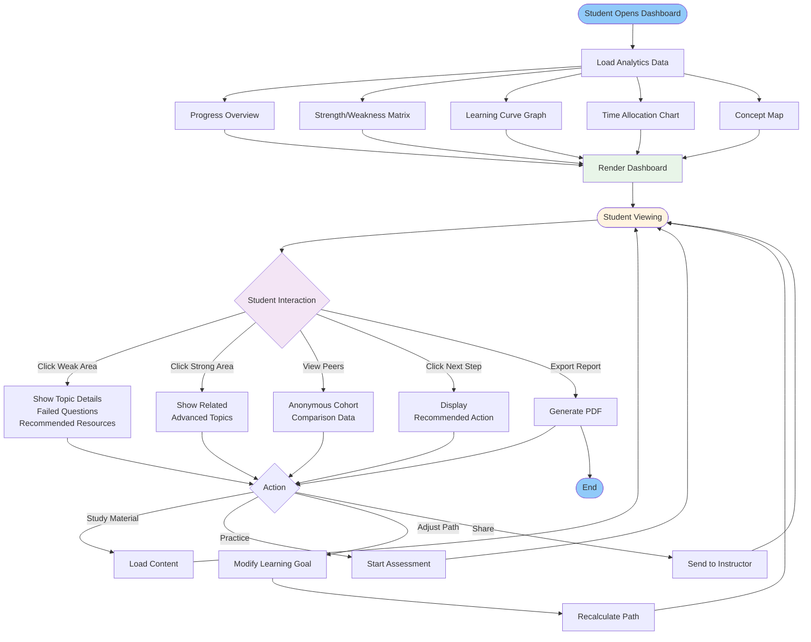
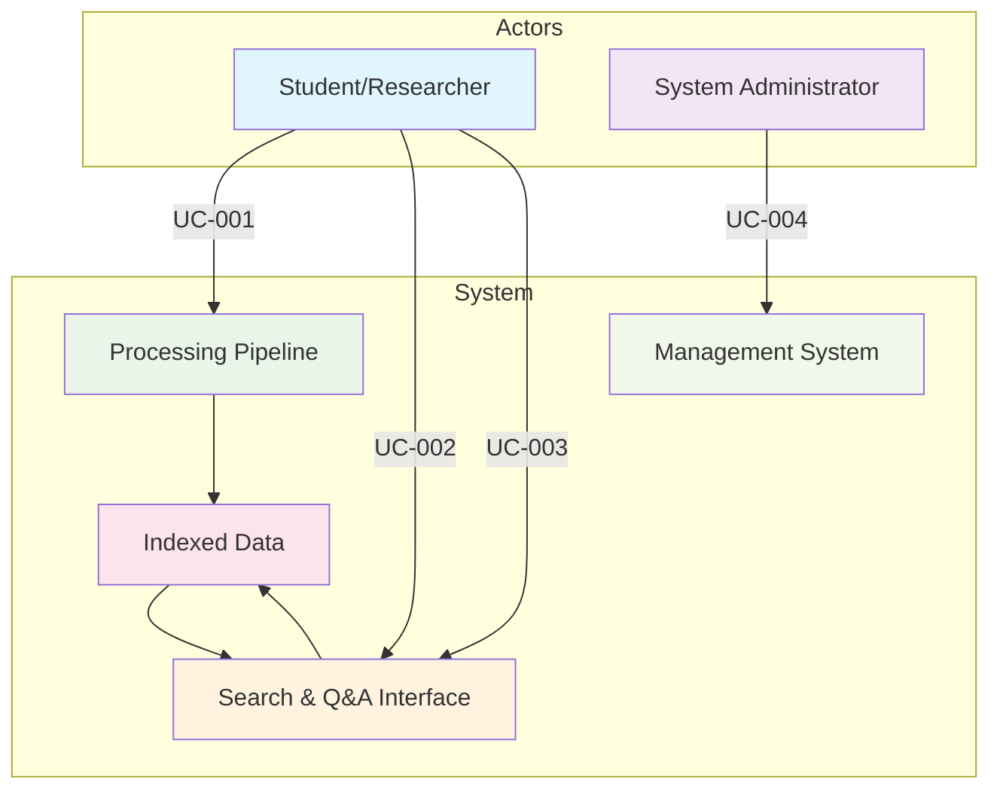

# Use Cases and Scenarios

## Educational Content Processing & Retrieval-Augmented Generation System

---

### 1. Use Case Overview

This document describes the primary use cases and detailed scenarios for the Educational Content Processing & RAG System, covering all major user interactions and system workflows.

---

### 2. Primary Use Cases

#### 2.1 Use Case: Document Processing

**UC-001: Upload and Process Educational Content**

**Primary Actor**: Student/Researcher
**Secondary Actors**: System Administrator, Processing Pipeline

**Description**: User uploads educational materials (lecture videos, slides, documents) for processing and indexing.

**Preconditions**:

- User is logged into the system
- System is operational with sufficient resources
- Processing pipeline is configured

**Postconditions**:

- Documents are processed and indexed
- Content is searchable via multiple modalities
- Processing results are available for querying

**Main Flow**:

1. User accesses the web interface
2. User selects files for upload (drag-and-drop or file picker)
3. System validates file formats and sizes
4. Files are uploaded to temporary storage
5. Processing pipeline is triggered automatically
6. System processes files through 4-stage pipeline:
   - Stage 1: Format normalization
   - Stage 2: Media processing (ASR/OCR)
   - Stage 3: Document understanding (VLM)
   - Stage 4: RAG-ready consolidation
7. Results are stored and indexed
8. User receives completion notification

**Alternative Flows**:

- **Invalid Format**: System rejects unsupported files with error message
- **Processing Failure**: System logs error and allows retry
- **Insufficient Resources**: System queues processing or notifies user

**Exceptions**:

- Network interruption during upload
- Corrupted file detection
- API service unavailability

---

#### 2.2 Use Case: Content Search and Retrieval

**UC-002: Search Educational Content**

**Primary Actor**: Student/Researcher
**Secondary Actors**: Retrieval Engine, LLM Service

**Description**: User searches for information within processed educational content using natural language queries.

**Preconditions**:

- Content has been processed and indexed
- Search indexes are available
- User has access to the system

**Postconditions**:

- Relevant content chunks are retrieved
- Search results are ranked and displayed
- Citations are provided for all results

**Main Flow**:

1. User enters natural language query in search interface
2. System analyzes query and determines retrieval strategy
3. Retrieval engine searches across multiple indexes:
   - Text retrieval (BM25/Dense/Hybrid)
   - Visual retrieval (if applicable)
4. Results are ranked and filtered
5. Top results are displayed with relevance scores
6. User can refine search or select specific results

**Alternative Flows**:

- **No Results Found**: System suggests query refinement
- **Multimodal Query**: System processes both text and image inputs
- **Advanced Search**: User specifies retrieval method or filters

**Exceptions**:

- Search index unavailable
- Query timeout
- LLM service failure

---

#### 2.3 Use Case: Question Answering

**UC-003: Generate Answer with Citations**

**Primary Actor**: Student/Researcher
**Secondary Actors**: LLM Service, Citation Engine

**Description**: User asks a question and receives a generated answer with citations from source materials.

**Preconditions**:

- Content is processed and indexed
- LLM service is available
- User has valid query

**Postconditions**:

- Answer is generated based on retrieved context
- Citations link to source documents
- Answer confidence is indicated

**Main Flow**:

1. User submits question through search interface
2. System retrieves relevant context using UC-002
3. Retrieved context is formatted for LLM
4. LLM generates answer based on context
5. Citations are extracted and linked to sources
6. Answer with citations is displayed to user
7. User can provide feedback on answer quality

**Alternative Flows**:

- **Insufficient Context**: System requests query refinement
- **Multiple Perspectives**: System provides balanced answer
- **Real-time Information**: System indicates knowledge limitations

**Exceptions**:

- LLM service timeout
- Citation extraction failure
- Content access restrictions

---

#### 2.4 Use Case: System Administration

**UC-004: Manage Processing Pipeline**

**Primary Actor**: System Administrator
**Secondary Actors**: Processing Pipeline, Monitoring System

**Description**: Administrator monitors and manages the document processing pipeline and system health.

**Preconditions**:

- Administrator has system access
- System is operational

**Postconditions**:

- System status is monitored
- Processing jobs are managed
- Performance metrics are collected

**Main Flow**:

1. Administrator accesses admin dashboard
2. System displays current status and metrics
3. Administrator can:
   - Monitor processing queue
   - View system performance
   - Manage failed jobs
   - Configure processing parameters
4. Actions are executed and results displayed
5. System logs all administrative actions

**Alternative Flows**:

- **System Alert**: Administrator receives notification of issues
- **Performance Tuning**: Administrator adjusts parameters
- **Maintenance Mode**: System enters maintenance state

**Exceptions**:

- Authentication failure
- System unavailable
- Configuration errors

---

### 3. Extended Use Cases: Lecture Summaries & Learning Paths

#### 3.1 Use Case: Generate Automated Lecture Summary

**UC-005: Generate Concise Lecture Summary**

**Primary Actor**: Student/Researcher
**Secondary Actors**: Summarization Engine, Content Processor

**Description**: User requests a system-generated summary of a processed lecture video or document, receiving a concise overview with key concepts, learning objectives, and important definitions.

**Preconditions**:

- Lecture content has been processed and indexed
- Summarization engine is operational
- User has access to viewing the content

**Postconditions**:

- Summary document is generated and stored
- Summary is searchable and navigable
- Timestamps/citations link to source material

**Main Flow**:

1. User accesses processed lecture from library
2. User clicks "Generate Summary" button
3. System analyzes lecture content (transcript, slides, extracted concepts)
4. User selects summary level:
   - **Brief** (2-3 minutes reading time)
   - **Standard** (5-7 minutes reading time)
   - **Comprehensive** (10-15 minutes reading time)
5. Summarization engine processes content:
   - Extracts key learning objectives
   - Identifies core concepts and definitions
   - Detects formulas and important equations
   - Finds important timestamps and slide references
6. Summary is structured hierarchically with sections
7. Summary is displayed with:
   - Numbered sections and subsections
   - Highlighted key terms
   - Inline citations with timestamps
   - Cross-references to visual content
8. User can navigate, annotate, and export summary

**Alternative Flows**:

- **Custom Focus**: User specifies focus areas (e.g., "algorithms only")
- **Multi-lecture Summary**: User combines multiple lectures into one summary
- **Comparison Summary**: System highlights new content vs. previously covered topics
- **Failed Summarization**: Low-quality input triggers manual review notification

**Exceptions**:

- Insufficient content for meaningful summary
- Summarization engine failure or timeout
- Content access restrictions

**Usage Notes**:

- Summary generation based on:
  - ASR transcripts with confidence scoring
  - OCR text from slides
  - VLM-generated image descriptions
  - Extracted structured data (tables, formulas)

---

#### 3.2 Use Case: Interactive Summary Navigation

**UC-006: Navigate and Interact with Summary**

**Primary Actor**: Student/Researcher
**Secondary Actors**: Content Retrieval Engine

**Description**: User navigates the generated summary with interactive features, linking back to source material and exploring related content.

**Preconditions**:

- Summary has been generated (UC-005 completed)
- User is viewing the summary

**Postconditions**:

- User understands lecture content structure
- Source materials are located and accessed
- Annotations are saved (if applicable)

**Main Flow**:

1. User views summary with hierarchical structure:
   - Learning Objectives (top)
   - Main Concepts Sections
   - Key Definitions
   - Important Formulas/Theorems
   - Summary Conclusions
2. User clicks section heading
3. System expands/collapses sections dynamically
4. User clicks timestamp link (e.g., "[00:12:34]")
5. System jumps to that timestamp in video/document
6. User clicks "View Slide" button
7. Corresponding slide is displayed in side panel
8. User hovers over key term for definition popup
9. User clicks "See in Context" on definition
10. System highlights that term throughout the summary
11. User adds annotation/note to specific section
12. User clicks "Related Content" button
13. System suggests related concepts from other lectures

**Alternative Flows**:

- **Search Within Summary**: User searches for specific topics
- **Outline View**: User switches to tree/outline visualization
- **Timeline View**: Visual representation of lecture flow
- **Concept Map**: Graph view showing relationships between concepts
- **Export**: User exports summary as PDF/Markdown/PNG

**Exceptions**:

- Timestamp not available
- Source material access restricted
- Network error retrieving related content

---

#### 3.3 Use Case: Student Generates Personalized Summary

**UC-007: Create Custom Summary with Focus Areas**

**Primary Actor**: Student
**Secondary Actors**: Summarization Engine, Knowledge Graph

**Description**: Student customizes summary generation based on personal learning needs, focusing on specific topics or question topics.

**Preconditions**:

- Student has completed lecture viewing/initial summary review
- Student has identified weak areas or questions
- System has student learning profile

**Postconditions**:

- Personalized summary is generated
- Summary emphasizes identified weak areas
- Related prerequisite materials are suggested

**Main Flow**:

1. Student selects "Customize Summary" from summary view
2. System presents customization options:
   - **Select Focus Topics**: Student checks boxes for topics to emphasize
   - **Difficulty Level**: Choose basic/intermediate/advanced explanation depth
   - **Include Prerequisites**: Toggle to include prerequisite concept explanations
   - **Add Examples**: Toggle to include more worked examples
   - **Visual Focus**: Choose "More diagrams" / "More text" / "Balanced"
3. Student adjusts slider for "Depth of Explanations" (1-10 scale)
4. Student clicks "Generate Custom Summary"
5. System regenerates summary with:
   - Emphasized sections marked visually
   - Additional examples in focused areas
   - Prerequisites explained inline
   - Alternative explanations for complex concepts
6. System shows "Customization Score" indicating completeness
7. Student previews customized summary
8. Student saves customized version or generates new variant

**Alternative Flows**:

- **Question-Driven**: Student inputs specific questions to guide customization
- **Comparison Mode**: Compare standard vs. customized summaries side-by-side
- **Difficulty Adaption**: System suggests difficulty level based on performance history

**Exceptions**:

- Requested focus topics not sufficiently covered in source material
- Prerequisite materials not available
- Customization takes too long

---

#### 3.4 Use Case: Generate Personalized Learning Path

**UC-008: Analyze Student Profile and Generate Learning Roadmap**

**Primary Actor**: Student
**Secondary Actors**: Recommendation Engine, Knowledge Graph, Learning Analytics

**Description**: System analyzes student's query history, assessment performance, and learning patterns to generate a personalized learning roadmap recommending topics to study and prerequisites to review.

**Preconditions**:

- Student has completed multiple sessions with the system
- Student has taken at least 3 assessments
- Content corpus is indexed and categorized
- Personalization features are enabled

**Postconditions**:

- Personalized learning path is generated and saved
- Student has roadmap with recommended next steps
- Path includes prerequisites, core topics, and advanced materials
- Progress tracking is initialized

**Main Flow**:

1. Student clicks "Generate Learning Path" button
2. System analyzes student data:
   - **Query Analysis**: Topics searched, question patterns
   - **Assessment History**: Scores by topic/concept
   - **Time Spent**: How long spent on each concept
   - **Engagement**: Viewed materials, annotations, exports
   - **Weakness Detection**: Concepts with <70% accuracy
   - **Strength Identification**: Concepts with >85% accuracy
3. System performs:
   - **Gap Analysis**: Identifies missing prerequisites
   - **Progression Mapping**: Determines optimal sequence
   - **Milestone Planning**: Sets achievable checkpoints
   - **Difficulty Adaptation**: Adjusts difficulty curve
4. System generates personalized path with:
   - **Review Phase**: 3-5 prerequisite topics needing review
   - **Core Learning**: 8-12 main topics aligned with goals
   - **Practice Phase**: Targeted exercises for weak areas
   - **Advanced Phase**: Challenge materials for interests
5. System presents:
   - Visual roadmap showing progression
   - Time estimates for each phase
   - Recommended pace (weekly goals)
   - Related resources for each topic
6. Student accepts and saves learning path
7. System sets up tracking and progress monitoring

**Alternative Flows**:

- **Goal-Based Path**: Student specifies learning goal, system creates path
- **Quick Start Path**: Pre-defined paths for common goals
- **Collaborative Path**: Paths based on peer performance aggregates
- **Instructor Path**: Instructor creates paths for student cohorts

**Exceptions**:

- Insufficient student data for meaningful recommendations
- Student has mastered all covered topics
- Large gaps requiring fundamental review

---

#### 3.5 Use Case: Take Adaptive Assessment and Receive Recommendations

**UC-009: Generate Adaptive MCQ Assessment and Personalized Recommendations**

**Primary Actor**: Student
**Secondary Actors**: Assessment Engine, Recommendation Engine, Content Processor

**Description**: System generates adaptive multiple-choice questions from lecture content, adjusts difficulty based on responses, and provides personalized learning recommendations based on performance.

**Preconditions**:

- Student has completed learning related to assessed topics
- Assessment engine is configured
- Question bank exists with tagged difficulty levels

**Postconditions**:

- Student has completed adaptive assessment
- Performance metrics are recorded
- Personalized recommendations are generated
- Learning gaps are identified

**Main Flow**:

1. Student accesses "Practice Assessment" section
2. Student selects topic or full course
3. System presents options:
   - **Timed**: 30/60/90 minute assessment
   - **Untimed**: Self-paced assessment
   - **Difficulty**: Basic/Intermediate/Advanced start level
4. Student starts assessment:
   - Question 1 (Medium difficulty): Student gets correct
   - Question 2 (Medium difficulty): Student gets correct
   - Question 3 (Hard difficulty): Student gets incorrect
   - Question 4 (Hard difficulty): Student gets correct
   - Question 5 (Very Hard difficulty): Student gets incorrect
   - System identifies student is primarily comfortable with core topics
5. System adapts:
   - Next question (Hard difficulty): Student gets incorrect
   - System downgrades to Medium
   - Presents 2 more Medium questions (both correct)
   - Problem area identified: Advanced topic variant
6. Assessment continues 15-20 questions (adaptive length)
7. Student completes with performance:
   - Overall: 75% (12/16 correct)
   - By Topic:
     - Core Concepts: 90%
     - Algorithm Implementation: 70%
     - Complexity Analysis: 60%
     - Advanced Optimization: 40%
8. System generates report with:
   - Concept-level breakdown
   - Identified weak areas (Complexity Analysis, Advanced Optimization)
   - Incorrectly answered questions with explanations
   - Related lecture timestamps for each mistake
9. System provides recommendations:
   - "Review: Complexity Analysis [Lecture 7, 00:15:30]"
   - "Practice: 5 additional problems on Big-O notation"
   - "Advanced: Try optimization techniques once complexity is solid"
10. Student views recommendations and selects resources to study

**Alternative Flows**:

- **Diagnostic Assessment**: Initial assessment to place student
- **Pre/Post Assessment**: Compare before and after learning
- **Peer Comparison**: Anonymous benchmarking against cohort (opt-in)
- **Feedback Modes**: Immediate/Delayed/On-Demand explanations

**Exceptions**:

- Student performance too low (suggest prerequisite review)
- Student performance perfect (offer advanced materials)
- Technical issues during assessment

---

#### 3.6 Use Case: View Learning Dashboard and Progress Analytics

**UC-010: Monitor Progress and View Personalized Analytics Dashboard**

**Primary Actor**: Student
**Secondary Actors**: Analytics Engine, Learning Analytics Service

**Description**: Student accesses personalized dashboard showing learning progress, strength/weakness visualization, and data-driven recommendations.

**Preconditions**:

- Student has been using system for multiple sessions
- Learning path is active
- Multiple assessments completed
- Analytics data is available

**Postconditions**:

- Student understands current learning status
- Student identifies areas needing focus
- Student receives Next Steps recommendation

**Main Flow**:

1. Student opens "Learning Dashboard"
2. Dashboard displays multiple views:

   **A. Progress Overview**:

   - Learning Path: "Completed: 6/18 topics (33%)"
   - Time Invested: "Last 7 days: 12 hours"
   - Pace: "On track for completion in 3 weeks"
   - Motivation: Daily streak (5 days), achievement badges

   **B. Strength/Weakness Matrix**:

   - Visual grid showing topic mastery levels
   - Green (Mastered >85%), Yellow (Competent 70-85%), Red (Needs Review <70%)
   - Topics:
     - Fundamentals: Green
     - Core Algorithms: Yellow
     - Data Structures: Yellow
     - Advanced Optimization: Red
     - Practical Implementation: Yellow

   **C. Learning Curve Over Time**:

   - Line graph showing assessment scores over 4 weeks
   - Trend: Upward with 2% weekly improvement
   - Milestone markers ("Completed DP module", "Mastered Sorting")
   - Relative performance vs. recommended path

   **D. Time Allocation Pie Chart**:

   - How time spent (Lectures 40%, Practice 35%, Assessments 15%, Review 10%)
   - Recommendation: Increase practice to 45%

   **E. Concept Dependency Map**:

   - Prerequisite relationships shown
   - Mastered concepts highlighted
   - "Blockers" identified (unsolved prerequisites for next topics)
   - Current blocker: "Complexity Analysis" blocks "Advanced Optimization"
3. Student clicks "Weak Areas"
4. System shows:

   - **Complexity Analysis**: 60% average, 3 failed questions
   - Recommended: Re-read notes, 4 new practice problems, 10-min refresher video
   - Estimated time: 30 minutes
5. Student clicks "Suggested Next Step"
6. System recommends:

   - Based on mastery: Ready for Graph Algorithms
   - Based on time: 45 min learning window available today
   - Recommended: "20-min Graph Algorithms intro + 25-min practice"
7. Student clicks "Follow Recommendation"
8. System loads recommended materials

**Alternative Flows**:

- **Cohort Comparison**: See anonymous peer stats (opt-in)
- **Instructor View**: Student shares dashboard with instructor
- **Export Report**: Student generates PDF progress report
- **Goal Adjustment**: Student modifies learning goal, path regenerates
- **Historical View**: Compare against previous weeks/months

**Exceptions**:

- Insufficient assessment data
- No active learning path
- Analytics engine unavailable

---

### 4. Detailed Scenarios

#### 4.1 Scenario: Lecture Video Processing

**Scenario S-001: Processing a Vietnamese Lecture Video**

**Context**: A student uploads a 45-minute Vietnamese lecture video on machine learning.

**Steps**:

1. **Upload**: Student drags `ML_Lecture_Video.mp4` to web interface
2. **Validation**: System confirms MP4 format (45MB, valid)
3. **Processing Initiation**: Pipeline starts in "Full Mode"
4. **Stage 1 - Normalization**:
   - Video format validated
   - Filename truncated for Windows compatibility
   - Hash calculated: `a1b2c3d4...`
5. **Stage 2 - Media Processing**:
   - Audio extracted using FFmpeg
   - Whisper Large-v3 transcribes Vietnamese audio
   - Timestamps generated (JSON format)
   - SRT and VTT subtitle files created
6. **Stage 3 - Document Understanding**:
   - Video frames analyzed for slide content
   - SmolVLM-256M generates descriptions
   - Key concepts extracted and tagged
7. **Stage 4 - Consolidation**:
   - Dual outputs created:
     - `ML_Lecture_Video.pdf` (image-based RAG)
     - `ML_Lecture_Video.md` (text-based RAG)
   - Metadata stored in database
8. **Indexing**: Content indexed for both text and visual retrieval
9. **Completion**: Student receives notification with processing summary

**Expected Results**:

- Vietnamese transcription with 92% accuracy
- 15 slide images extracted and described
- Processing time: ~12 minutes
- File sizes: PDF (8MB), MD (2MB)

---

#### 4.2 Scenario: Multimodal Search

**Scenario S-002: Searching for Neural Network Information**

**Context**: A researcher searches for information about backpropagation algorithms across multiple lecture materials.

**Steps**:

1. **Query Entry**: Researcher enters "How does backpropagation work in neural networks?"
2. **Query Analysis**: System identifies key concepts: backpropagation, neural networks
3. **Retrieval Strategy**: Hybrid approach selected (BM25 + Dense)
4. **Text Retrieval**:
   - BM25 finds exact matches for "backpropagation"
   - Dense retrieval finds semantic related content
   - Results combined using Reciprocal Rank Fusion
5. **Visual Retrieval**:
   - ColQwen searches for diagrams containing neural network visualizations
   - 3 relevant lecture slides identified
6. **Result Ranking**:
   - Top 10 text chunks (nDCG scores: 0.75-0.92)
   - 2 relevant images (visual similarity: 0.88-0.94)
7. **Display**: Results shown with:
   - Text excerpts with highlighting
   - Slide thumbnails with page numbers
   - Relevance scores and citations
8. **Answer Generation**:
   - Researcher clicks "Generate Answer"
   - LLM synthesizes information from top 5 results
   - Answer includes mathematical equations and citations
9. **Feedback**: Researcher rates answer quality (4.5/5)

**Expected Results**:

- 8 relevant text chunks from 3 different lectures
- 2 neural network diagrams from slide decks
- Generated answer with 4 citations
- Total response time: 3.2 seconds

---

#### 4.3 Scenario: Batch Document Processing

**Scenario S-003: Processing Semester Course Materials**

**Context**: An instructor uploads an entire semester's course materials for a computer science class.

**Steps**:

1. **Batch Upload**: Instructor selects 45 files (videos, PDFs, PPTX)
2. **Format Validation**: System confirms all supported formats
3. **Processing Mode Selection**: Instructor chooses "Balanced Mode" for quality-speed tradeoff
4. **Queue Management**: Files added to processing queue
5. **Parallel Processing**:
   - 4 concurrent processing workers
   - Smart deduplication skips 3 duplicate files
   - Processing order optimized by file type
6. **Progress Monitoring**:
   - Real-time progress bar shows 42/45 files processed
   - Estimated completion time: 25 minutes
   - Current processing: `Algorithm_Video.mp4` (67% complete)
7. **Error Handling**:
   - 1 corrupted PDF file detected and skipped
   - 1 video file fails ASR processing, retried successfully
8. **Completion**:
   - All 43 valid files processed
   - Comprehensive index created
   - Processing report generated
9. **Quality Assurance**:
   - Sample results reviewed by instructor
   - OCR accuracy verified on key documents
   - Search functionality tested

**Expected Results**:

- 43 files processed successfully
- 2 files failed with detailed error logs
- Total processing time: 28 minutes
- Index size: 2.3GB
- Average OCR accuracy: 94%

---

#### 4.4 Scenario: Cross-Modal Query

**Scenario S-004: Image-Based Question Answering**

**Context**: A student takes a photo of a complex algorithm diagram and asks for explanation.

**Steps**:

1. **Image Input**: Student uploads photo of algorithm flowchart
2. **Image Analysis**:
   - VLM processes image and generates description
   - Key elements identified: nodes, edges, decision points
3. **Query Formulation**: Student asks "What does this algorithm do?"
4. **Multimodal Retrieval**:
   - Visual search finds similar diagrams in lecture materials
   - Text search finds explanations of similar algorithms
5. **Context Assembly**:
   - Retrieved image descriptions combined
   - Text explanations aligned with visual elements
6. **Answer Generation**:
   - LLM receives both image description and text context
   - Answer explains algorithm step-by-step
   - References to original lecture materials provided
7. **Interactive Follow-up**:
   - Student asks "What's the time complexity?"
   - System provides Big-O analysis with citations
   - Additional related topics suggested

**Expected Results**:

- 3 similar diagrams found in course materials
- 5 relevant text explanations retrieved
- Comprehensive answer with visual references
- Follow-up questions answered accurately

---

#### 5.1 Scenario: Student Summarizes Complex Algorithm Lecture

**Scenario S-005: Generating Standard Summary of Dynamic Programming Lecture**

**Context**: A second-year CS student completes watching a 90-minute lecture on Dynamic Programming algorithms. Student wants a quick summary before working on assignments.

**Steps**:

1. **Access Lecture**: Student opens previously processed "DP_Algorithms_Lecture.mp4" from library
2. **Request Summary**: Clicks "Summarize" → Chooses "Standard" (5-7 min reading)
3. **Processing**:
   - System extracts 90-minute transcript with timestamps
   - OCR processes 25 slides containing code, diagrams, tables
   - VLM analyzes diagrams showing DP table evolution
   - Identifies 4 key algorithms covered: Fibonacci, Coin Change, LCS, Matrix Chain
4. **Summary Generated** (5 min reading time):
   - **Objective**: Understand principles, recognize when to apply, implement basic DP solutions
   - **Key Concepts**:
     - Overlapping subproblems
     - Optimal substructure
     - Memoization vs. tabulation
   - **4 Main Sections** with timestamps:
     - DP Fundamentals [00:05:12]
     - Classic Problems Solved [00:25:34]
     - Implementation Techniques [00:52:18]
     - Complexity Analysis [01:15:42]
   - **Formulas Highlighted**: Recurrence relations for each problem
   - **Side-by-side Code**: Key implementations shown in Python
5. **Interactive Navigation**:
   - Student clicks "[00:25:34] Classic Problems" → Video jumps to demos
   - Student clicks "Coin Change Problem" term → Popup shows definition
   - Student clicks slide thumbnail → Slide #8 displayed in side panel
6. **Annotations**: Student adds note: "Review memoization vs tabulation trade-offs"
7. **Export**: Student exports summary as PDF for offline studying
8. **Time Impact**:
   - Processing: 8 minutes
   - Reading: 5 minutes
   - Total: 13 minutes for comprehensive understanding vs. 90-minute lecture + notes

**Expected Result**:

- Concise summary covering all algorithms
- 4 clickable timestamps for deep-dives
- 12 key formulas/code blocks
- 8 interactive concept definitions
- 2-page PDF export
- Student saves 30% of review time

---

#### 5.2 Scenario: Instructor Uses Summary for Class Review

**Scenario S-006: Comprehensive Summary for Lecture Series Overview**

**Context**: Instructor preparing for midterm review session needs overview of all 12 lectures in a Machine Learning series.

**Steps**:

1. **Batch Summary Request**: Instructor selects all 12 lectures in course
2. **Settings**:
   - Summary Level: Comprehensive
   - Include: Key concepts, formulas, learning objectives
   - Cross-References: Show connections between lectures
   - Format: Structured outline with timestamps
3. **Processing** (30 min):
   - Each 60-minute lecture summarized separately
   - System identifies overlapping concepts (e.g., "gradient descent" appears in lectures 3, 4, 7)
   - Cumulative summary generated showing progression
   - Historical connections highlighted (Week 1 foundations → Week 4 applications)
4. **Summary Generated**:
   - **Lecture 1-3**: Foundations (Linear Algebra, Probability, Basics)
   - **Lecture 4-7**: Core Algorithms (Regression, Classification, Neural Networks)
   - **Lecture 8-10**: Advanced Topics (Ensemble methods, Deep Learning)
   - **Lecture 11-12**: Applications (Computer Vision, NLP)
5. **Cross-Reference Links**: Student can see:
   - "Gradient Descent" first appears in Lecture 4 [04:23:10]
   - Applied in Lecture 5, 6, 7, 9
   - Optimized variants in Lecture 10
6. **Visual Summary**:
   - Timeline view showing progression
   - Concept dependency graph
   - Key milestones marked
7. **Usage in Class**:
   - Instructor projects summary on screen
   - Each section has 1-2 minute explanation
   - Students pick weak areas for focus review
   - Total review time: 40 minutes (vs. 12 hours rewatching)

**Expected Result**:

- 40-page comprehensive summary
- 80+ cross-references between lectures
- 120+ interactive definitions
- Visual concept map showing relationships
- Students identify weak areas in 10 minutes
- Review session efficiency increased 4x

---

#### 5.3 Scenario: Remedial Learner Gets Personalized Path

**Scenario S-008: Struggling Student Receives Adaptive Learning Path**

**Context**: Sarah is a first-year CS student struggling with algorithms and data structures. She scored 45% on the first assessment and doesn't know where to start.

**Entry Point**: Sarah clicks "Help Me Learn" after poor assessment

**Steps**:

1. **Initial Diagnostics**:

   - System shows assessment results: 45% (18/40 correct)
   - Breakdown:
     - Arrays/Lists: 70% ✓
     - Sorting Algorithms: 35% ✗
     - Searching Algorithms: 40% ✗
     - Complexity Analysis: 30% ✗
     - Recursion: 25% ✗
2. **Path Generation**:

   - System detects: Foundation gaps in core concepts
   - Recommends: Review prerequisite materials before advanced topics
   - Generates 4-week remedial path:
     - **Week 1**: Fundamentals Review (Complexity, Big-O)
     - **Week 2**: Recursion Mastery
     - **Week 3**: Sorting Algorithms (5 key algorithms)
     - **Week 4**: Searching & Selection
3. **Personalization Factors Applied**:

   - Reduced difficulty curve (basic → intermediate)
   - Increased worked examples (2x default)
   - More frequent low-stakes quizzes (5 per topic vs. 2)
   - Video-first learning (prefers visual style)
   - Extended time estimates (1.5x normal)
4. **Week 1 Plan** (Complexity Analysis):

   - Day 1-2: Video fundamentals + 3 practice problems
   - Day 3: Mini-quiz (3 questions)
   - Day 4-5: Advanced concepts + 5 practice problems
   - Day 6: Mid-week check (full 10-question quiz)
   - Day 7: Review weak areas
5. **Learning in Practice**:

   - Sarah watches fundamentals video (15 min)
   - Attempts 3 practice problems:
     - Problem 1: Correct
     - Problem 2: Incorrect → Gets hint "Check your coefficient"
     - Problem 3: Incorrect → Gets hint + video explanation clip
   - System adapts: Inserts mini-lesson on "Polynomial time analysis"
   - Sarah retakes Problem 3: Correct
   - Mini-quiz: 2/3 correct
   - System identifies: "Need more on logarithmic time"
   - Recommends: Additional video (8 min) + 2 more practice problems
   - Sarah completes additional content: 2/2 correct
6. **Week 1 Results**:

   - Topics mastered: Big-O notation, complexity categories
   - Topics needing work: Logarithmic analysis
   - On-time completion: Yes
   - New assessment: 60% (24/40) — 15 point improvement
   - Motivation boost: 🎉 "Great progress!" badge earned
7. **Path Adjustment**:

   - Week 2 starts, but system updates Week 3 content
   - Week 3 still on "Sorting" but with more visual representation (Sarah's preference)
   - Adds optional "Peer review" problem where Sarah explains code to classmate
   - System detects: Sarah spends 2x time on videos but only 0.5x on problem-solving
   - Recommendation: "Try explaining problems to study partner for better retention"
8. **2-Month Outcome**:

   - Initial: 45% → Week 4: 72% → Week 8: 88%
   - Mastery gained: Sorting, Searching, Complexity Analysis
   - Now ready for advanced algorithms
   - System automatically suggests: "You've mastered prerequisites! Ready for Graph Algorithms?"

**Key Features Demonstrated**:

- Adaptive difficulty scaling based on performance
- Just-in-time content insertion for gaps
- Multiple learning modalities (visual strength recognized)
- Problem explanation and hints
- Real-time path adjustment
- Progress visualization and motivation
- Peer learning suggested

---

### 6. Activity Diagrams

#### 6.1 Document Processing Activity Diagram



#### 6.2 Search and Q&A Activity Diagram



#### 6.3 System Administration Activity Diagram



#### 6.4 Lecture Summary Generation Workflow



#### 6.5 Personalized Learning Path Generation Workflow



#### 6.6 Adaptive Assessment Workflow



#### 6.7 Learning Dashboard Interaction Workflow



---

### 7. Use Case Relationships

#### 7.1 Use Case Diagram



#### 7.2 Extended Actor-Use Case Matrix

| Actor                 | UC-001    | UC-002    | UC-003    | UC-004    | UC-005    | UC-006    | UC-007    | UC-008    | UC-009    | UC-010    |
| --------------------- | --------- | --------- | --------- | --------- | --------- | --------- | --------- | --------- | --------- | --------- |
| Student/Researcher    | Primary   | Primary   | Primary   | -         | Primary   | Primary   | Primary   | Primary   | Primary   | Primary   |
| System Administrator  | -         | -         | -         | Primary   | -         | -         | -         | -         | -         | Secondary |
| Processing Pipeline   | Secondary | Secondary | Secondary | Secondary | -         | -         | -         | -         | -         | -         |
| LLM Service           | -         | -         | Secondary | -         | -         | -         | -         | -         | -         | -         |
| Retrieval Engine      | -         | Secondary | Secondary | -         | -         | Secondary | -         | -         | -         | -         |
| Summarization Engine  | -         | -         | -         | -         | Secondary | -         | Secondary | -         | -         | -         |
| Recommendation Engine | -         | -         | -         | -         | -         | -         | -         | Secondary | Secondary | -         |
| Assessment Engine     | -         | -         | -         | -         | -         | -         | -         | -         | Secondary | -         |
| Analytics Engine      | -         | -         | -         | -         | -         | -         | -         | -         | -         | Secondary |
| Knowledge Graph       | -         | -         | -         | -         | -         | -         | Secondary | Secondary | -         | -         |
| Learning Analytics    | -         | -         | -         | -         | -         | -         | -         | -         | -         | Secondary |

---

### 8. Use Case & Scenario Integration Matrix

| #      | Use Case            | Primary Actor      | Secondary Systems     | Scenarios           |
| ------ | ------------------- | ------------------ | --------------------- | ------------------- |
| UC-005 | Generate Summary    | Student            | Summarization Engine  | S-005, S-006, S-007 |
| UC-006 | Navigate Summary    | Student            | Content Retrieval     | S-005, S-006, S-007 |
| UC-007 | Custom Summary      | Student            | Summarization Engine  | S-005 (alternate)   |
| UC-008 | Generate Roadmap    | Student            | Recommendation Engine | S-008, S-009, S-010 |
| UC-009 | Adaptive Assessment | Student            | Assessment Engine     | S-008, S-009, S-010 |
| UC-010 | View Dashboard      | Student/Instructor | Analytics Engine      | S-008, S-009, S-010 |

---

### 9. Success Criteria for Summary & Learning Path Features

#### 9.1 Summary Generation Success Metrics

| Metric                      | Target                           | Measurement                |
| --------------------------- | -------------------------------- | -------------------------- |
| **Accuracy**          | >85% concept coverage            | Manual review of summaries |
| **Completeness**      | All learning objectives captured | Checklist comparison       |
| **Usability**         | Users spend <10% time on review  | Time tracking analytics    |
| **User Satisfaction** | 4.2+/5.0 average rating          | Post-summary survey        |
| **Time Savings**      | 40% reduction in review time     | Compare vs. manual notes   |
| **Accessibility**     | WCAG 2.1 AA compliance           | Automated + manual testing |

#### 9.2 Learning Path Success Metrics

| Metric                             | Target                           | Measurement                      |
| ---------------------------------- | -------------------------------- | -------------------------------- |
| **Personalization Accuracy** | Paths match student needs        | Path completion rate >90%        |
| **Performance Impact**       | +15% average grade improvement   | Pre/post assessment comparison   |
| **Engagement**               | >80% path completion rate        | Path segment completion tracking |
| **Time Efficiency**          | Students finish 10% faster       | Actual vs. estimated time        |
| **Confidence Gain**          | Self-reported confidence +30%    | Pre/post confidence survey       |
| **Retention Rate**           | 95% of students retain knowledge | Post-semester assessment         |
| **Satisfaction**             | 4.3+/5.0 average rating          | End-of-course survey             |

---

### 10. Integration with Core RAG System

#### 10.1 Dependency Graph

```
Core RAG System (UC-001, UC-002, UC-003, UC-004)
    ↓
Processed Content + Metadata
    ↓
Summary Generation (UC-005) ← Summarization Engine
    ↓
Interactive Summary (UC-006) ← Retrieval Engine, Content Processor
    ↓
Custom Summary (UC-007) ← Personalization Engine
    ↦━━━━━━━┓
            ↓
Assessment Engine (UC-009) ← Question Generator, Adapter
    ↓
Assessment Results + Learning History
    ↓
Path Generation Engine (UC-008) ← Recommendation Engine, Knowledge Graph
    ↓
Learning Path + Progress Tracking
    ↓
Analytics Dashboard (UC-010) ← Analytics Service, Visualization Engine
```
